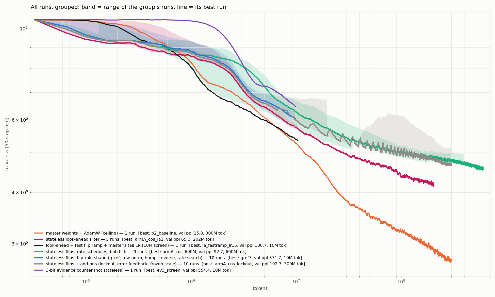

# ternary-LLM

From-scratch **native ternary** ({-1, 0, 1}) language models — BitNet-style, but
trained **without full-precision master weights**, with custom Triton kernels that
keep the weights packed at **1.58 bit** (5 trits/byte) even during training.

Two things live here:
- **A systems result:** a 27B ternary model *trains* on a single 12 GB consumer
  GPU (172 tok/s, ~9.9 GiB) — weights never materialized dense.
- **A study:** how far can you get *without* the master weights. Stateless flip
  rules, a look-ahead flip filter, and what still separates them from a
  latent-master ceiling. See **[docs/RUNS.md](docs/RUNS.md)** (every run, newest
  findings at the bottom), **[docs/RESULTS.md](docs/RESULTS.md)** and
  **[docs/NOTES.md](docs/NOTES.md)**.

## Headline numbers



27B training on one 12 GB GPU (seq 512):

| | tok/s | peak VRAM |
|---|---|---|
| torch unpack+linear | 67 | 10.86 GiB |
| + Triton kernels (fwd, grad_x, fused-flip) | **172** | **9.93 GiB** |
| + int8 tensor-core forward, norms inside checkpoint | **170** | **8.55 GiB** |

Master-free study, 110M params, seq 2048, 32,768 tokens/step, Wikipedia (32k vocab),
everything identical except the weight-update rule (val perplexity):

| training mode | per-weight state | tokens | perplexity |
|---|---|---|---|
| latent master + STE + AdamW (**ceiling**) | 12 B/param | 300M | **15.79** |
| stateless flips + **look-ahead filter** (stopped early, still falling) | 1.58 bit | 200M | **65.3** |
| stateless flips, annealed rate, 600M tokens | 1.58 bit | 600M | 92.72 |
| stateless flips, annealed rate | 1.58 bit | 300M | 98.56 |
| stateless flips, constant rate | 1.58 bit | 300M | 135.84 |

Caveat: until `--tail_fp32` (see docs/RUNS.md, "Float tail precision"), every
flip run trained its float tail (embeddings, norm gains) in bf16, which froze all
RMSNorm gains at exactly 1.0. Master mode never had this. Flip-vs-flip comparisons
are fair; flip-vs-master comparisons carry that handicap.

## Layout

```
bitnet/                  the package: model, Triton kernels, flip rules, training loop
  train.py               training entry point  (python -m bitnet.train --help)
  kernel.py              packed-ternary Triton kernels (fwd GEMM, grad_x, fused flip)
  flip.py                flip layers (stateless, evidence, kernel, look-ahead capture)
  master.py              latent-master baseline (STE + AdamW), the ceiling
  probe.py               in-training probes (--probe): copying, context use, norms
  model.py, config.py    Llama-style transformer, presets (small = 110M ... b27 = 27B)
  opt8.py, pack.py, packed.py, data_prep*.py
scripts/
  train/                 run launchers (screen_10m.sh, full_run.sh); legacy/ = old queues
  analysis/              offline experiments on checkpoints (curvature, look-ahead,
                         per-step efficiency, gradient SNR, superposition)
  plots/                 figure scripts -> docs/figures/   (legacy/ = retired figures)
  bench/                 kernel / throughput benchmarks (incl. 27B)
  data/, generate/       data prep, text sampling
tests/                   sanity tests
docs/                    RUNS.md (lab notebook), RESULTS.md, NOTES.md, RUN_INDEX.md,
                         figures/
checkpoints/             run outputs, one dir per run (gitignored; see docs/RUN_INDEX.md)
data/                    tokenized corpora (gitignored)
```

Everything runs **from the repo root**; scripts are modules:
`python -m scripts.plots.plot_all`, `python -m scripts.analysis.efficiency_test <ckpts>`.

## Quickstart

```bash
pip install -r requirements.txt
python -m tests.test_flip                                   # sanity

# data: Wikipedia with the 32k Llama tokenizer
python -m scripts.data.prep_wiki 1.25e9

# a 10M-token screen of the current best flip config (~20 min on one GPU)
scripts/train/screen_10m.sh my_screen                       # extra flags are appended

# a full 300M-token run of the current best flip config (~10 h)
scripts/train/full_run.sh my_run

# master-weights ceiling (same data, batch, schedule)
python -m bitnet.train --preset small --mode master --master_dtype fp32 \
    --data data/wiki32k_train.bin --val data/wiki32k_val.bin --seq_len 2048 \
    --batch_size 16 --steps 9155 --warmup 305 --lr 1.5e-3 --min_lr 1.5e-4 \
    --out_dir checkpoints/master

# resume anything
python -m bitnet.train <same flags> --out_dir checkpoints/<run> --resume

# figures
python -m scripts.plots.plot_all          # every run, grouped -> docs/figures/all_runs.png
```

## Training modes (`--mode`)

| mode | what | state per weight |
|------|------|------------------|
| `kernel` | pure-ternary, stochastic flips, Triton kernels (fastest) | trit only |
| `master` | latent weights + STE + AdamW — the ceiling | fp32 latent + Adam |
| `evidence` | `kernel` + k-bit saturating counter (`--ev_bits`) | trit + k bits |
| `stateless` | pure-ternary flips, torch path | trit only |
| `flip` | learned flip-predictor + int8 evidence (torch) | trit + int8 |
| `latent` | int8 latent master-free path | int8 |

Key flags (kernel mode):

| flag | what |
|---|---|
| `--lookahead 1` | look-ahead filter: keep a proposed flip only if its slope is still downhill at W+Δ (the biggest win so far; ~1.8x per step) |
| `--rate`, `--rate_schedule cosine`, `--rate_peak`, `--rate_warmup` | flip-rate schedule (ramp to the peak, then anneal) |
| `--g_ref` | knee of the flip-probability ramp (broad optimum 3-10) |
| `--tail_fp32` | float tail in fp32 + AdamW like master (otherwise norm gains freeze at 1.0) |
| `--probe 0-40:5,40-9155:250` | log copying / context-use / norm probes |
| `--max_temp 84 --resume_temp 79` | thermal guard: pause when hot, resume when cool (on by default) |
| `--flip_seed N` | replicate with different flip randomness, same data order |
| `--snap_every N` | keep a checkpoint copy every N steps |
| `--int8`, `--track_flips` | int8 tensor-core forward; per-layer flip telemetry |

## Honest limitations

- **n = 1 per config, one model size (110M), one dataset**, and everything is
  undertrained (300M tokens for a 110M model is ~7% of Chinchilla).
- The flip runs had frozen norm gains until `--tail_fp32` (above).
- 27B *fits* on one GPU but can't be *pretrained* there — 170 tok/s against the
  ~540B tokens Chinchilla wants is ~100 years. The wall is compute, not memory.
- Ternary gives a real but modest compute win on current GPUs: the int8 tensor-core
  forward is 1.7-2.0x per layer but only **1.12-1.15x end-to-end**.
