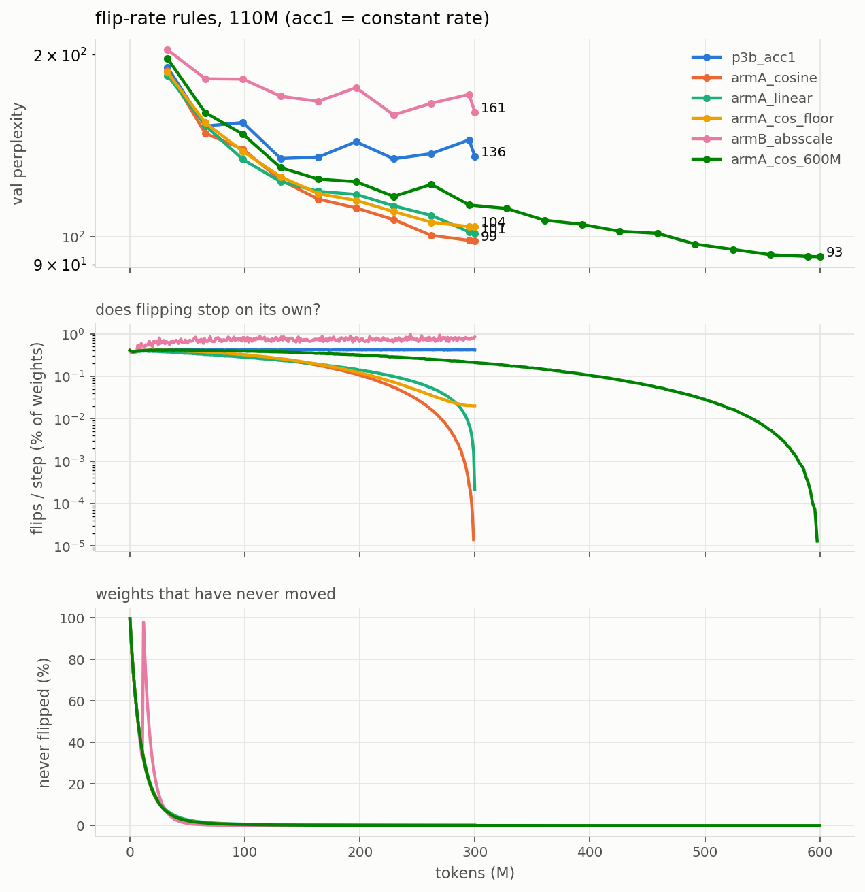
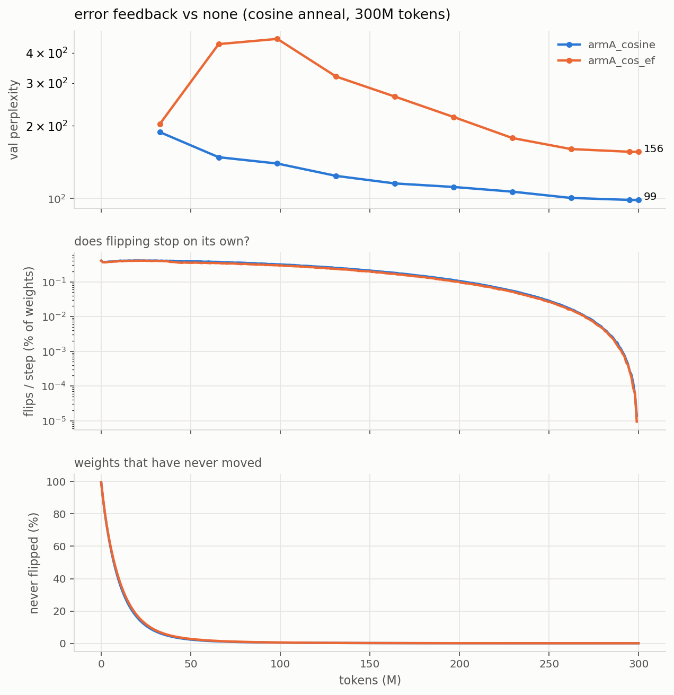

# Runs

## Headline

110M params, seq 2048, 32,768 tokens/step, 300M tokens, Wikipedia (Llama 32k), all
identical except the weight-update rule:

| training rule | per-weight state | val ppl |
|---|---|---|
| latent master + STE + AdamW (**ceiling**) | fp32 latent + 2x fp32 Adam = 12 B | **15.79** |
| stateless flips, cosine-annealed rate | trit only (1.58 bit) | **98.56** |
| stateless flips, linear-annealed rate | trit only | 101.38 |
| stateless flips, cosine to a 0.02% floor | trit only | 103.96 |
| stateless flips, constant rate (the old recipe) | trit only | 135.84 |
| stateless flips, frozen absolute threshold (Arm B) | trit only | 160.68 |
| *published 51M run, pre-beta, 1.1B tokens* | trit only | *1552* |

Master-free ternary costs **6.2x perplexity** against its own ceiling at identical
config. Annealing the flip rate closed 27% of the master-free gap for free; the
remaining gap is the real cost of having no accumulator.

Everything here is **stateless, master-free, 1.58-bit packed ternary** (no evidence
array, no latent/master weights). Perplexity = exp(per-token mean cross-entropy).

## Standard config (identical across every run below)

| | |
|---|---|
| preset | `small` — 110M params, 32k vocab (Llama tokenizer), dim 768, 12 layers |
| data | `data/wiki32k_{train,val}.bin` — Wikipedia 20231101.en, Llama 32k BPE, 398.5M train / 2.0M val tokens, **article-level split** |
| micro-batch | 16 × seq 2048 = 32,768 tokens per micro-step |
| budget | 300M tokens |
| schedule | cosine, lr 3e-4 → 3e-5, warmup = steps/30, flip rate 2e-2, g_ref 3 |
| seed | 1337; data order from a dedicated RNG, identical across runs |
| eval | 30 fixed val windows × 16 × 2048 = 1.0M tokens, same windows every run |
| kernels | int8 forward + bf16 dx + dense dw, β = 1/√(K·ρ) |

**Not comparable to RESULTS.md**: those are 51M / GPT-2 50k vocab / seq 512 / 1.1B
tokens and predate the β and memory fixes.

## Phase 3b — batch sweep at 0-bit (running)

Only variable: tokens per optimizer step. Flips are accumulated across micro-steps
and applied once per step, so "tokens per step" means the same for the flip rule as
for the tail optimizer.

| run | grad accum | tokens/step | steps | wall clock | final val ppl |
|-----|-----------|-------------|-------|-----------|---------------|
| `p3b_acc1` | 1 | 32,768 | 9155 | 5.0 h | **135.84** (val loss 4.9115) |
| `p3b_acc4` | 4 | 131,072 | 2288 | 4.8 h | **140.09** (val loss 4.9423) |
| `p3b_acc4` +100M | 4 | 131,072 | 3051 (400M tok) | +1.5 h | **135.51** |
| `p3b_acc16` | 16 | 524,288 | 572 | **not run** | gate: acc4 did not beat acc1 |
| `p3b_acc64` | 64 | 2,097,152 | 143 | **not run** | gate: acc4 did not beat acc1 |

acc16/acc64 run only if acc4 beats acc1; otherwise the batch effect has saturated
at 32k tokens/step and the queue goes straight to the baseline. Caveat for acc64 if
it does run: at ~0.42% flips/step × 143 steps each weight flips ~0.6 times, so a bad
result there is ambiguous between "batch does not help" and "ran out of flips" —
never-flipped fraction is logged to separate them.

**Baseline** `p2_baseline`: master mode (latent + STE + AdamW), same 110M / seq 2048
/ 32,768 tokens per step / 300M tokens. Latent is **fp32, not bf16**: in bf16 an
AdamW step of ~1e-4 on a weight of ~0.02 falls below half the representable gap and
rounds away, and weight decay (~1e-6) always does — that would understate the very
ceiling the ternary runs are measured against.

### Result: batch does not help, and ~135 is a hard floor

At the same 300M budget, 4x batch was worse (140.09 vs 135.84) because it got 4x
fewer flip opportunities (2288 vs 9155 steps). Extending acc4 by 100M tokens at a
flat LR closed that gap exactly — 135.51 — so the deficit was update count, not
batch damage. But the larger batch bought nothing: it needs **33% more tokens to
reach the same place**.

val ppl trace, acc4: 156.6 -> 143.6 -> **140.09** (300M) -> 146.8 -> 140.0 -> **135.51** (400M)

Caveat on acc4's never-flipped: the tracking mask was a plain attribute, so it reset
when the run was resumed at step 2289 (fixed since — masks now persist in the
checkpoint with the step they started from). acc4's post-resume readings (9.2%) are
"since resume". Its true since-init value is **<= 1.029%**, the last correct reading
at step 2288; the per-weight history before that is unrecoverable, since a weight
that flipped and flipped back cannot be told from one that never moved.

So the floor is robust across everything varied: 32k and 131k tokens/step, 2288 to
9155 steps, 300M to 400M tokens, all landing at **135.5-135.8**. Throughout, the
flip rate never moved off 0.417-0.420%/step and never-flipped stayed ~0%.

Combined with the acc1 gradient SNR (65.7% sign agreement, cosine 0.535, SNR 1.52 —
not noise dominated), the spatial-averaging premise is dead. Gradient noise is not
what holds the model at ppl ~135; the flip rule's inability to stop flipping is the
candidate, which is what the arms test.

## Flip-rule arms (queued, all at the acc1 config: 32,768 tokens/step, 300M tokens)

The acc1 gradient SNR (below) rules out gradient noise as the binding constraint,
so these test the flip rule itself. `prob = min(|g| / (3·mean|g|), 1) × rate` is
normalized to the tensor's OWN mean, recomputed every step: if every gradient
shrinks, the ratio is unchanged and the same fraction keeps flipping forever.
Telemetry confirms it — 0.405% at step 0, 0.42% at step 8170, never-flipped 0.0%.

| arm | change | final val ppl |
|-----|--------|---------------|
| `p3b_acc1` (reference) | constant rate 2e-2 | 135.84 |
| **`armA_cosine`** | decay `rate` 2e-2 -> 0, cosine | **98.56** |
| `armA_linear` | decay `rate` 2e-2 -> 0, linear | **101.38** |
| `armB_absscale` | freeze the threshold denominator after 200 steps | **160.68** (flip rate ROSE 0.58% -> 0.80%) |
| `armA_cos_floor` | cosine 2e-2 -> 9.52e-4 (flip 0.42% -> 0.02%, never 0) | **103.96** |
| `armA_cos_600M` | cosine 2e-2 -> 0 stretched over **600M tokens** | **92.72** |
| `armA_cos_ef` | armA_cosine + spatial error feedback, alpha 0.01 | **156.01** |

### Result: the plateau was the flip rule, not gradient noise

Annealing the flip rate breaks a floor that batch, steps, tokens and LR all failed
to move — **135.84 -> 98.56**, a 27% cut, from one schedule on `rate`.

val ppl, armA_cosine: 188.3 -> 148.3 -> 139.6 -> 124.1 -> 115.5 -> 111.7 -> 106.8 -> 100.6 -> 98.7 -> **98.56**
flip rate: 0.405% -> 0.374% -> 0.247% -> 0.104% -> 0.013% -> **0.000%** at step 9153

Shape matters less than the annealing itself (cosine 98.56 vs linear 101.38, and the
two were within noise of each other until the back half, where cosine's hold-then-drop
banked its gains). Both were **still descending at the token budget**, so neither is a
converged number.

Never-flipped ended at 0.173% in armA_cosine: the gain comes from flipping *less*,
not from individual weights locking. NOTES.md predicted locking; that is not what
happens.

**Arm B failed in an informative way.** Freezing the denominator did make the flip
rate responsive — it had been pinned at 0.42% regardless of batch, steps, tokens or
LR — but it rose (0.58% -> 0.92%) instead of falling, because gradient magnitude
*grows* relative to its value at init rather than shrinking. The premise "as
gradients shrink, flip rate falls on its own" is wrong for this model. Any absolute
threshold calibrated during warmup at init is calibrated in the wrong regime.

Primary evidence is the flip-rate curve, not perplexity. If Arm B stays flat at
~0.42%, the hypothesis is wrong. A meaningful never-flipped fraction at the end of
Arm B would be the first time weights have ever settled.

### Does more data close the gap? Mostly no

The winning recipe at double the budget (cosine anneal stretched over 600M tokens,
~38 flips/weight vs ~19):

| | tokens | val ppl |
|---|---|---|
| `armA_cosine` | 300M | 98.56 |
| `armA_cos_600M` | 600M | **92.72** |

2x the tokens and 2x the flip budget bought **5.8 ppl (5.9%)**, with the curve
flattening (last four checkpoints: 95.3 -> 93.4 -> 92.8 -> 92.72). The gap to the
15.79 ceiling stays ~5.9x. The remaining gap is rule-bound, not data-bound.

Caveat: this varies tokens *and* anneal length together (the schedule must still
reach zero at the end), so it does not separate "more tokens" from "slower anneal".

### Result: keeping flips alive late is worse than stopping them

`armA_cos_floor` holds the flip rate at 0.02% instead of reaching zero, same shape
and same ~20 flips/weight budget otherwise: **103.96 vs 98.56**. The two track
within ~2 ppl until ~60% of the run, then diverge exactly where cosine's rate
collapses. So the late gains in `armA_cosine` were *caused by* flipping stopping,
not throttled by it — residual churn at convergence costs ~5 ppl.

## Phase 4 — performance

### 4a/4b: int8 tensor-core kernels

`mma.sync.aligned.m16n8k32.row.col.satfinite.s32.s8.s8.s32` confirmed in the PTX of
all three new kernels. Activations are already 8-bit, so the int8 **forward is exact
in int32** where the bf16 path rounded partial sums.

Per-layer, M = 16,384 tokens (ms, and speedup vs bf16):

| shape | fwd bf16 | fwd int8 | × | dx bf16 | dx int8 | × | dw dense | dw int8 | × | dw sign | × |
|---|---|---|---|---|---|---|---|---|---|---|---|
| 110M 768→2048 | 1.13 | 0.66 | **1.70** | 1.59 | 4.52 | 0.35 | 0.74 | 5.43 | 0.14 | 1.32 | 0.56 |
| 110M 2048→768 | 1.29 | 0.66 | **1.97** | 1.33 | 2.23 | 0.60 | 0.74 | 2.33 | 0.32 | 0.95 | 0.78 |
| 110M 768→768 | 0.45 | 0.27 | **1.68** | 0.52 | 1.59 | 0.33 | 0.29 | 2.09 | 0.14 | 0.59 | 0.50 |
| 27B 5120→13824 | 52.64 | 29.99 | **1.76** | 68.75 | 57.40 | 1.20 | 34.55 | 61.24 | 0.56 | 32.48 | 1.06 |
| 27B 13824→5120 | 63.14 | 33.54 | **1.88** | 82.15 | 49.38 | 1.66 | 36.09 | 40.31 | 0.90 | 32.19 | 1.12 |

Full model:

| model | combo | tok/s | peak |
|---|---|---|---|
| 110M (bs8×2048) | bf16 baseline | 16,311 | 1.65 GiB |
| 110M | **int8 fwd + bf16 dx + dense dw** | **18,230** (1.12×) | 1.65 GiB |
| 110M | int8 fwd + bf16 dx + sign dw | 18,046 | 1.65 GiB |
| 110M | int8 fwd + bf16 dx + cublas dw | 14,353 | 1.65 GiB |
| 110M | int8 fwd + int8 dx + cublas dw | 12,834 | 1.65 GiB |
| 27B (bs1×512) | bf16 baseline | 148 | 8.55 GiB |
| 27B | **int8 fwd + bf16 dx + dense dw** | **170** (1.15×) | 8.55 GiB |

(27B numbers here are a different code path from RESULTS.md — β + chunked loss head
+ int8 forward — so they are not a correction of the 172 tok/s figure there.)

### Two premises that did not survive measurement

1. **dx was already on tensor cores.** The bf16 `_dx_kernel` emits
   `mma.sync.aligned.m16n8k16...bf16`, so there was no CUDA-core penalty to recover.
   int8 dx *loses* at 110M (0.33–0.60×) because quantizing `gy` costs a full pass over
   [M,N]; it wins only at 27B shapes (1.20–1.66×), where the GEMM amortizes that pass.
2. **dw is the cheapest of the three, not the largest.** At 768→2048 it is 0.74 ms vs
   fwd 1.13 and dx 1.59. It is a plain dense GEMM on cuBLAS, and nothing hand-written
   beat it: Triton int8 0.14–0.32×, cuBLASLt int8 (`torch._int_mm`) 0.16–0.47×. The
   int8 variants lose to the quantization pass plus a transpose copy, not to the GEMM.
   **sign(dL/dy) ⊗ sign(x) as an XNOR outer product** reaches parity only at 27B
   (1.06–1.12×), and costs accuracy: 71% sign agreement with the dense dW, vs 99.6%
   for the int8 dw. It is implemented (`--dw_mode sign`) but is not the default.

4c (evidence offload to host RAM) does not apply: stateless runs have no evidence array.

### Memory fix (what actually enabled the larger batches)

`RMSNorm` upcasts to fp32, and the norms were called **outside** the checkpointed
region, so two fp32 [B,T,d] tensors per sublayer were retained instead of recomputed:
4.69 GiB at 32k tokens/step. Moving the norms inside the checkpoint, returning the
input dtype from `RMSNorm`, and chunking the output head dropped peak VRAM at
110M/seq2048/bs16 from **7.67 → 2.70 GiB**.

## Phase 0 findings (why the old numbers are suspect)

1. **No weight scale in the kernel forward.** Raw trits made each linear multiply RMS
   by 19–75×; attention logit std was 260–700 and entropy 0.008–0.018 nats (mean
   max-prob 0.99) — every head attended to exactly one token. Fixed by β = 1/√(K·ρ):
   rms(out) ≈ rms(in), entropy ≈ 4.6 nats on a fresh model.
2. **The float tail was pure bf16 with no master copy.** All 17 RMSNorm gains were
   still exactly 1.0 after 134k steps; weight decay (~6e-7/step) never did anything.
3. **The published bodies are statistically independent of init**: 66.6% of trits
   differ, exactly the value for two independent ternary draws at ρ=0.69.
4. **Gradient SNR is at chance for most layers** (`diag_snr.py`): mean sign agreement
   between batch halves 54.0% (stateless) / 50.8% (3-bit), where 50% is pure noise.
   wq/wk sit at 50% in every layer. Signal concentrates in the last two layers (to
   85%) and in the strongest 1% of entries (to 100%).
5. Eval itself was correct: article-level split, per-token averaging, no padding.
   Train/val 13-gram overlap on the new data is 4.80%, no val article >90% covered.

## Spatial error feedback (negative result)

Idea: a stochastic flip moves a weight by a full level (or not at all) where the
rule's expectation is `p` of a level. Instead of storing that residual per weight,
push it into `grad_x` so earlier layers compensate within the same backward pass —
no per-weight state at all (`--err_feedback`, `--ef_alpha`; `_ef_backward` in
`bitnet/flip.py`). Config identical to `armA_cosine` otherwise.

**600-step probes** (val ppl at ~20M tokens, same schedule horizon as the full run):

| alpha | 0 | 0.01 | 0.03 | 0.1 |
|---|---|---|---|---|
| val ppl | 255.56 | 273.70 | 445.99 | 828.11 |

**Full run, alpha 0.01: 156.01 vs 98.56 without feedback** — 58% worse.

val ppl: 203.7 -> **435.7 -> 457.9** -> 319.9 -> 264.3 -> 217.6 -> 178.1 -> 160.2 -> 156.2 -> 156.01

The run blew up between 33M and 98M tokens, while flipping was heavy, and recovered
only as the cosine anneal drove the flip rate — and with it the feedback term — to
zero. Flip rate and never-flipped are indistinguishable from the no-feedback run.

Why it hurts: `E[fired] = p`, so the residual is **zero-mean flip-sampling noise**.
Rescaled to the size of `gy`, it adds noise to every earlier layer's gradient and to
the embedding's Adam updates, on top of a gradient whose SNR is already only ~1.5.
Damage grows steeply with alpha and is only small at 0.01 over a short horizon.

**The probe was misleading at 0.01**: 7% worse at 20M tokens (inside run-to-run
noise), 58% worse at 300M. The harm accumulates while flip activity is high, which
a 600-step probe barely samples. Short probes can rank alphas; they can't certify
that a small alpha is safe.

Two bugs found on the way, both fixed before the full run: the feedback term's sign
was inverted (it asked earlier layers to amplify the overshoot; verified by a
one-step toy where the old sign was 3.4x more harmful), and `grad_x` was taken at
post-flip weights.
