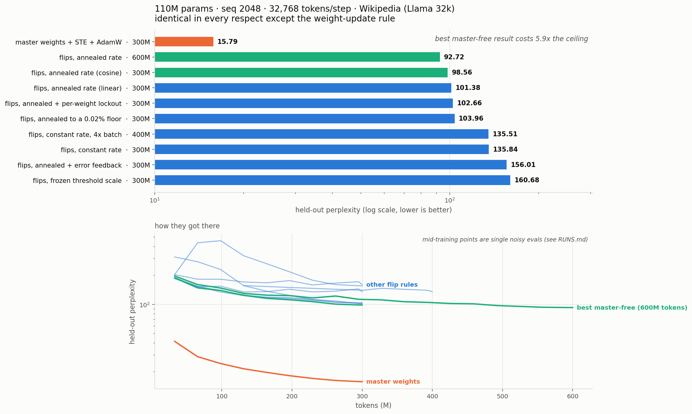
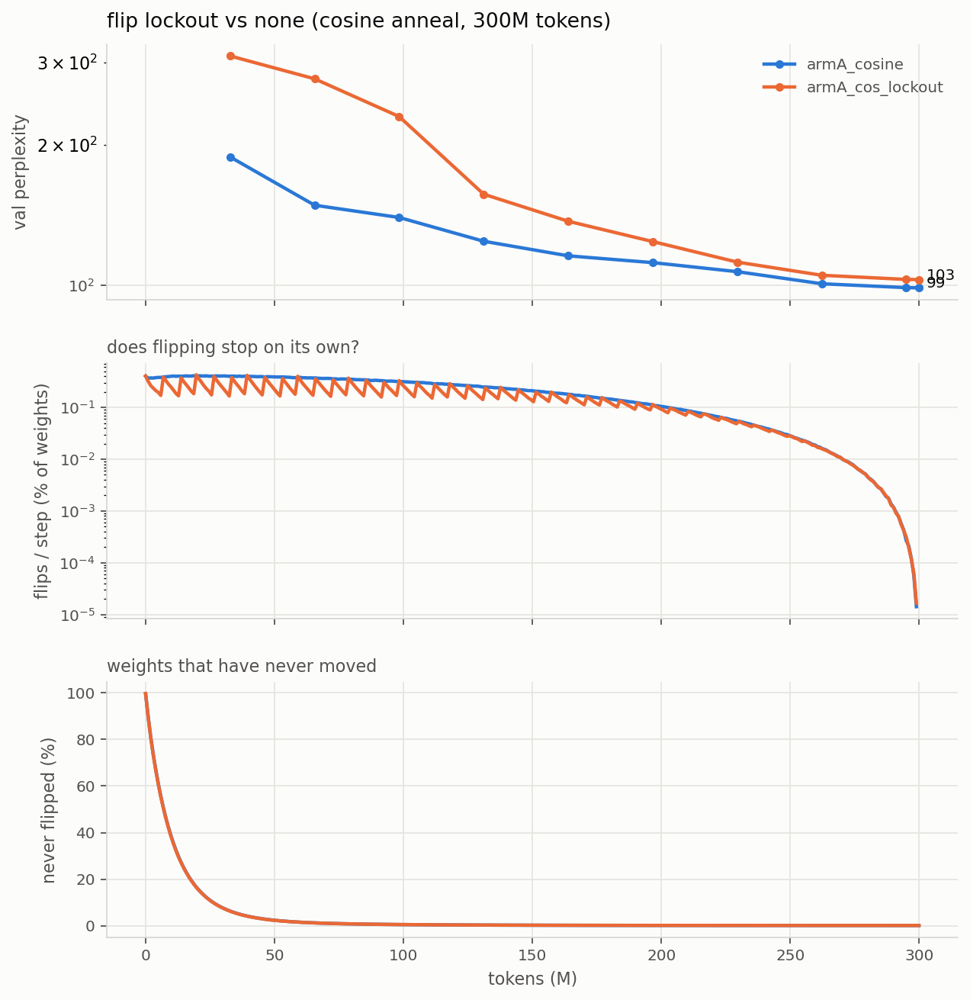
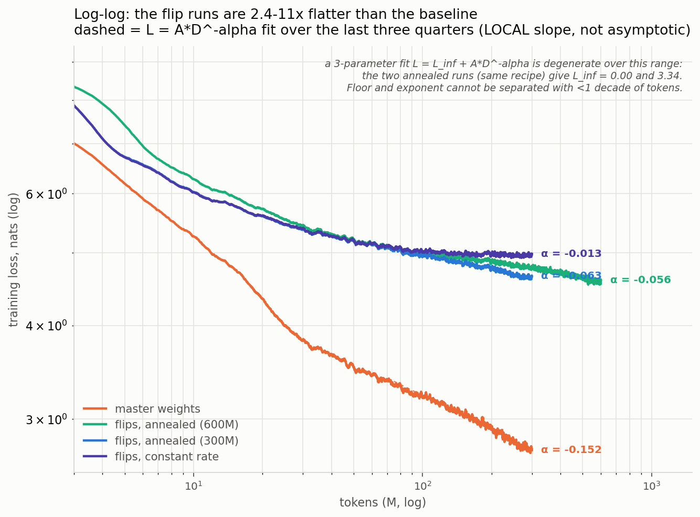
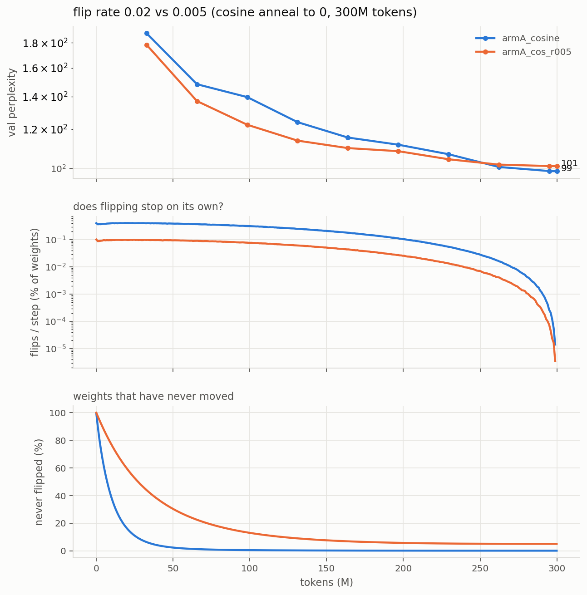

# Runs

*(regenerate with `python3 plot_modes.py`)*

## Headline

110M params, seq 2048, 32,768 tokens/step, 300M tokens, Wikipedia (Llama 32k), all
identical except the weight-update rule:

| training rule | per-weight state | val ppl |
|---|---|---|
| latent master + STE + AdamW (**ceiling**) | fp32 latent + 2x fp32 Adam = 12 B | **15.79** |
| stateless flips, cosine-annealed rate | trit only (1.58 bit) | **98.56** |
| stateless flips, linear-annealed rate | trit only | 101.38 |
| stateless flips, cosine to a 0.02% floor | trit only | 103.96 |
| stateless flips, constant rate (the old recipe) | trit only | 135.84 |
| stateless flips, frozen absolute threshold (Arm B) | trit only | 160.68 |
| *published 51M run, pre-beta, 1.1B tokens* | trit only | *1552* |

Master-free ternary costs **6.2x perplexity** against its own ceiling at identical
config. Annealing the flip rate closed 27% of the master-free gap for free; the
remaining gap is the real cost of having no accumulator.

Everything here is **stateless, master-free, 1.58-bit packed ternary** (no evidence
array, no latent/master weights). Perplexity = exp(per-token mean cross-entropy).

## Standard config (identical across every run below)

| | |
|---|---|
| preset | `small` — 110M params, 32k vocab (Llama tokenizer), dim 768, 12 layers |
| data | `data/wiki32k_{train,val}.bin` — Wikipedia 20231101.en, Llama 32k BPE, 398.5M train / 2.0M val tokens, **article-level split** |
| micro-batch | 16 × seq 2048 = 32,768 tokens per micro-step |
| budget | 300M tokens |
| schedule | cosine, lr 3e-4 → 3e-5, warmup = steps/30, flip rate 2e-2, g_ref 3 |
| seed | 1337; data order from a dedicated RNG, identical across runs |
| eval | 30 fixed val windows × 16 × 2048 = 1.0M tokens, same windows every run |
| kernels | int8 forward + bf16 dx + dense dw, β = 1/√(K·ρ) |

**Not comparable to RESULTS.md**: those are 51M / GPT-2 50k vocab / seq 512 / 1.1B
tokens and predate the β and memory fixes.

## Phase 3b — batch sweep at 0-bit (running)

Only variable: tokens per optimizer step. Flips are accumulated across micro-steps
and applied once per step, so "tokens per step" means the same for the flip rule as
for the tail optimizer.

| run | grad accum | tokens/step | steps | wall clock | final val ppl |
|-----|-----------|-------------|-------|-----------|---------------|
| `p3b_acc1` | 1 | 32,768 | 9155 | 5.0 h | **135.84** (val loss 4.9115) |
| `p3b_acc4` | 4 | 131,072 | 2288 | 4.8 h | **140.09** (val loss 4.9423) |
| `p3b_acc4` +100M | 4 | 131,072 | 3051 (400M tok) | +1.5 h | **135.51** |
| `p3b_acc16` | 16 | 524,288 | 572 | **not run** | gate: acc4 did not beat acc1 |
| `p3b_acc64` | 64 | 2,097,152 | 143 | **not run** | gate: acc4 did not beat acc1 |

acc16/acc64 run only if acc4 beats acc1; otherwise the batch effect has saturated
at 32k tokens/step and the queue goes straight to the baseline. Caveat for acc64 if
it does run: at ~0.42% flips/step × 143 steps each weight flips ~0.6 times, so a bad
result there is ambiguous between "batch does not help" and "ran out of flips" —
never-flipped fraction is logged to separate them.

**Baseline** `p2_baseline`: master mode (latent + STE + AdamW), same 110M / seq 2048
/ 32,768 tokens per step / 300M tokens. Latent is **fp32, not bf16**: in bf16 an
AdamW step of ~1e-4 on a weight of ~0.02 falls below half the representable gap and
rounds away, and weight decay (~1e-6) always does — that would understate the very
ceiling the ternary runs are measured against.

### Result: batch does not help, and ~135 is a hard floor

At the same 300M budget, 4x batch was worse (140.09 vs 135.84) because it got 4x
fewer flip opportunities (2288 vs 9155 steps). Extending acc4 by 100M tokens at a
flat LR closed that gap exactly — 135.51 — so the deficit was update count, not
batch damage. But the larger batch bought nothing: it needs **33% more tokens to
reach the same place**.

val ppl trace, acc4: 156.6 -> 143.6 -> **140.09** (300M) -> 146.8 -> 140.0 -> **135.51** (400M)

Caveat on acc4's never-flipped: the tracking mask was a plain attribute, so it reset
when the run was resumed at step 2289 (fixed since — masks now persist in the
checkpoint with the step they started from). acc4's post-resume readings (9.2%) are
"since resume". Its true since-init value is **<= 1.029%**, the last correct reading
at step 2288; the per-weight history before that is unrecoverable, since a weight
that flipped and flipped back cannot be told from one that never moved.

So the floor is robust across everything varied: 32k and 131k tokens/step, 2288 to
9155 steps, 300M to 400M tokens, all landing at **135.5-135.8**. Throughout, the
flip rate never moved off 0.417-0.420%/step and never-flipped stayed ~0%.

Combined with the acc1 gradient SNR (65.7% sign agreement, cosine 0.535, SNR 1.52 —
not noise dominated), the spatial-averaging premise is dead. Gradient noise is not
what holds the model at ppl ~135; the flip rule's inability to stop flipping is the
candidate, which is what the arms test.

## Flip-rule arms (queued, all at the acc1 config: 32,768 tokens/step, 300M tokens)

The acc1 gradient SNR (below) rules out gradient noise as the binding constraint,
so these test the flip rule itself. `prob = min(|g| / (3·mean|g|), 1) × rate` is
normalized to the tensor's OWN mean, recomputed every step: if every gradient
shrinks, the ratio is unchanged and the same fraction keeps flipping forever.
Telemetry confirms it — 0.405% at step 0, 0.42% at step 8170, never-flipped 0.0%.

| arm | change | final val ppl |
|-----|--------|---------------|
| `p3b_acc1` (reference) | constant rate 2e-2 | 135.84 |
| **`armA_cosine`** | decay `rate` 2e-2 -> 0, cosine | **98.56** |
| `armA_linear` | decay `rate` 2e-2 -> 0, linear | **101.38** |
| `armB_absscale` | freeze the threshold denominator after 200 steps | **160.68** (flip rate ROSE 0.58% -> 0.80%) |
| `armA_cos_floor` | cosine 2e-2 -> 9.52e-4 (flip 0.42% -> 0.02%, never 0) | **103.96** |
| `armA_cos_600M` | cosine 2e-2 -> 0 stretched over **600M tokens** | **92.72** |
| `armA_cos_ef` | armA_cosine + spatial error feedback, alpha 0.01 | **156.01** |
| `armA_cos_lockout` | armA_cosine + per-weight flip lockout (once per 200 steps) | **102.66** |

### Result: the plateau was the flip rule, not gradient noise

Annealing the flip rate breaks a floor that batch, steps, tokens and LR all failed
to move — **135.84 -> 98.56**, a 27% cut, from one schedule on `rate`.

val ppl, armA_cosine: 188.3 -> 148.3 -> 139.6 -> 124.1 -> 115.5 -> 111.7 -> 106.8 -> 100.6 -> 98.7 -> **98.56**
flip rate: 0.405% -> 0.374% -> 0.247% -> 0.104% -> 0.013% -> **0.000%** at step 9153

Shape matters less than the annealing itself (cosine 98.56 vs linear 101.38, and the
two were within noise of each other until the back half, where cosine's hold-then-drop
banked its gains). Both were **still descending at the token budget**, so neither is a
converged number.

Never-flipped ended at 0.173% in armA_cosine: the gain comes from flipping *less*,
not from individual weights locking. NOTES.md predicted locking; that is not what
happens.

**Arm B failed in an informative way.** Freezing the denominator did make the flip
rate responsive — it had been pinned at 0.42% regardless of batch, steps, tokens or
LR — but it rose (0.58% -> 0.92%) instead of falling, because gradient magnitude
*grows* relative to its value at init rather than shrinking. The premise "as
gradients shrink, flip rate falls on its own" is wrong for this model. Any absolute
threshold calibrated during warmup at init is calibrated in the wrong regime.

Primary evidence is the flip-rate curve, not perplexity. If Arm B stays flat at
~0.42%, the hypothesis is wrong. A meaningful never-flipped fraction at the end of
Arm B would be the first time weights have ever settled.

### Does more data close the gap? Mostly no

The winning recipe at double the budget (cosine anneal stretched over 600M tokens,
~38 flips/weight vs ~19):

| | tokens | val ppl |
|---|---|---|
| `armA_cosine` | 300M | 98.56 |
| `armA_cos_600M` | 600M | **92.72** |

2x the tokens and 2x the flip budget bought **5.8 ppl (5.9%)**, with the curve
flattening (last four checkpoints: 95.3 -> 93.4 -> 92.8 -> 92.72). The gap to the
15.79 ceiling stays ~5.9x. The remaining gap is rule-bound, not data-bound.

Caveat: this varies tokens *and* anneal length together (the schedule must still
reach zero at the end), so it does not separate "more tokens" from "slower anneal".

### Result: keeping flips alive late is worse than stopping them

`armA_cos_floor` holds the flip rate at 0.02% instead of reaching zero, same shape
and same ~20 flips/weight budget otherwise: **103.96 vs 98.56**. The two track
within ~2 ppl until ~60% of the run, then diverge exactly where cosine's rate
collapses. So the late gains in `armA_cosine` were *caused by* flipping stopping,
not throttled by it — residual churn at convergence costs ~5 ppl.

## Phase 4 — performance

### 4a/4b: int8 tensor-core kernels

`mma.sync.aligned.m16n8k32.row.col.satfinite.s32.s8.s8.s32` confirmed in the PTX of
all three new kernels. Activations are already 8-bit, so the int8 **forward is exact
in int32** where the bf16 path rounded partial sums.

Per-layer, M = 16,384 tokens (ms, and speedup vs bf16):

| shape | fwd bf16 | fwd int8 | × | dx bf16 | dx int8 | × | dw dense | dw int8 | × | dw sign | × |
|---|---|---|---|---|---|---|---|---|---|---|---|
| 110M 768→2048 | 1.13 | 0.66 | **1.70** | 1.59 | 4.52 | 0.35 | 0.74 | 5.43 | 0.14 | 1.32 | 0.56 |
| 110M 2048→768 | 1.29 | 0.66 | **1.97** | 1.33 | 2.23 | 0.60 | 0.74 | 2.33 | 0.32 | 0.95 | 0.78 |
| 110M 768→768 | 0.45 | 0.27 | **1.68** | 0.52 | 1.59 | 0.33 | 0.29 | 2.09 | 0.14 | 0.59 | 0.50 |
| 27B 5120→13824 | 52.64 | 29.99 | **1.76** | 68.75 | 57.40 | 1.20 | 34.55 | 61.24 | 0.56 | 32.48 | 1.06 |
| 27B 13824→5120 | 63.14 | 33.54 | **1.88** | 82.15 | 49.38 | 1.66 | 36.09 | 40.31 | 0.90 | 32.19 | 1.12 |

Full model:

| model | combo | tok/s | peak |
|---|---|---|---|
| 110M (bs8×2048) | bf16 baseline | 16,311 | 1.65 GiB |
| 110M | **int8 fwd + bf16 dx + dense dw** | **18,230** (1.12×) | 1.65 GiB |
| 110M | int8 fwd + bf16 dx + sign dw | 18,046 | 1.65 GiB |
| 110M | int8 fwd + bf16 dx + cublas dw | 14,353 | 1.65 GiB |
| 110M | int8 fwd + int8 dx + cublas dw | 12,834 | 1.65 GiB |
| 27B (bs1×512) | bf16 baseline | 148 | 8.55 GiB |
| 27B | **int8 fwd + bf16 dx + dense dw** | **170** (1.15×) | 8.55 GiB |

(27B numbers here are a different code path from RESULTS.md — β + chunked loss head
+ int8 forward — so they are not a correction of the 172 tok/s figure there.)

### Two premises that did not survive measurement

1. **dx was already on tensor cores.** The bf16 `_dx_kernel` emits
   `mma.sync.aligned.m16n8k16...bf16`, so there was no CUDA-core penalty to recover.
   int8 dx *loses* at 110M (0.33–0.60×) because quantizing `gy` costs a full pass over
   [M,N]; it wins only at 27B shapes (1.20–1.66×), where the GEMM amortizes that pass.
2. **dw is the cheapest of the three, not the largest.** At 768→2048 it is 0.74 ms vs
   fwd 1.13 and dx 1.59. It is a plain dense GEMM on cuBLAS, and nothing hand-written
   beat it: Triton int8 0.14–0.32×, cuBLASLt int8 (`torch._int_mm`) 0.16–0.47×. The
   int8 variants lose to the quantization pass plus a transpose copy, not to the GEMM.
   **sign(dL/dy) ⊗ sign(x) as an XNOR outer product** reaches parity only at 27B
   (1.06–1.12×), and costs accuracy: 71% sign agreement with the dense dW, vs 99.6%
   for the int8 dw. It is implemented (`--dw_mode sign`) but is not the default.

4c (evidence offload to host RAM) does not apply: stateless runs have no evidence array.

### Memory fix (what actually enabled the larger batches)

`RMSNorm` upcasts to fp32, and the norms were called **outside** the checkpointed
region, so two fp32 [B,T,d] tensors per sublayer were retained instead of recomputed:
4.69 GiB at 32k tokens/step. Moving the norms inside the checkpoint, returning the
input dtype from `RMSNorm`, and chunking the output head dropped peak VRAM at
110M/seq2048/bs16 from **7.67 → 2.70 GiB**.

## Phase 0 findings (why the old numbers are suspect)

1. **No weight scale in the kernel forward.** Raw trits made each linear multiply RMS
   by 19–75×; attention logit std was 260–700 and entropy 0.008–0.018 nats (mean
   max-prob 0.99) — every head attended to exactly one token. Fixed by β = 1/√(K·ρ):
   rms(out) ≈ rms(in), entropy ≈ 4.6 nats on a fresh model.
2. **The float tail was pure bf16 with no master copy.** All 17 RMSNorm gains were
   still exactly 1.0 after 134k steps; weight decay (~6e-7/step) never did anything.
3. **The published bodies are statistically independent of init**: 66.6% of trits
   differ, exactly the value for two independent ternary draws at ρ=0.69.
4. **Gradient SNR is at chance for most layers** (`diag_snr.py`): mean sign agreement
   between batch halves 54.0% (stateless) / 50.8% (3-bit), where 50% is pure noise.
   wq/wk sit at 50% in every layer. Signal concentrates in the last two layers (to
   85%) and in the strongest 1% of entries (to 100%).
5. Eval itself was correct: article-level split, per-token averaging, no padding.
   Train/val 13-gram overlap on the new data is 4.80%, no val article >90% covered.

## Spatial error feedback (negative result)

Idea: a stochastic flip moves a weight by a full level (or not at all) where the
rule's expectation is `p` of a level. Instead of storing that residual per weight,
push it into `grad_x` so earlier layers compensate within the same backward pass —
no per-weight state at all (`--err_feedback`, `--ef_alpha`; `_ef_backward` in
`bitnet/flip.py`). Config identical to `armA_cosine` otherwise.

**600-step probes** (val ppl at ~20M tokens, same schedule horizon as the full run):

| alpha | 0 | 0.01 | 0.03 | 0.1 |
|---|---|---|---|---|
| val ppl | 255.56 | 273.70 | 445.99 | 828.11 |

**Full run, alpha 0.01: 156.01 vs 98.56 without feedback** — 58% worse.

val ppl: 203.7 -> **435.7 -> 457.9** -> 319.9 -> 264.3 -> 217.6 -> 178.1 -> 160.2 -> 156.2 -> 156.01

The run blew up between 33M and 98M tokens, while flipping was heavy, and recovered
only as the cosine anneal drove the flip rate — and with it the feedback term — to
zero. Flip rate and never-flipped are indistinguishable from the no-feedback run.

Why it hurts: `E[fired] = p`, so the residual is **zero-mean flip-sampling noise**.
Rescaled to the size of `gy`, it adds noise to every earlier layer's gradient and to
the embedding's Adam updates, on top of a gradient whose SNR is already only ~1.5.
Damage grows steeply with alpha and is only small at 0.01 over a short horizon.

**The probe was misleading at 0.01**: 7% worse at 20M tokens (inside run-to-run
noise), 58% worse at 300M. The harm accumulates while flip activity is high, which
a 600-step probe barely samples. Short probes can rank alphas; they can't certify
that a small alpha is safe.

Two bugs found on the way, both fixed before the full run: the feedback term's sign
was inverted (it asked earlier layers to amplify the overshoot; verified by a
one-step toy where the old sign was 3.4x more harmful), and `grad_x` was taken at
post-flip weights.

## Per-weight flip lockout (negative result)

Idea: nearly all flip work is undone, so let each weight flip **once**, then lock it
until the epoch ends (`--flip_lockout N --lockout_mode once`), or allow further flips
only in the same direction (`noreversal`). Two packed bitmasks, 1 bit/weight each.

**The premise is right.** Net displacement vs total flips, measured against the
reproducible init:

| run | flips/weight | net levels moved | wasted |
|---|---|---|---|
| constant rate | 38.2 | 0.896 | **97.7%** |
| cosine anneal | 19.0 | 0.895 | **95.3%** |
| cosine anneal, 600M | 38.2 | 0.897 | **97.7%** |

**The fix does not follow: 102.66 vs 98.56** (once per 200 steps, the best of three
screened variants, otherwise identical to `armA_cosine`). Slightly worse, not better.

Why the guarantee fails: a flip's direction comes from a noisy minibatch gradient
(65.7% sign agreement), so ~1 in 3 flips is wrong when made. Locking does not make
it right — it removes the chance to undo it, trading churn for frozen-in error.
Locking also cuts the flip budget (~26 vs 38 flips/weight at N=200), so "less churn"
and "less learning" are confounded.

### Methodological warning: single mid-training evals are unreliable here

The 1000-step screens ranked `once_t200` 175.47, `once_t1000` 177.82,
`norev_t1000` 190.68 against a 188.3 control — i.e. they suggested lockout *helps*,
the opposite of the full run. Taking the screen's own step-1000 checkpoint and
running single training steps from it, val perplexity moves

    175.5 -> 310.1 -> 249.3 -> 223.2 -> 341.7 -> 219.0 -> 417.1 -> 211.3 -> 340.0

a **2.4x spread between consecutive steps**, with the real optimizer state restored
and reproduced with the flip RNG advanced to its mid-run value. A single eval at one
step is therefore not a measurement of run quality while the flip rate is high, and
short screens cannot rank variants.

Unresolved: the logged traces of the long runs are smooth and monotone, which is not
consistent with that spread. The probe differs from real training in at least one way
(it re-loads a checkpoint and, for the no-lockout comparison, flips at a higher rate
than the run that produced it), so the spread may be an artifact of the probe rather
than the run. Final numbers are unaffected — all three were re-evaluated from their
checkpoints and match the logged values exactly (175.47 / 102.66 / 98.56) — but the
intermediate points of every val trace in this file should be treated as indicative
only.

## Scaling shape (log-log)

Local power-law slopes of training loss vs tokens, fitted over the last three
quarters of each run:

| run | local alpha |
|---|---|
| master weights | **-0.152** |
| flips, annealed (600M) | -0.056 |
| flips, annealed (300M) | -0.063 |
| flips, constant rate | -0.013 |

Over the measured range the flip curves are **2.4-11x flatter** than the baseline,
so the gap widens with tokens rather than holding at a fixed ratio. Annealing
improves the local slope ~5x over a constant rate (-0.013 -> -0.063).

**This does not license an asymptotic claim.** Fitting the proper form
`L = L_inf + A*D^-alpha` is degenerate over this token range: the two annealed runs
are the same recipe and return L_inf = 0.00 (600M) and 3.34 (300M), trading floor
against exponent. Separating "master-free has a higher floor" from "master-free
scales worse" needs runs spanning more than the <1 decade of tokens available here.

## g_ref sweep (α screens, 300 steps each)

`g_ref` is the knee of the flip-probability ramp, in units of the layer's mean |g|:
`p = min(|g| / (g_ref·mean|g|), 1) · r`. Below the knee the rule is SGD (probability
proportional to the gradient); above it, signSGD (magnitude discarded).

Screened with local α fitted over steps 100-300 (3.3-10M tokens), ~11 min per run,
everything else identical to `armA_cosine`. Noise floor of the α estimate is ±0.003,
measured from two independent runs of one config.

| g_ref | α (100-300) | loss @300 | flip% | never flipped |
|---|---|---|---|---|
| 1 | -0.144 | 6.041 | 0.774 | 15.7% |
| **3** (default) | **-0.154** | 5.977 | 0.388 | 38.7% |
| **7** | **-0.155** | 5.981 | 0.184 | 62.1% |
| **10** | **-0.155** | 5.988 | 0.130 | 70.8% |
| 25 | -0.145 | 6.083 | 0.053 | 86.4% |
| 100 | -0.138 | 6.268 | 0.013 | 96.3% |
| *master weights* | *-0.222* | *5.205* | — | — |

**A broad flat optimum at 3-10, degrading gently on both sides.** g_ref=10 matches
the default's α and loss while flipping **3x fewer** weights, with 71% of the body
never moving at all — more evidence that most flipping is waste (see the 95-98%
wasted-motion measurement above).

**g_ref is not the lever on α.** A 100x sweep moves α by 0.017; the gap to master
weights is 0.068. The knee position — where signSGD takes over from SGD — is
second-order. On a real gradient, 4.66% of weights sit above the default knee and
carry 19.4% of the gradient mass, but clipping them costs only ~5% of the intended
movement; the ternary boundary absorbs far more (~33% of fires are no-ops, since
2/3 of weights sit at ±1 and half of those are pushed outward).

**Caveat:** these are early-α on a 300-step window during LR warmup, a screening
proxy. Its value (-0.154) is not the full-run α (-0.063), and a short proxy has
inverted before (the error-feedback probes).

## Does a one-level flip overshoot? — curvature, signal, and interaction

**Correction.** An earlier version of this section (commit 1eeb2e7) reported a median
Newton displacement of 0.034 flips and a "curvature gate" that cut flip damage 5-20x.
Those numbers are **invalid**: the dense surrogate used to compute them applied
activation quantisation without a straight-through estimator, so gradients could not
flow back through any layer's input quantisation. Its gradient had cosine **0.155**
with the real kernel-path gradient (only the last layer was right). With an STE the
surrogate matches: cosine **0.996** mean, 0.957 worst layer. Everything below uses
the fixed surrogate or the kernel path directly.

### Per-weight curvature cannot be estimated usefully this way
- **Hutchinson** (finite-difference HVPs, 64 samples): 50.1% of diagonal entries come
  out positive — exactly what random sign gives. The off-diagonal mass swamps the
  diagonal; the per-weight estimate is noise.
- **Gauss-Newton** estimators (MC-Fisher with labels sampled from the model,
  per-position or squared-gradient form; empirical Fisher) are resolvable and agree
  with each other, and say a flip is well inside the local quadratic regime: median
  |g|/H = 150 (converged) and 61 (step 1000). "Justified" (|g| > H/2) for 99.5%+.

### At a converged model there is no signal to follow
One batch's gradient vs a 64-batch average: cosine **-0.008**, and 0% of the selected
gradient survives on independent data. So every flip at convergence is noise-selected,
and flip-selection experiments there measure which noise flips are cheapest — not
which rule learns. The apparent wins of curvature gating, consistency, reverse
magnitude and row/column normalisation are all explained by **de-concentration**:
a control that picks a random tenth of the top-10x|g| pool does as well
(84,934 flips: +1.71 vs +1.83-2.32 for the "principled" criteria, +3.26 for top |g|).

### Mid-training the gradient is real, and the problem is interaction
At step 1000 (`lr_ctl`), one real training batch (32k tokens) vs a 16-batch average:
cosine **0.824**; 77-84% of the top-|g| gradient survives along the flip direction.

| flips (top \|g\|) | first-order | + GN curvature | **measured** |
|---|---|---|---|
| 849 | -0.069 | -0.068 | **-0.016** (improves) |
| 8,493 | -0.479 | -0.471 | **+1.123** |
| 84,934 | -2.573 | -2.527 | **+3.034** |
| 339,738 | -6.373 | -6.265 | **+4.523** |

A single flip does not overshoot — the top 849 improve held-out loss. The damage is
wildly super-linear in the number of simultaneous flips, which a diagonal model
(curvature-corrected or not) cannot see: it lives in how flips combine.

### The current rule oversteps by ~4x per step
One genuine stochastic step of the training rule at step 1000, swept over rate
(3 seeds, noise +-0.0002-0.0008):

| rate | flips/step | d held-out |
|---|---|---|
| 0.0002 | 3.5k | -0.0065 |
| 0.001 | 17.6k | -0.0306 |
| 0.002 | 35k | -0.0564 |
| **0.005** | **87k** | **-0.1087** |
| 0.0194 (current) | 340k | -0.0250 |
| 0.05 | 875k | +0.7716 |

Below the optimum the benefit is nearly linear in flip count; past it, interaction
eats it. The cosine schedule is still at 0.0194 at step 1000 — 4x above the one-step
optimum — which fits annealing being the only change that has ever helped.

### A greedy rate controller does not fix it
`--rate_search` line-searches a global rate multiplier every N steps (candidates share
random numbers, so flip sets are nested and the comparison is paired). It collapses:
the multiplier falls 0.5 -> 0.016 in 140 steps and learning freezes. One-step greedy
search always prefers small steps (short-horizon bias), and the `g_ref` sweep already
showed a 3x lower effective rate gives identical alpha over steps 100-300 — one-step
gains do not compose linearly over a trajectory.

### Result: the lower rate learns faster, then loses at the end

`armA_cos_r005` — `armA_cosine` exactly, but cosine-annealed from rate 0.005 (the
one-step optimum at step 1000) instead of 0.02, 300M tokens:

| tokens | rate 0.005 | rate 0.02 |
|---|---|---|
| 33M | 178.4 | 188.3 |
| 98M | 122.6 | 139.6 |
| 197M | 108.3 | 111.7 |
| 262M | 101.7 | 100.6 |
| **300M** | **100.95** | **98.56** |

Ahead by up to 17 ppl through ~70% of training, then overtaken; the endpoint is 2.4
ppl worse, which is inside the single-run noise band for this study. So the one-step
optimum is real but does not buy a better endpoint: the 0.02 run passes through the
efficient rate region *late* in its anneal (its cosine reaches ~0.005 around step
6000), which is exactly when it makes its biggest gains, while the 0.005 run is by
then annealed far below it. The target is a schedule that tracks the per-step optimum
throughout — and the greedy controller shows that tracking has to be non-myopic.

### Direct measurement: curvature is concentrated in the high-gradient tail

No Hessian estimator. At step 1000, flip a random set of 1,200 weights drawn from one
|g| quantile band, compare the measured held-out change with the first-order
prediction from a 16-batch gradient, and solve for the effective curvature
(3 seeds per band):

| \|g\| band | first-order | measured | curvature cost / flip | Newton displacement |
|---|---|---|---|---|
| top 0.001% | -0.0625 | **-0.0043** | 4.9e-5 | **0.8 flips** |
| 0.01-0.1% | -0.0328 | -0.0263 | 5.4e-6 | 2.5 |
| 0.1-1% | -0.0134 | -0.0127 | 5.8e-7 | 9 |
| 1-10% | -0.0042 | -0.0042 | ~0 | linear |
| 20-50% | -0.0010 | -0.0010 | ~0 | linear |
| 50-90% | -0.0003 | -0.0003 | ~0 | linear |

- The typical weight is in the **linear regime**: outside the top ~1%, a flip's
  measured effect equals the first-order prediction exactly. There is no nearby
  optimum along its coordinate, only a gentle slope.
- Curvature scales roughly as **g^2**, so Newton displacement scales as 1/|g|. The
  largest-gradient weights are the ones nearest their optimum (a flip is ~right-sized
  at 0.8), and they are where selection damage comes from.
- Gauss-Newton's median of ~61 is roughly right for the typical weight but badly
  underestimates curvature in the tail. The 0.034 reported in 1eeb2e7 was an artifact
  of the broken surrogate.
- **Gain per flip peaks in the 0.01-0.1% band** (-2.2e-5 per flip) and is 6x lower in
  the top band. The ideal flip probability is a hump in |g|, not the current ramp and
  not the full inversion (which lost alpha). With H ~ c g^2, predicted gain per flip
  is |g| - c g^2.

**Correction to the last two bullets.** The "curvature" in the table above is a
*group* quantity (1,200 flips at once), so it includes the cross-terms between them.
Measured one weight at a time (next section), per-weight curvature is small everywhere
and the Gauss-Newton estimate is accurate. The tail's excess curvature is interaction.

### Hump-shaped flip probability (α screen, 300 steps)

`p = min(r · ĝ/g_ref · (1 - (ĝ/37)^1.8), 1)`: the ramp for ĝ < 3, higher for 3-37 (peak
at ĝ ≈ 21), zero above 37. Kernel verified against the formula on synthetic gradients.

| rule | α (100-300) | loss @300 | flip% | never flipped |
|---|---|---|---|---|
| armA_cosine (ramp) | -0.154 | 5.977 | 0.401 | 38.7% |
| hump | -0.154 | 5.997 | 0.436 | 35.6% |

Null. Reshaping the probability as a function of |g| alone does not help.

### Per-weight curvature, one weight at a time (`curv_single.py`)

At step 1000 (`lr_ctl`), 80 weights from each |g| quantile band. Each weight is moved
+1 and -1 trit level alone on the dense surrogate; the loss change gives
H = L₊ + L₋ - 2L₀ directly (4,096 tokens, float64 loss accumulation).

**The int8-activation loss is rough at single-weight scale.** Nudging one weight by
0.001 of a level changes the loss by up to 3e-4: a rounding boundary somewhere
downstream flips. That is larger than a single flip's first-order effect
(7e-7 to 1e-4), so on the rounded loss "per-weight curvature" measures rounding noise
(70-97% of weights appear to have negative curvature). The measurement was repeated
with activation rounding off: the smooth loss the STE gradient describes. There the
finite-difference slope matches autograd to 1.00 in every band.

| \|g\| band | d = \|g\|/H, median [q25, q75] |
|---|---|
| top 0.001% | 61 [42, 76] |
| 0.001-0.01% | 53 [38, 76] |
| 0.01-0.1% | 63 [39, 90] |
| 0.1-1% | 93 [44, 141] |
| 1-10% | 79 [52, 139] |
| 10-50% | 47 [26, 106] |
| 50-100% | 10 [4, 19] |

- **In isolation, no flip is right-sized.** Every weight's own optimum is ~50-90 levels
  away, including the top 0.001%. Only 5 of 560 have d in [0.5, 2], all in the bottom
  half with near-zero gradient. A rule "flip iff right-sized by own curvature" flips
  essentially nothing.
- **Gauss-Newton diagonal is accurate per weight:** EF and MC-Fisher vs measured H:
  Spearman 0.88, scale 1.1-1.3. The earlier "61" was right.
- So the ~30x effective curvature of a 1,200-flip tail group, and the overshoot of the
  full step, come from **off-diagonal interaction**: tail weights share rows, columns
  and tokens, so their effects add coherently. Whether a flip is right-sized depends on
  what the other flips in the same step do.

### Look-ahead filter: judge each flip against the others

Propose flips with the current rule (Δ), take the gradient g' at W + Δ on the same
batch, keep flip i iff Δᵢ(gᵢ + g'ᵢ) < 0 (its midpoint slope still descends: the exact
per-flip contribution of a quadratic, given all the other flips). Stateless: g lives
only within the step. One extra forward/backward per step. (`lookahead_test.py`,
one step at step 1000, 16 held-out batches; control = random subset of the proposal
with the same count per layer.)

| rate | proposal | midpoint filter (kept) | random, same count |
|---|---|---|---|
| 0.0194 (current) | -0.029 | **-0.124** (82%) | -0.088 |
| 0.005 | -0.106 | -0.106 (99%) | -0.105 |
| 0.05 | +0.825 | +0.062 (61%) | +0.194 |

The filter selects better than chance and, at the current rate, beats the best rate
alone (-0.106). At rate 0.005 there is almost no interaction left to remove. Caveat:
a one-step greedy gain; the greedy rate search also looked good in one step and then
collapsed in training.

**α screen (300 steps, `--lookahead 1`, otherwise armA_cosine):**

| rule | α (100-300) | loss @300 | val @300 | flip% | never flipped |
|---|---|---|---|---|---|
| ramp (armA_cosine) | -0.154 | 5.977 | - | 0.401 | 38.7% |
| hump | -0.154 | 5.997 | 5.948 | 0.436 | 35.6% |
| **look-ahead** | **-0.178** | **5.691** | **5.633** | 0.233 | 57.1% |
| look-ahead, 2 passes | -0.181 | 5.610 | 5.536 | 0.171 | 61.0% |
| *master weights* | *-0.222* | *5.205* | - | - | - |

The first stateless change to move α outside the noise: it closes 35% of the gap to
master weights. It is not the lower flip count (g_ref=10 flips 0.13% and stays at
-0.155). The filter keeps 55-60% of proposals throughout, so interaction is large for
the whole window. Cost: 1.8x wall-clock per step (3.8 s vs 2.1 s); comparisons here
are per token.

A second pass (`--lookahead 2`: re-check the survivors at the filtered point, keeping
46-51% of proposals) lowers loss by a further ~0.08 but leaves α within noise
(-0.181 vs -0.178), at 5.8 s/step vs 3.8. The full run uses one pass.

### `armA_cos_la1`: look-ahead, full schedule, stopped at step 3000 (98M tokens)

armA_cosine exactly (9155-step cosine schedule), plus `--lookahead 1`. Stopped at step
3000 on request. Two machine power-offs (steps 2660 and ~2780) were resumed from
checkpoints; metrics were trimmed to the checkpoint step each time (pre-crash files
kept). Resume does not restore the data-sampler RNG, so batch order after step 2546
differs from an uninterrupted run; val batches are fixed.

| val ppl @ step | look-ahead | armA_cosine | armA_cos_r005 | master |
|---|---|---|---|---|
| 1000 (33M tok) | **124.9** | 188.3 | 178.4 | 41.4 |
| 2000 (66M) | **96.5** | 148.3 | 137.0 | 28.7 |
| 3000 (98M) | **80.1** | 139.6 | 122.6 | 24.3 |

- At 98M tokens it is below the reference's *final* ppl (98.56 at 300M), so it gets
  there with about 3x fewer tokens (~2x less compute at 1.8x per step).
- It does not bend toward 1e8 tokens. Local train-loss slope: 30-60M -0.081 (reference
  -0.065, master -0.149); 60-98M **-0.112** (reference -0.069, master -0.138). Every
  earlier flip rule flattened in this window; this one steepens.
- Keeps 55-60% of proposed flips throughout; flips 0.19-0.20% of weights per step.

### `la_rwarm`: flip-rate warmup in the early phase (stopped at step 790)

Look-ahead exactly as `armA_cos_la1`, but the flip rate ramps linearly from 0.02 to
**0.04** over the LR warmup (305 steps, 10M tokens), then cosine from 0.04 to 0. Run in
parallel from an isolated code copy (the flags `--rate_peak/--rate_warmup/--snap_every`
are not in the repo yet); the main run was paused with SIGSTOP meanwhile. Stopped at
step 790 on request: the outcome was clear.

Same batches as the main run for these steps. The warmup run flips ~0.5% of weights per
step vs ~0.24% (the filter keeps 63-65% of proposals, so the extra flips are applied),
yet train loss is **slightly worse throughout** (+0.01 to +0.027, 50-step average).

The 10-30M-token window is where master pulls away (slope -0.26 to -0.28 vs -0.12 for
look-ahead) and most of the final offset forms. Doubling the movement there does not
help, so the gap is not about *how much* moves but *what* moves: master makes some
coordinated change there that independent flips don't. Next: structural probes (e.g.
induction/copying loss on repeated sequences) on snapshots, master vs flips.
