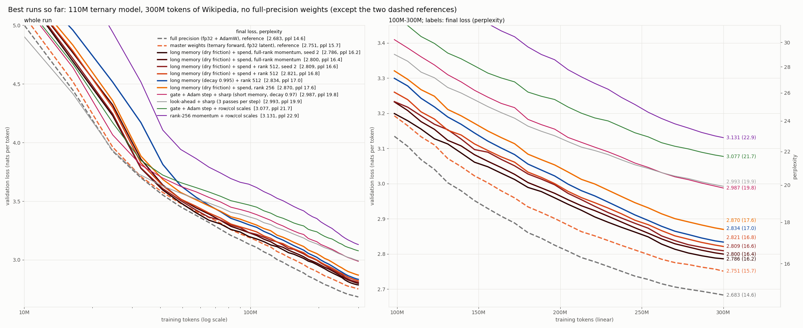

# Runs

*(regenerate with `python -m scripts.plots.plot_best`; every rule's formula: [FORMULAS.md](FORMULAS.md); run
directories: [RUN_INDEX.md](RUN_INDEX.md); what is running: [QUEUE.md](QUEUE.md))*

## Headline (30 Sep)

110M ternary model, 300M tokens of Wikipedia (Llama 32k), seq 2048, 32,768 tokens/step, from scratch, one seed.
No full-precision copy of the ternary weights; optimizer state sublinear in the parameter count.

| training rule | per-weight state | val loss | ppl |
|---|---|---|---|
| full precision (fp32 + AdamW) | 16 B | 2.683 | 14.6 |
| master weights (fp32 latent + STE + AdamW, BitNet b1.58) | 16 B | **2.751** | **15.7** |
| **long memory (dry friction 1/33) + rank 1024** (`gvsharp_dry_r1024_s0`) | trit only (+ 1024 (N+K) per layer) | **2.8198** | **16.8** |
| **long memory (dry friction 1/33) + spend + rank 512** (`gvsharp_dryspend_r512_s0`) | trit only (+ 512 (N+K)) | **2.8215** | **16.8** |
| long memory (decay 0.995) + rank 512 | trit only | 2.8339 | 17.0 |
| long memory (dry friction), rank 256 | trit only | 2.8812 | 17.8 |
| gate + Adam step + sharp, short memory (decay 0.97) | trit only | 2.9875 | 19.8 |
| look-ahead x2 + sharp (3 passes per step) | trit only | 2.9925 | 19.9 |
| gate + Adam step + row/col scales | trit only | 3.0773 | 21.7 |
| rank-256 momentum + row/col scales | trit only | 3.1307 | 22.9 |
| stateless flips from the gradient, cosine rate (26 Sep) | trit only | 4.591 | 98.6 |

All "trit only" rows share the sharp base where noted: sign gate, factored Adam step, row/column scales, additive
rank-16 float term with weight decay, per-head attention temperature ([FORMULAS.md](FORMULAS.md) section 2). The gap to
master fell from 0.33 (29 Sep morning) to **0.069**. What closed it: the momentum's memory (33 -> ~200-400 steps), then
rank 512-1024. Summary of what was tried, what failed and what is open: the "30 Sep summary" at the end.

## Phase 1 headline (26 Sep): stateless flips from the gradient

110M params, seq 2048, 32,768 tokens/step, 300M tokens, Wikipedia (Llama 32k), all
identical except the weight-update rule:

| training rule | per-weight state | val ppl |
|---|---|---|
| latent master + STE + AdamW (**ceiling**) | fp32 latent + 2x fp32 Adam = 12 B | **15.79** |
| stateless flips, cosine-annealed rate | trit only (1.58 bit) | **98.56** |
| stateless flips, linear-annealed rate | trit only | 101.38 |
| stateless flips, cosine to a 0.02% floor | trit only | 103.96 |
| stateless flips, constant rate (the old recipe) | trit only | 135.84 |
| stateless flips, frozen absolute threshold (Arm B) | trit only | 160.68 |
| *published 51M run, pre-beta, 1.1B tokens* | trit only | *1552* |

Master-free ternary costs **6.2x perplexity** against its own ceiling at identical
config. Annealing the flip rate closed 27% of the master-free gap for free; the
remaining gap is the real cost of having no accumulator.

Everything here is **stateless, master-free, 1.58-bit packed ternary** (no evidence
array, no latent/master weights). Perplexity = exp(per-token mean cross-entropy).

## Standard config (identical across every run below)

| | |
|---|---|
| preset | `small` — 110M params, 32k vocab (Llama tokenizer), dim 768, 12 layers |
| data | `data/wiki32k_{train,val}.bin` — Wikipedia 20231101.en, Llama 32k BPE, 398.5M train / 2.0M val tokens, **article-level split** |
| micro-batch | 16 × seq 2048 = 32,768 tokens per micro-step |
| budget | 300M tokens |
| schedule | phase 1: cosine, lr 3e-4 → 3e-5, warmup = steps/30, flip rate 2e-2, g_ref 3. **Since 24 Sep**: float tail fp32 + AdamW lr 1.5e-3 → 1.5e-4, warmup 305 steps; flip rate warmup 30 steps to 0.02, then cosine to 0; g_ref 3 |
| seed | 1337; data order from a dedicated RNG, identical across runs |
| eval | 30 fixed val windows × 16 × 2048 = 1.0M tokens, same windows every run |
| kernels | int8 forward + bf16 dx + dense dw, β = 1/√(K·ρ) |

**Not comparable to RESULTS.md**: those are 51M / GPT-2 50k vocab / seq 512 / 1.1B
tokens and predate the β and memory fixes.

## Phase 3b — batch sweep at 0-bit (running)

Only variable: tokens per optimizer step. Flips are accumulated across micro-steps
and applied once per step, so "tokens per step" means the same for the flip rule as
for the tail optimizer.

| run | grad accum | tokens/step | steps | wall clock | final val ppl |
|-----|-----------|-------------|-------|-----------|---------------|
| `p3b_acc1` | 1 | 32,768 | 9155 | 5.0 h | **135.84** (val loss 4.9115) |
| `p3b_acc4` | 4 | 131,072 | 2288 | 4.8 h | **140.09** (val loss 4.9423) |
| `p3b_acc4` +100M | 4 | 131,072 | 3051 (400M tok) | +1.5 h | **135.51** |
| `p3b_acc16` | 16 | 524,288 | 572 | **not run** | gate: acc4 did not beat acc1 |
| `p3b_acc64` | 64 | 2,097,152 | 143 | **not run** | gate: acc4 did not beat acc1 |

acc16/acc64 run only if acc4 beats acc1; otherwise the batch effect has saturated
at 32k tokens/step and the queue goes straight to the baseline. Caveat for acc64 if
it does run: at ~0.42% flips/step × 143 steps each weight flips ~0.6 times, so a bad
result there is ambiguous between "batch does not help" and "ran out of flips" —
never-flipped fraction is logged to separate them.

**Baseline** `p2_baseline`: master mode (latent + STE + AdamW), same 110M / seq 2048
/ 32,768 tokens per step / 300M tokens. Latent is **fp32, not bf16**: in bf16 an
AdamW step of ~1e-4 on a weight of ~0.02 falls below half the representable gap and
rounds away, and weight decay (~1e-6) always does — that would understate the very
ceiling the ternary runs are measured against.

### Result: batch does not help, and ~135 is a hard floor

At the same 300M budget, 4x batch was worse (140.09 vs 135.84) because it got 4x
fewer flip opportunities (2288 vs 9155 steps). Extending acc4 by 100M tokens at a
flat LR closed that gap exactly — 135.51 — so the deficit was update count, not
batch damage. But the larger batch bought nothing: it needs **33% more tokens to
reach the same place**.

val ppl trace, acc4: 156.6 -> 143.6 -> **140.09** (300M) -> 146.8 -> 140.0 -> **135.51** (400M)

Caveat on acc4's never-flipped: the tracking mask was a plain attribute, so it reset
when the run was resumed at step 2289 (fixed since — masks now persist in the
checkpoint with the step they started from). acc4's post-resume readings (9.2%) are
"since resume". Its true since-init value is **<= 1.029%**, the last correct reading
at step 2288; the per-weight history before that is unrecoverable, since a weight
that flipped and flipped back cannot be told from one that never moved.

So the floor is robust across everything varied: 32k and 131k tokens/step, 2288 to
9155 steps, 300M to 400M tokens, all landing at **135.5-135.8**. Throughout, the
flip rate never moved off 0.417-0.420%/step and never-flipped stayed ~0%.

Combined with the acc1 gradient SNR (65.7% sign agreement, cosine 0.535, SNR 1.52 —
not noise dominated), the spatial-averaging premise is dead. Gradient noise is not
what holds the model at ppl ~135; the flip rule's inability to stop flipping is the
candidate, which is what the arms test.

## Flip-rule arms (queued, all at the acc1 config: 32,768 tokens/step, 300M tokens)

The acc1 gradient SNR (below) rules out gradient noise as the binding constraint,
so these test the flip rule itself. `prob = min(|g| / (3·mean|g|), 1) × rate` is
normalized to the tensor's OWN mean, recomputed every step: if every gradient
shrinks, the ratio is unchanged and the same fraction keeps flipping forever.
Telemetry confirms it — 0.405% at step 0, 0.42% at step 8170, never-flipped 0.0%.

| arm | change | final val ppl |
|-----|--------|---------------|
| `p3b_acc1` (reference) | constant rate 2e-2 | 135.84 |
| **`armA_cosine`** | decay `rate` 2e-2 -> 0, cosine | **98.56** |
| `armA_linear` | decay `rate` 2e-2 -> 0, linear | **101.38** |
| `armB_absscale` | freeze the threshold denominator after 200 steps | **160.68** (flip rate ROSE 0.58% -> 0.80%) |
| `armA_cos_floor` | cosine 2e-2 -> 9.52e-4 (flip 0.42% -> 0.02%, never 0) | **103.96** |
| `armA_cos_600M` | cosine 2e-2 -> 0 stretched over **600M tokens** | **92.72** |
| `armA_cos_ef` | armA_cosine + spatial error feedback, alpha 0.01 | **156.01** |
| `armA_cos_lockout` | armA_cosine + per-weight flip lockout (once per 200 steps) | **102.66** |

### Result: the plateau was the flip rule, not gradient noise

Annealing the flip rate breaks a floor that batch, steps, tokens and LR all failed
to move — **135.84 -> 98.56**, a 27% cut, from one schedule on `rate`.

val ppl, armA_cosine: 188.3 -> 148.3 -> 139.6 -> 124.1 -> 115.5 -> 111.7 -> 106.8 -> 100.6 -> 98.7 -> **98.56**
flip rate: 0.405% -> 0.374% -> 0.247% -> 0.104% -> 0.013% -> **0.000%** at step 9153

Shape matters less than the annealing itself (cosine 98.56 vs linear 101.38, and the
two were within noise of each other until the back half, where cosine's hold-then-drop
banked its gains). Both were **still descending at the token budget**, so neither is a
converged number.

Never-flipped ended at 0.173% in armA_cosine: the gain comes from flipping *less*,
not from individual weights locking. NOTES.md predicted locking; that is not what
happens.

**Arm B failed in an informative way.** Freezing the denominator did make the flip
rate responsive — it had been pinned at 0.42% regardless of batch, steps, tokens or
LR — but it rose (0.58% -> 0.92%) instead of falling, because gradient magnitude
*grows* relative to its value at init rather than shrinking. The premise "as
gradients shrink, flip rate falls on its own" is wrong for this model. Any absolute
threshold calibrated during warmup at init is calibrated in the wrong regime.

Primary evidence is the flip-rate curve, not perplexity. If Arm B stays flat at
~0.42%, the hypothesis is wrong. A meaningful never-flipped fraction at the end of
Arm B would be the first time weights have ever settled.

### Does more data close the gap? Mostly no

The winning recipe at double the budget (cosine anneal stretched over 600M tokens,
~38 flips/weight vs ~19):

| | tokens | val ppl |
|---|---|---|
| `armA_cosine` | 300M | 98.56 |
| `armA_cos_600M` | 600M | **92.72** |

2x the tokens and 2x the flip budget bought **5.8 ppl (5.9%)**, with the curve
flattening (last four checkpoints: 95.3 -> 93.4 -> 92.8 -> 92.72). The gap to the
15.79 ceiling stays ~5.9x. The remaining gap is rule-bound, not data-bound.

Caveat: this varies tokens *and* anneal length together (the schedule must still
reach zero at the end), so it does not separate "more tokens" from "slower anneal".

### Result: keeping flips alive late is worse than stopping them

`armA_cos_floor` holds the flip rate at 0.02% instead of reaching zero, same shape
and same ~20 flips/weight budget otherwise: **103.96 vs 98.56**. The two track
within ~2 ppl until ~60% of the run, then diverge exactly where cosine's rate
collapses. So the late gains in `armA_cosine` were *caused by* flipping stopping,
not throttled by it — residual churn at convergence costs ~5 ppl.

## Phase 4 — performance

### 4a/4b: int8 tensor-core kernels

`mma.sync.aligned.m16n8k32.row.col.satfinite.s32.s8.s8.s32` confirmed in the PTX of
all three new kernels. Activations are already 8-bit, so the int8 **forward is exact
in int32** where the bf16 path rounded partial sums.

Per-layer, M = 16,384 tokens (ms, and speedup vs bf16):

| shape | fwd bf16 | fwd int8 | × | dx bf16 | dx int8 | × | dw dense | dw int8 | × | dw sign | × |
|---|---|---|---|---|---|---|---|---|---|---|---|
| 110M 768→2048 | 1.13 | 0.66 | **1.70** | 1.59 | 4.52 | 0.35 | 0.74 | 5.43 | 0.14 | 1.32 | 0.56 |
| 110M 2048→768 | 1.29 | 0.66 | **1.97** | 1.33 | 2.23 | 0.60 | 0.74 | 2.33 | 0.32 | 0.95 | 0.78 |
| 110M 768→768 | 0.45 | 0.27 | **1.68** | 0.52 | 1.59 | 0.33 | 0.29 | 2.09 | 0.14 | 0.59 | 0.50 |
| 27B 5120→13824 | 52.64 | 29.99 | **1.76** | 68.75 | 57.40 | 1.20 | 34.55 | 61.24 | 0.56 | 32.48 | 1.06 |
| 27B 13824→5120 | 63.14 | 33.54 | **1.88** | 82.15 | 49.38 | 1.66 | 36.09 | 40.31 | 0.90 | 32.19 | 1.12 |

Full model:

| model | combo | tok/s | peak |
|---|---|---|---|
| 110M (bs8×2048) | bf16 baseline | 16,311 | 1.65 GiB |
| 110M | **int8 fwd + bf16 dx + dense dw** | **18,230** (1.12×) | 1.65 GiB |
| 110M | int8 fwd + bf16 dx + sign dw | 18,046 | 1.65 GiB |
| 110M | int8 fwd + bf16 dx + cublas dw | 14,353 | 1.65 GiB |
| 110M | int8 fwd + int8 dx + cublas dw | 12,834 | 1.65 GiB |
| 27B (bs1×512) | bf16 baseline | 148 | 8.55 GiB |
| 27B | **int8 fwd + bf16 dx + dense dw** | **170** (1.15×) | 8.55 GiB |

(27B numbers here are a different code path from RESULTS.md — β + chunked loss head
+ int8 forward — so they are not a correction of the 172 tok/s figure there.)

### Two premises that did not survive measurement

1. **dx was already on tensor cores.** The bf16 `_dx_kernel` emits
   `mma.sync.aligned.m16n8k16...bf16`, so there was no CUDA-core penalty to recover.
   int8 dx *loses* at 110M (0.33–0.60×) because quantizing `gy` costs a full pass over
   [M,N]; it wins only at 27B shapes (1.20–1.66×), where the GEMM amortizes that pass.
2. **dw is the cheapest of the three, not the largest.** At 768→2048 it is 0.74 ms vs
   fwd 1.13 and dx 1.59. It is a plain dense GEMM on cuBLAS, and nothing hand-written
   beat it: Triton int8 0.14–0.32×, cuBLASLt int8 (`torch._int_mm`) 0.16–0.47×. The
   int8 variants lose to the quantization pass plus a transpose copy, not to the GEMM.
   **sign(dL/dy) ⊗ sign(x) as an XNOR outer product** reaches parity only at 27B
   (1.06–1.12×), and costs accuracy: 71% sign agreement with the dense dW, vs 99.6%
   for the int8 dw. It is implemented (`--dw_mode sign`) but is not the default.

4c (evidence offload to host RAM) does not apply: stateless runs have no evidence array.

### Memory fix (what actually enabled the larger batches)

`RMSNorm` upcasts to fp32, and the norms were called **outside** the checkpointed
region, so two fp32 [B,T,d] tensors per sublayer were retained instead of recomputed:
4.69 GiB at 32k tokens/step. Moving the norms inside the checkpoint, returning the
input dtype from `RMSNorm`, and chunking the output head dropped peak VRAM at
110M/seq2048/bs16 from **7.67 → 2.70 GiB**.

## Phase 0 findings (why the old numbers are suspect)

1. **No weight scale in the kernel forward.** Raw trits made each linear multiply RMS
   by 19–75×; attention logit std was 260–700 and entropy 0.008–0.018 nats (mean
   max-prob 0.99) — every head attended to exactly one token. Fixed by β = 1/√(K·ρ):
   rms(out) ≈ rms(in), entropy ≈ 4.6 nats on a fresh model.
2. **The float tail was pure bf16 with no master copy.** All 17 RMSNorm gains were
   still exactly 1.0 after 134k steps; weight decay (~6e-7/step) never did anything.
3. **The published bodies are statistically independent of init**: 66.6% of trits
   differ, exactly the value for two independent ternary draws at ρ=0.69.
4. **Gradient SNR is at chance for most layers** (`diag_snr.py`): mean sign agreement
   between batch halves 54.0% (stateless) / 50.8% (3-bit), where 50% is pure noise.
   wq/wk sit at 50% in every layer. Signal concentrates in the last two layers (to
   85%) and in the strongest 1% of entries (to 100%).
5. Eval itself was correct: article-level split, per-token averaging, no padding.
   Train/val 13-gram overlap on the new data is 4.80%, no val article >90% covered.

## Spatial error feedback (negative result)

(curve: see [figures/archive/all_runs.png](figures/archive/all_runs.png))

Idea: a stochastic flip moves a weight by a full level (or not at all) where the
rule's expectation is `p` of a level. Instead of storing that residual per weight,
push it into `grad_x` so earlier layers compensate within the same backward pass —
no per-weight state at all (`--err_feedback`, `--ef_alpha`; `_ef_backward` in
`bitnet/flip.py`). Config identical to `armA_cosine` otherwise.

**600-step probes** (val ppl at ~20M tokens, same schedule horizon as the full run):

| alpha | 0 | 0.01 | 0.03 | 0.1 |
|---|---|---|---|---|
| val ppl | 255.56 | 273.70 | 445.99 | 828.11 |

**Full run, alpha 0.01: 156.01 vs 98.56 without feedback** — 58% worse.

val ppl: 203.7 -> **435.7 -> 457.9** -> 319.9 -> 264.3 -> 217.6 -> 178.1 -> 160.2 -> 156.2 -> 156.01

The run blew up between 33M and 98M tokens, while flipping was heavy, and recovered
only as the cosine anneal drove the flip rate — and with it the feedback term — to
zero. Flip rate and never-flipped are indistinguishable from the no-feedback run.

Why it hurts: `E[fired] = p`, so the residual is **zero-mean flip-sampling noise**.
Rescaled to the size of `gy`, it adds noise to every earlier layer's gradient and to
the embedding's Adam updates, on top of a gradient whose SNR is already only ~1.5.
Damage grows steeply with alpha and is only small at 0.01 over a short horizon.

**The probe was misleading at 0.01**: 7% worse at 20M tokens (inside run-to-run
noise), 58% worse at 300M. The harm accumulates while flip activity is high, which
a 600-step probe barely samples. Short probes can rank alphas; they can't certify
that a small alpha is safe.

Two bugs found on the way, both fixed before the full run: the feedback term's sign
was inverted (it asked earlier layers to amplify the overshoot; verified by a
one-step toy where the old sign was 3.4x more harmful), and `grad_x` was taken at
post-flip weights.

## Per-weight flip lockout (negative result)

(curve: see [figures/archive/all_runs.png](figures/archive/all_runs.png))

Idea: nearly all flip work is undone, so let each weight flip **once**, then lock it
until the epoch ends (`--flip_lockout N --lockout_mode once`), or allow further flips
only in the same direction (`noreversal`). Two packed bitmasks, 1 bit/weight each.

**The premise is right.** Net displacement vs total flips, measured against the
reproducible init:

| run | flips/weight | net levels moved | wasted |
|---|---|---|---|
| constant rate | 38.2 | 0.896 | **97.7%** |
| cosine anneal | 19.0 | 0.895 | **95.3%** |
| cosine anneal, 600M | 38.2 | 0.897 | **97.7%** |

**The fix does not follow: 102.66 vs 98.56** (once per 200 steps, the best of three
screened variants, otherwise identical to `armA_cosine`). Slightly worse, not better.

Why the guarantee fails: a flip's direction comes from a noisy minibatch gradient
(65.7% sign agreement), so ~1 in 3 flips is wrong when made. Locking does not make
it right — it removes the chance to undo it, trading churn for frozen-in error.
Locking also cuts the flip budget (~26 vs 38 flips/weight at N=200), so "less churn"
and "less learning" are confounded.

### Methodological warning: single mid-training evals are unreliable here

The 1000-step screens ranked `once_t200` 175.47, `once_t1000` 177.82,
`norev_t1000` 190.68 against a 188.3 control — i.e. they suggested lockout *helps*,
the opposite of the full run. Taking the screen's own step-1000 checkpoint and
running single training steps from it, val perplexity moves

    175.5 -> 310.1 -> 249.3 -> 223.2 -> 341.7 -> 219.0 -> 417.1 -> 211.3 -> 340.0

a **2.4x spread between consecutive steps**, with the real optimizer state restored
and reproduced with the flip RNG advanced to its mid-run value. A single eval at one
step is therefore not a measurement of run quality while the flip rate is high, and
short screens cannot rank variants.

Unresolved: the logged traces of the long runs are smooth and monotone, which is not
consistent with that spread. The probe differs from real training in at least one way
(it re-loads a checkpoint and, for the no-lockout comparison, flips at a higher rate
than the run that produced it), so the spread may be an artifact of the probe rather
than the run. Final numbers are unaffected — all three were re-evaluated from their
checkpoints and match the logged values exactly (175.47 / 102.66 / 98.56) — but the
intermediate points of every val trace in this file should be treated as indicative
only.

## Scaling shape (log-log)

(curve: see [figures/archive/all_runs.png](figures/archive/all_runs.png))

Local power-law slopes of training loss vs tokens, fitted over the last three
quarters of each run:

| run | local alpha |
|---|---|
| master weights | **-0.152** |
| flips, annealed (600M) | -0.056 |
| flips, annealed (300M) | -0.063 |
| flips, constant rate | -0.013 |

Over the measured range the flip curves are **2.4-11x flatter** than the baseline,
so the gap widens with tokens rather than holding at a fixed ratio. Annealing
improves the local slope ~5x over a constant rate (-0.013 -> -0.063).

**This does not license an asymptotic claim.** Fitting the proper form
`L = L_inf + A*D^-alpha` is degenerate over this token range: the two annealed runs
are the same recipe and return L_inf = 0.00 (600M) and 3.34 (300M), trading floor
against exponent. Separating "master-free has a higher floor" from "master-free
scales worse" needs runs spanning more than the <1 decade of tokens available here.

## g_ref sweep (α screens, 300 steps each)

`g_ref` is the knee of the flip-probability ramp, in units of the layer's mean |g|:
`p = min(|g| / (g_ref·mean|g|), 1) · r`. Below the knee the rule is SGD (probability
proportional to the gradient); above it, signSGD (magnitude discarded).

Screened with local α fitted over steps 100-300 (3.3-10M tokens), ~11 min per run,
everything else identical to `armA_cosine`. Noise floor of the α estimate is ±0.003,
measured from two independent runs of one config.

| g_ref | α (100-300) | loss @300 | flip% | never flipped |
|---|---|---|---|---|
| 1 | -0.144 | 6.041 | 0.774 | 15.7% |
| **3** (default) | **-0.154** | 5.977 | 0.388 | 38.7% |
| **7** | **-0.155** | 5.981 | 0.184 | 62.1% |
| **10** | **-0.155** | 5.988 | 0.130 | 70.8% |
| 25 | -0.145 | 6.083 | 0.053 | 86.4% |
| 100 | -0.138 | 6.268 | 0.013 | 96.3% |
| *master weights* | *-0.222* | *5.205* | — | — |

**A broad flat optimum at 3-10, degrading gently on both sides.** g_ref=10 matches
the default's α and loss while flipping **3x fewer** weights, with 71% of the body
never moving at all — more evidence that most flipping is waste (see the 95-98%
wasted-motion measurement above).

**g_ref is not the lever on α.** A 100x sweep moves α by 0.017; the gap to master
weights is 0.068. The knee position — where signSGD takes over from SGD — is
second-order. On a real gradient, 4.66% of weights sit above the default knee and
carry 19.4% of the gradient mass, but clipping them costs only ~5% of the intended
movement; the ternary boundary absorbs far more (~33% of fires are no-ops, since
2/3 of weights sit at ±1 and half of those are pushed outward).

**Caveat:** these are early-α on a 300-step window during LR warmup, a screening
proxy. Its value (-0.154) is not the full-run α (-0.063), and a short proxy has
inverted before (the error-feedback probes).

## Does a one-level flip overshoot? — curvature, signal, and interaction

**Correction.** An earlier version of this section (commit 1eeb2e7) reported a median
Newton displacement of 0.034 flips and a "curvature gate" that cut flip damage 5-20x.
Those numbers are **invalid**: the dense surrogate used to compute them applied
activation quantisation without a straight-through estimator, so gradients could not
flow back through any layer's input quantisation. Its gradient had cosine **0.155**
with the real kernel-path gradient (only the last layer was right). With an STE the
surrogate matches: cosine **0.996** mean, 0.957 worst layer. Everything below uses
the fixed surrogate or the kernel path directly.

### Per-weight curvature cannot be estimated usefully this way
- **Hutchinson** (finite-difference HVPs, 64 samples): 50.1% of diagonal entries come
  out positive — exactly what random sign gives. The off-diagonal mass swamps the
  diagonal; the per-weight estimate is noise.
- **Gauss-Newton** estimators (MC-Fisher with labels sampled from the model,
  per-position or squared-gradient form; empirical Fisher) are resolvable and agree
  with each other, and say a flip is well inside the local quadratic regime: median
  |g|/H = 150 (converged) and 61 (step 1000). "Justified" (|g| > H/2) for 99.5%+.

### At a converged model there is no signal to follow
One batch's gradient vs a 64-batch average: cosine **-0.008**, and 0% of the selected
gradient survives on independent data. So every flip at convergence is noise-selected,
and flip-selection experiments there measure which noise flips are cheapest — not
which rule learns. The apparent wins of curvature gating, consistency, reverse
magnitude and row/column normalisation are all explained by **de-concentration**:
a control that picks a random tenth of the top-10x|g| pool does as well
(84,934 flips: +1.71 vs +1.83-2.32 for the "principled" criteria, +3.26 for top |g|).

### Mid-training the gradient is real, and the problem is interaction
At step 1000 (`lr_ctl`), one real training batch (32k tokens) vs a 16-batch average:
cosine **0.824**; 77-84% of the top-|g| gradient survives along the flip direction.

| flips (top \|g\|) | first-order | + GN curvature | **measured** |
|---|---|---|---|
| 849 | -0.069 | -0.068 | **-0.016** (improves) |
| 8,493 | -0.479 | -0.471 | **+1.123** |
| 84,934 | -2.573 | -2.527 | **+3.034** |
| 339,738 | -6.373 | -6.265 | **+4.523** |

A single flip does not overshoot — the top 849 improve held-out loss. The damage is
wildly super-linear in the number of simultaneous flips, which a diagonal model
(curvature-corrected or not) cannot see: it lives in how flips combine.

### The current rule oversteps by ~4x per step
One genuine stochastic step of the training rule at step 1000, swept over rate
(3 seeds, noise +-0.0002-0.0008):

| rate | flips/step | d held-out |
|---|---|---|
| 0.0002 | 3.5k | -0.0065 |
| 0.001 | 17.6k | -0.0306 |
| 0.002 | 35k | -0.0564 |
| **0.005** | **87k** | **-0.1087** |
| 0.0194 (current) | 340k | -0.0250 |
| 0.05 | 875k | +0.7716 |

Below the optimum the benefit is nearly linear in flip count; past it, interaction
eats it. The cosine schedule is still at 0.0194 at step 1000 — 4x above the one-step
optimum — which fits annealing being the only change that has ever helped.

### A greedy rate controller does not fix it
`--rate_search` line-searches a global rate multiplier every N steps (candidates share
random numbers, so flip sets are nested and the comparison is paired). It collapses:
the multiplier falls 0.5 -> 0.016 in 140 steps and learning freezes. One-step greedy
search always prefers small steps (short-horizon bias), and the `g_ref` sweep already
showed a 3x lower effective rate gives identical alpha over steps 100-300 — one-step
gains do not compose linearly over a trajectory.

### Result: the lower rate learns faster, then loses at the end

`armA_cos_r005` — `armA_cosine` exactly, but cosine-annealed from rate 0.005 (the
one-step optimum at step 1000) instead of 0.02, 300M tokens:

| tokens | rate 0.005 | rate 0.02 |
|---|---|---|
| 33M | 178.4 | 188.3 |
| 98M | 122.6 | 139.6 |
| 197M | 108.3 | 111.7 |
| 262M | 101.7 | 100.6 |
| **300M** | **100.95** | **98.56** |

(curve: see [figures/archive/all_runs.png](figures/archive/all_runs.png))

Ahead by up to 17 ppl through ~70% of training, then overtaken; the endpoint is 2.4
ppl worse, which is inside the single-run noise band for this study. So the one-step
optimum is real but does not buy a better endpoint: the 0.02 run passes through the
efficient rate region *late* in its anneal (its cosine reaches ~0.005 around step
6000), which is exactly when it makes its biggest gains, while the 0.005 run is by
then annealed far below it. The target is a schedule that tracks the per-step optimum
throughout — and the greedy controller shows that tracking has to be non-myopic.

### Direct measurement: curvature is concentrated in the high-gradient tail

No Hessian estimator. At step 1000, flip a random set of 1,200 weights drawn from one
|g| quantile band, compare the measured held-out change with the first-order
prediction from a 16-batch gradient, and solve for the effective curvature
(3 seeds per band):

| \|g\| band | first-order | measured | curvature cost / flip | Newton displacement |
|---|---|---|---|---|
| top 0.001% | -0.0625 | **-0.0043** | 4.9e-5 | **0.8 flips** |
| 0.01-0.1% | -0.0328 | -0.0263 | 5.4e-6 | 2.5 |
| 0.1-1% | -0.0134 | -0.0127 | 5.8e-7 | 9 |
| 1-10% | -0.0042 | -0.0042 | ~0 | linear |
| 20-50% | -0.0010 | -0.0010 | ~0 | linear |
| 50-90% | -0.0003 | -0.0003 | ~0 | linear |

- The typical weight is in the **linear regime**: outside the top ~1%, a flip's
  measured effect equals the first-order prediction exactly. There is no nearby
  optimum along its coordinate, only a gentle slope.
- Curvature scales roughly as **g^2**, so Newton displacement scales as 1/|g|. The
  largest-gradient weights are the ones nearest their optimum (a flip is ~right-sized
  at 0.8), and they are where selection damage comes from.
- Gauss-Newton's median of ~61 is roughly right for the typical weight but badly
  underestimates curvature in the tail. The 0.034 reported in 1eeb2e7 was an artifact
  of the broken surrogate.
- **Gain per flip peaks in the 0.01-0.1% band** (-2.2e-5 per flip) and is 6x lower in
  the top band. The ideal flip probability is a hump in |g|, not the current ramp and
  not the full inversion (which lost alpha). With H ~ c g^2, predicted gain per flip
  is |g| - c g^2.

**Correction to the last two bullets.** The "curvature" in the table above is a
*group* quantity (1,200 flips at once), so it includes the cross-terms between them.
Measured one weight at a time (next section), per-weight curvature is small everywhere
and the Gauss-Newton estimate is accurate. The tail's excess curvature is interaction.

### Hump-shaped flip probability (α screen, 300 steps)

`p = min(r · ĝ/g_ref · (1 - (ĝ/37)^1.8), 1)`: the ramp for ĝ < 3, higher for 3-37 (peak
at ĝ ≈ 21), zero above 37. Kernel verified against the formula on synthetic gradients.

| rule | α (100-300) | loss @300 | flip% | never flipped |
|---|---|---|---|---|
| armA_cosine (ramp) | -0.154 | 5.977 | 0.401 | 38.7% |
| hump | -0.154 | 5.997 | 0.436 | 35.6% |

Null. Reshaping the probability as a function of |g| alone does not help.

### Per-weight curvature, one weight at a time (`curv_single.py`)

At step 1000 (`lr_ctl`), 80 weights from each |g| quantile band. Each weight is moved
+1 and -1 trit level alone on the dense surrogate; the loss change gives
H = L₊ + L₋ - 2L₀ directly (4,096 tokens, float64 loss accumulation).

**The int8-activation loss is rough at single-weight scale.** Nudging one weight by
0.001 of a level changes the loss by up to 3e-4: a rounding boundary somewhere
downstream flips. That is larger than a single flip's first-order effect
(7e-7 to 1e-4), so on the rounded loss "per-weight curvature" measures rounding noise
(70-97% of weights appear to have negative curvature). The measurement was repeated
with activation rounding off: the smooth loss the STE gradient describes. There the
finite-difference slope matches autograd to 1.00 in every band.

| \|g\| band | d = \|g\|/H, median [q25, q75] |
|---|---|
| top 0.001% | 61 [42, 76] |
| 0.001-0.01% | 53 [38, 76] |
| 0.01-0.1% | 63 [39, 90] |
| 0.1-1% | 93 [44, 141] |
| 1-10% | 79 [52, 139] |
| 10-50% | 47 [26, 106] |
| 50-100% | 10 [4, 19] |

- **In isolation, no flip is right-sized.** Every weight's own optimum is ~50-90 levels
  away, including the top 0.001%. Only 5 of 560 have d in [0.5, 2], all in the bottom
  half with near-zero gradient. A rule "flip iff right-sized by own curvature" flips
  essentially nothing.
- **Gauss-Newton diagonal is accurate per weight:** EF and MC-Fisher vs measured H:
  Spearman 0.88, scale 1.1-1.3. The earlier "61" was right.
- So the ~30x effective curvature of a 1,200-flip tail group, and the overshoot of the
  full step, come from **off-diagonal interaction**: tail weights share rows, columns
  and tokens, so their effects add coherently. Whether a flip is right-sized depends on
  what the other flips in the same step do.

### Look-ahead filter: judge each flip against the others

Propose flips with the current rule (Δ), take the gradient g' at W + Δ on the same
batch, keep flip i iff Δᵢ(gᵢ + g'ᵢ) < 0 (its midpoint slope still descends: the exact
per-flip contribution of a quadratic, given all the other flips). Stateless: g lives
only within the step. One extra forward/backward per step. (`lookahead_test.py`,
one step at step 1000, 16 held-out batches; control = random subset of the proposal
with the same count per layer.)

| rate | proposal | midpoint filter (kept) | random, same count |
|---|---|---|---|
| 0.0194 (current) | -0.029 | **-0.124** (82%) | -0.088 |
| 0.005 | -0.106 | -0.106 (99%) | -0.105 |
| 0.05 | +0.825 | +0.062 (61%) | +0.194 |

The filter selects better than chance and, at the current rate, beats the best rate
alone (-0.106). At rate 0.005 there is almost no interaction left to remove. Caveat:
a one-step greedy gain; the greedy rate search also looked good in one step and then
collapsed in training.

**α screen (300 steps, `--lookahead 1`, otherwise armA_cosine):**

| rule | α (100-300) | loss @300 | val @300 | flip% | never flipped |
|---|---|---|---|---|---|
| ramp (armA_cosine) | -0.154 | 5.977 | - | 0.401 | 38.7% |
| hump | -0.154 | 5.997 | 5.948 | 0.436 | 35.6% |
| **look-ahead** | **-0.178** | **5.691** | **5.633** | 0.233 | 57.1% |
| look-ahead, 2 passes | -0.181 | 5.610 | 5.536 | 0.171 | 61.0% |
| *master weights* | *-0.222* | *5.205* | - | - | - |

The first stateless change to move α outside the noise: it closes 35% of the gap to
master weights. It is not the lower flip count (g_ref=10 flips 0.13% and stays at
-0.155). The filter keeps 55-60% of proposals throughout, so interaction is large for
the whole window. Cost: 1.8x wall-clock per step (3.8 s vs 2.1 s); comparisons here
are per token.

A second pass (`--lookahead 2`: re-check the survivors at the filtered point, keeping
46-51% of proposals) lowers loss by a further ~0.08 but leaves α within noise
(-0.181 vs -0.178), at 5.8 s/step vs 3.8. The full run uses one pass.

### `armA_cos_la1`: look-ahead, full schedule, stopped at step 3000 (98M tokens)

armA_cosine exactly (9155-step cosine schedule), plus `--lookahead 1`. Stopped at step
3000 on request. Two machine power-offs (steps 2660 and ~2780) were resumed from
checkpoints; metrics were trimmed to the checkpoint step each time (pre-crash files
kept). Resume does not restore the data-sampler RNG, so batch order after step 2546
differs from an uninterrupted run; val batches are fixed.

| val ppl @ step | look-ahead | armA_cosine | armA_cos_r005 | master |
|---|---|---|---|---|
| 1000 (33M tok) | **124.9** | 188.3 | 178.4 | 41.4 |
| 2000 (66M) | **96.5** | 148.3 | 137.0 | 28.7 |
| 3000 (98M) | **80.1** | 139.6 | 122.6 | 24.3 |

- At 98M tokens it is below the reference's *final* ppl (98.56 at 300M), so it gets
  there with about 3x fewer tokens (~2x less compute at 1.8x per step).
- It does not bend toward 1e8 tokens. Local train-loss slope: 30-60M -0.081 (reference
  -0.065, master -0.149); 60-98M **-0.112** (reference -0.069, master -0.138). Every
  earlier flip rule flattened in this window; this one steepens.
- Keeps 55-60% of proposed flips throughout; flips 0.19-0.20% of weights per step.

### `la_rwarm`: flip-rate warmup in the early phase (stopped at step 790)

Look-ahead exactly as `armA_cos_la1`, but the flip rate ramps linearly from 0.02 to
**0.04** over the LR warmup (305 steps, 10M tokens), then cosine from 0.04 to 0. Run in
parallel from an isolated code copy (the flags `--rate_peak/--rate_warmup/--snap_every`
are not in the repo yet); the main run was paused with SIGSTOP meanwhile. Stopped at
step 790 on request: the outcome was clear.

Same batches as the main run for these steps. The warmup run flips ~0.5% of weights per
step vs ~0.24% (the filter keeps 63-65% of proposals, so the extra flips are applied),
yet train loss is **slightly worse throughout** (+0.01 to +0.027, 50-step average).

The 10-30M-token window is where master pulls away (slope -0.26 to -0.28 vs -0.12 for
look-ahead) and most of the final offset forms. Doubling the movement there does not
help, so the gap is not about *how much* moves but *what* moves: master makes some
coordinated change there that independent flips don't. Next: structural probes (e.g.
induction/copying loss on repeated sequences) on snapshots, master vs flips.

### `la_r0ramp`: flip rate ramped from 0 (stopped at step 313, 10M tokens)

Look-ahead as `armA_cos_la1`, but the flip rate ramps 0 -> 0.02 over the LR warmup
(305 steps), then cosine. Hypothesis: full-rate flips from step 0 act on uninformative
early gradients (39% of weights flipped by step 150), lock in a poor configuration and
"squash" all later progress (look-ahead = master's curve compressed 1.67x in log-loss).
Same batches as the main run; isolated code copy; main run paused meanwhile.

| step (tokens) | ramp from 0 | main | master |
|---|---|---|---|
| 10 (0.4M) | 10.44 | 9.25 | 10.14 |
| 100 (3.3M) | 7.09 | 6.85 | 6.57 |
| 200 (6.6M) | 6.33 | 6.11 | 5.70 |
| 313 (10.3M) | 5.79 | 5.67 | 5.17 |

Starts ~1.2 behind, closes to 0.12 at 10M with 2-5x fewer flips per step. Local slope
6.6-10M: ramp **-0.176**, main -0.145, master -0.201. Steeper than the main run as the
rate reaches full, but not yet ahead. Not decided: needs to run past ~20-30M tokens to
see whether it crosses and whether the steeper slope persists.

### `la_fastramp_lr15`: fast flip-rate ramp + master's float-tail LR (316 steps, 10M tokens)

Two changes vs `armA_cos_la1` (not yet separated): flip rate ramps 0 -> 0.02 over **30
steps** (~1M tokens, where master's loss cliff happens) instead of starting at 0.02, and
the float tail (embeddings, norms) uses **master's LR schedule: peak 1.5e-3, floor
1.5e-4** (5x the flip runs' 3e-4). Note: the old 305-step ramp already matched master's
LR warmup step for step; master drops fast at only 3-10% of peak LR, flips don't at
3-10% of peak rate. Same batches as the main run.

| step (tokens) | fast ramp + tail LR | main look-ahead | slow ramp | master |
|---|---|---|---|---|
| 40 (1.3M) | **7.34** | 8.39 | 9.13 | 7.59 |
| 60 (2.0M) | **6.71** | 7.99 | 8.47 | 7.16 |
| 100 (3.3M) | **6.32** | 6.85 | 7.09 | 6.57 |
| 200 (6.6M) | 5.71 | 6.08 | 6.28 | 5.68 |
| 300 (9.9M) | 5.29 | 5.65 | 5.77 | 5.15 |

It reproduces master's early cliff and is at or below master from 1M to ~5M tokens;
at 10M it is 0.37 below the main look-ahead run and 0.14 above master (main: 0.50).
But after ~3M tokens its slope equals the main run's (-0.136, -0.148 vs -0.152, -0.145;
master -0.21, -0.20): the early offset shrinks, the later squash is untouched in this
window. Val at step 316: 5.197.

### `armA_cos_la1` stopped at step ~6160 (202M tokens), resumable

Val ppl by step: 1000 124.9 | 2000 96.5 | 3000 80.1 | 4000 70.9 | 5000 67.2 | 6000 **65.3**
(reference armA_cosine: 188.3 | 148.3 | 139.6 | 124.1 | 115.5 | 111.7; its final 98.56).
It does bend, later than the plain rule: val slope (log loss vs log tokens) per 1000
steps -0.097, -0.070, **-0.038**, the last equal to the reference's -0.038 in the same
window. Look-ahead kept a large constant lead but stopped pulling away around
130-200M tokens. Stopped on request to spend the GPU on the early-phase findings
(fast ramp + master's tail LR); checkpoint at step 6119 kept.

Five whole-machine hard resets during this run (no GPU/thermal errors logged, GPU at
80-86 C each time). Added `--resume_temp` to the thermal guard (pause at `--max_temp`,
wait until `--resume_temp`); 84/79 costs ~3% throughput, 75/70 ~33%.

## Probes: what master learns in the early phase that flips don't (`bitnet/probe.py`)

`--probe` logs, on fixed data: loss given only the last K tokens (K = 1, 8, 64, 512),
in-context copying (loss on a random 64-token sequence minus loss on its exact repeat),
the spread of the context-independent (unigram) part of the logits, final-norm gain and
embedding norm. Reference levels on this data: unigram cross-entropy **7.18**, bigram
~5.0-5.2 (computed from counts). Runs: `probe_master` (p2_baseline config) and
`probe_fast` (look-ahead + fast ramp + master's tail LR), 161 steps (5.3M tokens) each.

- The flip runs' first pause (~9.25) is at the level of a partially learned unigram
  (p^0.2); master's first pause (~7.2) is the full unigram plateau.
- **Logit scale is not the difference** once the tail LR matches: unigram-logit spread
  1.52 vs 1.62 at 2M tokens, final-norm gain ~1.0 in both.
- **Long-context use is not missing**: loss(K=8) - loss(K=512) is *larger* for flips
  (0.57 vs 0.38 at 3.3M, 0.72 vs 0.44 at 4.9M).
- **Copying shows a sharp transition in master that flips lack.** Both first learn to
  expect tokens *not* to repeat (repeat loss > first-copy loss). Master snaps out of it
  between 2.0M and 2.3M tokens (-0.52 -> -0.05 -> +0.01), exactly where its unigram
  pause ends and its steeper second descent begins. Flips stay at -0.2 to -0.34 through
  4.9M (-0.06 at the last point, 5.3M, possibly the start of it).
- Val at 5.3M: master 5.79, flips 5.76 — equal here; master pulls ahead after ~6M.

Reading: master goes through a sharp internal change (overriding the don't-repeat prior
by attending to earlier occurrences, a precursor of induction) at the end of its pause,
and its steeper regime starts there. Flips learn context gradually and greedily (more
long-context statistics early) and have not made that change by 5M tokens.

## Float tail precision: the norm gains never trained (bug) — `--tail_fp32`

In kernel (flip) mode the float tail (embeddings + all 25 RMSNorm gains) has been bf16
+ bf16-state Adam since the start. RESULTS.md §0 described this exact bug as fixed; it
was not fixed in the kernel path used for every run in this file. Near 1.0 bf16 spacing is 2^-7; an Adam step (~lr <=
1.5e-3) is below half of it, so **every norm-gain update rounded away: all gains are
exactly 1.0000 in every flip run** (master, fp32: mean 1.53 on the final norm after
300M tokens, per-layer means 0.40-1.06, channels from ~0 to 2.3). Embedding updates
(values ~0.02, spacing ~1.2e-4) also round away once the LR decays below ~1e-4, i.e.
the last third of the 3e-4 runs. Every flip-vs-master comparison so far carries this
handicap; flip-vs-flip comparisons are unaffected (all had it).

`--tail_fp32`: tail in fp32 with AdamW (weight decay 0.1 on embeddings, 0 on norms),
exactly master's treatment. 10M-token screen `la_fast_fp32tail` = `la_fastramp_lr15`
with the fp32 tail, same batches: gains now train (1.012 at 3.3M, master ~1.006);
loss slightly lower and the gap growing slowly (-0.014 at 3.3M, -0.019 at 9.9M, -0.022
at 10.4M), val 5.188 vs 5.197. Slopes unchanged over 3-10M (-0.134/-0.144 vs
-0.136/-0.143; master -0.21/-0.20): the gains barely move this early (~1%), so the
effect should matter mainly in long runs.

## Night of 2026-09-24: cross-batch look-ahead

### Per-step efficiency, calibrated (`scripts/analysis/efficiency_test.py`)

One look-ahead step at rate 0.02 on checkpoints from 3M to 23M tokens. First-order
prediction of the kept flips, from the training batch's gradient ("intended") and from
a held-out gradient ("real"), against the measured held-out loss change. Calibration:
applying only 1% of the kept flips (a linear step), measured / held-out prediction =
0.95-1.15 at every checkpoint, so the prediction is right. (An earlier version
multiplied by beta twice; its magnitudes were off by ~1/beta.)

| full step | range over checkpoints |
|---|---|
| signal = real / intended | **0.17-0.35** |
| survive = measured / real | **0.06-0.44** |
| efficiency = measured / intended | **1-12%** |

Two separate leaks: about two-thirds of what a step intends is batch noise (the
same-batch look-ahead filter cannot see it), and of the real part most is lost to the
flips' interaction and curvature even after filtering.

### Cross-batch look-ahead (`--lookahead_xbatch`), 10M-token screens

The look-ahead pass(es) use a fresh batch (separate RNG stream; training batch order
unchanged), so a flip survives only if it is downhill on both batches. Base config
`la_fast_fp32tail` (same-batch look-ahead, val 5.1883).

| run | passes | val @ 10M |
|---|---|---|
| `la_fast_fp32tail` | 1, same batch | 5.1883 |
| `la_xb1` | 1, cross-batch | 5.1817 |
| **`la_xb2`** | **2, each on a new batch** | **5.0021** |

A second pass only pays once it brings new evidence: two cross-batch passes are the
largest single gain of any change so far (-0.19).

### `overnight_full`: full-schedule run of `la_xb2` (stopped at step ~3980, 130M tokens)

Look-ahead 2 passes cross-batch + fast rate ramp + fp32 tail + master's tail LR,
9155-step schedule. Thermal guard 82/76 C for 8 h without a crash (~7.4 s/step);
switched to 84/79 at step 3965 and the machine reset within minutes of the restart.

| val ppl @ step | overnight_full | look-ahead (same batch) | plain flips | master |
|---|---|---|---|---|
| 1000 | **80.4** | 124.9 | 188.3 | 41.4 |
| 2000 | **55.7** | 96.5 | 148.3 | 28.7 |
| 3000 | **50.8** | 80.1 | 139.6 | 24.3 |

Best stateless result by far, but flattening: val slope 2000->3000 is -0.057
(same-batch look-ahead -0.103, master -0.123). Extrapolating the slope plus the usual
anneal drop puts the end of the schedule around ppl 33-40.

### Flip rate with cross-batch look-ahead: r = 0.125 (`la_xb2_r0.125`, stopped at ~200 steps)

`la_xb2` with peak rate 0.125 instead of 0.02 (GPU clocks locked at 2000 MHz, see below).
Far ahead at the very start (-0.85 at 0.15M tokens), crosses to worse at ~1M, then
~+0.19 behind at 6M, while applying 5-7x the flips per step (0.7-1.0% vs 0.12-0.16%).
Same shape as same-batch look-ahead at 0.04 (-0.37 early, +0.28 at 10M): the
cross-batch filter absorbs more of the extra proposals, but a low rate is still
covering for the rule and the filter. Stopped on request.

### Machine resets (2026-09-24)

The laptop (ASUS ROG, i9-14900HX, RTX 4080 Laptop, 330 W adapter) hard-reset many times
under training load. A 50 ms fsync'd sensor log (`scripts/diag/blackbox.py`) over five
crashes: no power-supply signal (adapter online, no GPU power brake, battery never
discharging); CPU turbo off did not help (hottest core 78 C, still crashed); the plain
flip config that ran for hours on earlier days crashed after 73 s. Every crash: GPU at
84-88 C and 135-160 W, the last one with GPU *hardware* thermal slowdown active. GPU
clocks locked at 1800-2000 MHz (~100-120 W, 73-83 C) ran stably. Reading: degraded GPU
cooling (dust / pads); training now runs with the GPU clock locked at 2000 MHz
(~7.85 s/step for cross-batch look-ahead x2).

## Learned per-row and per-column scales (`--rc_scale`, `--rc_lr`)

Each ternary layer gets a learnable row scale r (N floats) and column scale c (K floats),
so W_ij = beta * r_i * c_j * q_ij: every weight gets its own magnitude from N + K floats
per layer (175k at 110M = 0.2% of params; 7.4M at 27B = 0.033%, ~113 MiB with AdamW).
Applied as y = r * ternary(c * x): kernels unchanged, the flip gradient comes out scaled by
r_i c_j. fp32, no weight decay, start at 1 (step 0 identical). 10M screens on the plain
cosine flip rule (`armA_cosine` config and batches):

| run | scale LR | loss @300 (vs plain) | alpha 100-300 | val @316 | scales after 316 steps |
|---|---|---|---|---|---|
| plain (`armA_cosine`) | - | 5.977 | -0.154 | - | - |
| `rc_plain` | float-tail LR (3e-4, in warmup) | +0.007 | -0.152 | 5.907 | 1.000 +- 0.004 (did not move) |
| **`rc_plain_lr1e2`** | **constant 1e-2** | **-0.051** | **-0.160** | **5.850** | mean 0.97, std 0.18-0.19, range ~0-2.2 |

With their own LR the scales spread like master's norm gains do, and the plain rule gains
-0.05 in loss and 0.006 in alpha (above the +-0.003 noise). Next: on cross-batch look-ahead.

On the best config (`la_xb2`: cross-batch look-ahead x2 + fast ramp + fp32 tail + master's
tail LR), `la_xb2_rc` adds `--rc_scale --rc_lr 1e-2`: train loss -0.04 to -0.05 throughout
(same batches), **val 4.974 vs 5.002** at 10M tokens. The two improvements add up.

## Ternary MLP testbed (`scripts/mlp/mlp_lab.py`)

Next-token prediction on wiki32k from the previous 8 tokens (embeddings -> concat ->
3-layer ternary residual MLP, 4.5M ternary weights -> tied head), 4096 examples/step x
6000 steps (25M examples), the same ternary layer classes as the LM. Minutes per run.

| run | final val | slope, first 10% | slope, last 90% |
|---|---|---|---|
| master (BitNet STE + AdamW) | 4.351 | -0.107 | -0.079 |
| stateless flips | 5.003 | -0.090 | -0.045 |
| flips + cross-batch look-ahead x2 | 4.877 | -0.098 | -0.040 |

It reproduces the LM's gap: all three track until ~4e5 examples, then flips bend to about
half master's slope (0.045/0.079 = 0.57, LM ~0.6). Look-ahead gives an offset (-0.13), not
a better slope, as on the LM. A single-factor stretch fits less cleanly than on the LM
(14-16% deviation): the MLP's bend is sharper. Usable as a ~100x cheaper testbed for the
flip rule and the filter.

MLP at flip rate r = 1 (6000 steps, same schedule): plain flips 5.625 (stuck near 7.2 until
the cosine pulls the rate down), cross-batch look-ahead x2 **5.115**, against 5.003 / 4.877 at
r = 0.02 and master 4.351. The filter makes r = 1 survivable but not good: a low rate still
wins by 0.24.

## Master-weights oracle: does the gradient predict the discrete moves that work?

`scripts/mlp/oracle.py`, ternary MLP LM. Master (BitNet STE + AdamW) is trained to a
checkpoint; its trits T0 are recorded; master continues N steps; the trits that changed are
the oracle moves. Candidate signals, computed at the checkpoint, scored per layer then averaged:
direction accuracy of -sign(signal) on moved trits (chance 0.5), AUC of |signal| for "moves
within N steps", precision among the top-k (k = number of oracle moves).

| checkpoint, horizon | trits moved | grad (1 batch) dir / AUC | grad (32 batches) dir / AUC | master momentum dir / AUC | latent near its rounding boundary AUC |
|---|---|---|---|---|---|
| 1.2M, 10 steps | 4.0% | 0.58 / 0.53 | 0.64 / 0.54 | 0.73 / 0.58 | **0.97** |
| 1.2M, 200 steps | 20.7% | 0.53 / 0.50 | 0.55 / 0.51 | 0.56 / 0.52 | 0.80 |
| 8.2M, 10 steps | 2.8% | 0.56 / 0.52 | 0.64 / 0.55 | 0.78 / 0.61 | **0.98** |
| 8.2M, 200 steps | 11.9% | 0.53 / 0.51 | 0.58 / 0.52 | 0.53 / 0.51 | 0.90 |

- The current gradient says almost nothing about **which** trits a working optimizer
  changes (AUC 0.50-0.55), and only weakly **which way** (55-64% direction agreement, even
  averaged over 32 batches to remove the noise). Denoising barely helps: the signal is weak
  as a guide to discrete moves, not just noisy.
- Master's moves are almost entirely explained by where its latent weight already sits
  (close to a rounding boundary: AUC 0.90-0.98) -- i.e. by accumulated history, which a
  stateless rule does not have. Momentum (the history of gradients) predicts direction better
  than any single gradient at short horizons (0.73-0.78).
- Caveat: "close to the boundary" partly restates how master works (a trit changes when the
  latent crosses). The informative part is how little the present gradient carries.

**With look-ahead.** Same checkpoints: flips proposed by the rule (r = 0.02) from the one-batch
gradient, then filtered by cross-batch look-ahead x2 on the ternary network at T0. Precision =
fraction of chosen flips that master also makes (same direction) within the horizon:

| checkpoint, horizon | proposal | look-ahead kept (~74% of proposals) | top-|g|, same count | random move |
|---|---|---|---|---|
| 1.2M, 10 | 0.039 | 0.042 | 0.042 | ~0.020 |
| 1.2M, 200 | 0.178 | 0.184 | 0.166 | ~0.103 |
| 8.2M, 10 | 0.023 | 0.025 | 0.030 | ~0.014 |
| 8.2M, 200 | 0.098 | 0.101 | 0.094 | ~0.059 |

Look-ahead barely changes which moves are chosen relative to master (+0.002-0.006): its gain
in loss comes from removing flips that hurt together, not from picking master's moves. All
gradient-based selections are ~2x random. Caveat: master's moves are one working solution, not
the only good moves.

## How master moves vs stateless flips (`scripts/mlp/geometry.py`)

Ternary MLP, both runs from step 300 (1.2M examples), windows of N steps. sum(g) = sum of
the gradients each run saw along its own trajectory. Cosines per layer, averaged.

| window | master: latent move vs -sum(g) | master: trit change vs -sum(g) | master: trits changed | flips: trit change vs -sum(g) | flips: trits changed |
|---|---|---|---|---|---|
| 1 step | 0.37 | 0.04 | 0.5% | 0.08 | 0.4% |
| 10 | 0.52 | 0.13 | 4.0% | 0.04 | 4.1% |
| 50 | 0.79 | 0.30 | 10.4% | 0.02 | 17.3% |
| 200 | **0.90** | **0.44** | 20.7% | **0.006** | **42.7%** |

(Master's single Adam step vs -g: 0.40.)

- Master moves along the **summed** gradient: its latent displacement lines up with -sum(g)
  better and better as the window grows (0.90 over 200 steps), and its trits follow (0.44).
- Stateless flips do the opposite: each step is somewhat aligned with its own gradient (0.08,
  more than master's per-step trit change), but the moves do **not** add up. Over 200 steps
  the net trit change is orthogonal to the summed gradient (0.006) while touching twice as
  many trits (43% vs 21%). The flips are a random walk around the pull, not a drift along it.

Along the full 6000-step run (every 200 steps; window = last 200 steps, cumulative = since step 0):

| examples | master window: float / trits | master cumulative: float / trits | master trits changed / window | flips window | flips cumulative | flips trits changed / window |
|---|---|---|---|---|---|---|
| 0.8M | 0.49 / 0.29 | 0.49 / 0.29 | 25% | 0.06 | 0.06 | 40% |
| 4M | 0.90 / 0.39 | 0.64 / 0.40 | 16% | 0.004 | 0.034 | 42% |
| 12M | 0.90 / 0.32 | 0.82 / 0.48 | 10% | -0.001 | 0.031 | 30% |
| 25M | 0.92 / 0.18 | 0.82 / 0.48 | 3% | -0.006 | 0.029 | 0.1% |

Master's float weights move along each window's summed gradient at ~0.90 for the whole run
and its trits keep ~0.48 of the cumulative direction. The flips' 200-step moves have zero
alignment with the summed gradient from 1.6M examples on, while changing 30-42% of all trits
per window: a random walk, which only stops when the annealed rate stops it.

With cross-batch look-ahead x2 (same test): window alignment 0.046 at 0.8M, 0.011 at 4M,
~0 from ~8M on, cumulative 0.024-0.037; trits changed per window 23-31% (vs 30-42% for plain
flips). Look-ahead touches fewer trits but its moves do not add up either: it removes
harmful combinations within a step, not the random walk across steps.

## Is the accumulated gradient low-rank? (`scripts/mlp/lowrank.py`)

MLP master run; sum of the gradients over a 200-step window, rank-r truncated SVD per layer
(layers 1024-2048 wide). "keeps" = cos(rank-r sum_g, sum_g); "vs master moves" = cos with
master's trit change over the window (full sum_g: 0.437 at 1.2M, 0.347 at 8.2M).

| rank | keeps (1.2M / 8.2M) | vs master moves (1.2M / 8.2M) | one batch's gradient keeps |
|---|---|---|---|
| 1 | 0.23 / 0.18 | 0.06 / 0.03 | 0.44 / 0.31 |
| 16 | 0.63 / 0.51 | 0.21 / 0.14 | 0.89 / 0.73 |
| 64 | 0.87 / 0.76 | 0.34 / 0.23 | 0.97 / 0.90 |
| 256 | 0.98 / 0.95 | 0.42 / 0.32 | 0.995 / 0.98 |

The summed gradient is only moderately compressible, and less so than a single batch's
(the summed direction spreads over more components as training goes on). Rank 64 keeps
~0.8 of it and ~70% of its alignment with master's moves; at 27B layer sizes rank 64 would
be ~1.7% of per-weight memory.

## Rank-64 momentum as the flip signal (`--lowrank 64`, MLP)

Each ternary layer keeps a rank-64 momentum of its gradient, M ~ U V^T (M <- 0.97 M + g,
re-compressed with one subspace-iteration step; 64 floats per row and per column), and flips
with the usual rule and rate but driven by M instead of the current gradient.

| run (6000 steps) | final val | slope, last 90% |
|---|---|---|
| master | 4.351 | -0.079 |
| **flips, rank-64 momentum** | **4.670** | **-0.062** |
| flips + cross-batch look-ahead x2 | 4.877 | -0.040 |
| plain flips | 5.003 | -0.045 |

Closes half of the flip-to-master gap (0.333 of 0.652) and, unlike look-ahead, raises the
slope (-0.062 vs -0.045), at plain-flip cost per step: accumulating the direction across steps
is the lever. Memory r*(N+K) per layer (~12% of per-weight at MLP size, ~1.7% at 27B shapes).

Rank-64 momentum + cross-batch look-ahead x2 (`mlp_lowrank64_xb2`): **val 4.615** (momentum
alone 4.670, look-ahead alone 4.877, master 4.351) -- 60% of the flip-to-master gap closed.
The two add up but only partly (-0.055 from look-ahead on top of momentum, vs -0.126 on top
of plain flips), at 3 passes per step.

Rank 256 (`mlp_lowrank256`, no look-ahead): **val 4.577** (rank 64: 4.670; master 4.351) --
65% of the flip-to-master gap closed with one pass per step. Memory 256*(N+K) per layer
(50% of per-weight at 1024x1024; ~7% at 27B layer shapes).

Hashed (count-sketch) momentum at the memory of rank 64 (`mlp_sketch64`: 64*(N+K) buckets per
layer, ~8 weights per bucket, fixed random signs): **val 4.804**, slope in between. Better than
plain flips (5.003) and look-ahead (4.877), clearly worse than rank-64 momentum at equal memory
(4.670): a random projection of the flattened gradient loses to the adaptive low-rank one,
because it ignores the outer-product structure and adds per-weight reconstruction noise.

### How does the random walk learn at all? Frozen baseline and projected geometry (MLP)

**Frozen ternary baseline** (`mlp_frozen`, flip rate 0: ternary layers stay at their random
init, only embeddings and norms learn): **val 5.066**. Plain flips reach 5.003, so they add only
9% of what master's ternary layers add (master 4.351). Relative to this baseline: look-ahead x2
26%, rank-64 momentum 55%, rank-256 momentum 68%, rank-256 + look-ahead 74%.

**Projected geometry** (each 200-step window's trit move projected onto the top-r singular
directions of that window's summed gradient): share of the move inside them, and alignment there.

| examples | master: share top16 / top64, cos there | plain flips | look-ahead x2 |
|---|---|---|---|
| 1.6M | 0.25 / 0.40, cos 0.97 / 0.93 | 0.03 / 0.08, cos 0.30 / 0.18 | 0.03 / 0.09, cos 0.46 / 0.30 |
| 8.2M | 0.14 / 0.26, cos 0.96 / 0.92 | 0.03 / 0.08, cos 0.14 / 0.08 | 0.02 / 0.08, cos 0.17 / 0.11 |
| 20.5M | 0.10 / 0.18, cos 0.96 / 0.89 | 0.02 / 0.08, cos -0.01 / 0.00 | 0.02 / 0.08, cos -0.05 / -0.03 |

Master puts a large share of its move in the important directions and moves along them almost
perfectly. The flips put a random-sized share there (~what a random move would) with weakly
positive alignment early that fades to zero: they barely move where it matters. Most of what the
plain-flip model learns is the float embeddings adapting to near-random ternary layers.

## LM 10M screens: frozen baseline, plain flips, rank-256 momentum

Same config and batches (fast rate ramp, fp32 tail, master's tail LR; `screen_10m.sh`):

| run | val @ 10M |
|---|---|
| `lm_frozen` (flip rate 0: ternary layers stay random) | 5.698 |
| `lm_plain` (plain flips, r = 0.02) | 5.684 |
| `la_fast_fp32tail` (same-batch look-ahead) | 5.188 |
| `la_xb2` (cross-batch look-ahead x2) | 5.002 |
| `lm_lowrank256` (rank-256 momentum, r = 0.02) | **6.047** |

- On the LM too, **plain flips add almost nothing over frozen random ternary layers** (-0.014):
  at 10M tokens the plain-flip model is the embeddings/norms adapting to random ternary layers.
  Look-ahead adds 0.5-0.7 on top of that, so on the LM it is doing real work.
- Rank-256 momentum at the plain rate is **worse than frozen** (stalls at the unigram level for
  ~80 steps). Accumulation turns the flips' random walk into a drift, so the same rate is a much
  larger effective step; the 12-layer transformer does not tolerate it. Needs a lower rate.

### Rank-256 momentum on the LM: rate and angle-scaled decay

| run | val @ 10M |
|---|---|
| `lm_lowrank256` (r = 0.02, beta 0.97) | 6.047 |
| `lm_lowrank256_r04` (r = 0.04) | 6.072 |
| `lm_lowrank256_r1` (r = 0.1) | stopped at step ~175: same 7.3 stall, off it at ~150 |
| `lm_lowrank256_adapt` (beta_t = 0.97 * cos(g, M), `--lr_adapt`) | 6.293 |

- Rate does not move the stall: 0.02, 0.04 and 0.1 all sit at 7.3 until step ~150.
- cos(g_t, M_{t-1}) (logged by `--lr_adapt`): +0.25..+0.49 for steps 1-7 (flip rate still ~0),
  negative from step ~9 on, -0.5..-0.7 in 99.8% of layer-steps, all 84 layers. Not noise: each
  step's flips overshoot along the dominant directions and the next gradient points back
  (ping-pong). Fixed beta keeps pushing through it (likely the stall); the adaptive decay
  reflects M every step.
- The adaptive decay removes the stall (train 6.87 vs 7.28 at steps 80-100) but decreases
  slowly after; train ends level with fixed beta (6.19 vs 6.21) and val is worse (6.29).
  Plain flips stay ahead throughout (5.73).

### Momentum + look-ahead on the LM: first momentum that helps

| run | val @ 10M |
|---|---|
| `lm_lowrank256_xb2` (rank-256 momentum, fixed beta 0.97, proposes; cross-batch look-ahead x2 keeps) | **4.892** |
| `la_xb2_rc` (look-ahead x2 + row/col scales) | 4.974 |
| `la_xb2` (look-ahead x2, proposals from g) | 5.002 |
| `lm_lowrank256_adapt_xb2` (decay 0.97*cos + look-ahead x2) | stopped at step 200, +0.02 behind la_xb2 |

- `--lr_adapt` turned momentum off: from the logged cosines, mean |beta_t| 0.58 (no look-ahead)
  and 0.16 (with look-ahead), i.e. effective memory 2.5 and 1.2 steps instead of 33.
- With look-ahead, fixed-beta momentum no longer fights the gradient: cos(g, M) stays at 0 +- 0.05
  (vs -0.5..-0.7 without). Behind la_xb2 early (+0.15 at step 20), crosses at step ~170, -0.08
  train at 290 and still widening; val -0.110.
- Half the flips: 0.06-0.08% of trits per step vs 0.12-0.16% for la_xb2; ~19% of momentum
  proposals survive the filter (la_xb2: ~40%).
- State: 256*(N+K) floats per layer = 44.8M floats (179 MB fp32) for 85M ternary weights.

### How does the momentum help? (diagnostics at 11M and 210M tokens, branches from step 340)

Per-step diagnostics (`--lr_diag`, `docs/figures/archive/m_diag.png`): |M|/|g| reaches 33 (fully
consistent) at ~0.6M tokens and falls to ~4 (the pure-noise level for beta 0.97) by ~4M; the top 1%
|M| agree in sign with the batch gradient 85% early, ~48% from 1M on; the gradient after the
proposed flips points back (cos(g, g') ~ -0.3 from 3M on: the proposal overshoots); the share of g
inside M's rank-256 subspace falls from ~0.9 to 0.58-0.65 for w_gate/w_up by 10M.

8-batch snapshots (`scripts/analysis/m_snapshot.py`): at step 340 (11M) cos(gbar, M) = -0.003 and
the top 1% |M| agree in sign with gbar 49%; at 210M, 0.05 and 57%.

Proposal precision at step 340 (`scripts/analysis/proposal_precision.py`, truth = 16-batch mean):
M proposals are downhill on the true gradient 49.5% of the time (g proposals 67.9%); after the
look-ahead x2 filter, M-kept 56.9% vs g-kept 65.0%, true gain per flip 0.86e-7 vs 2.3e-7. The
filter keeps 15% of M proposals vs 41% of g proposals.

60-step branches from step 340, same batches (`docs/figures/archive/branch340.png`):

| branch | flips | reversals | val |
|---|---|---|---|
| A: M proposes, look-ahead x2 (r 0.02) | 4.00M | 0.8% | **4.679** |
| B: g proposes, look-ahead x2 (r 0.02) | 7.73M | 3.9% | 4.714 |
| C: g proposes, look-ahead x2 at r 0.0072 (flip count of A) | 3.75M | 1.9% | 4.687 |

At this point the momentum works mostly as a step-size reducer: its proposals carry no direction
information, so the filter rejects most of them and fewer flips get through (the flips overshoot
together). Matching the flip count with plain gradient proposals recovers ~75% of the A-B gap;
the rest (0.008) is within noise, with somewhat fewer reversals for A.

### `lm_lowrank256_xb2_100M` finished: 300M tokens, val 3.127 (ppl 22.8)

Rank-256 momentum proposes, cross-batch look-ahead x2 keeps, full 9155-step schedule (paused and
resumed three times, exact resumes). Val ppl 44.6 @ 33M, 30.9 @ 98M, 25.1 @ 197M, **22.8 @ 300M**;
master 41.4 / 24.3 / 18.2 / 15.8. The best stateless-flip run before this: ppl 92.7 at 600M (plain
flips), 50.8 at 131M (look-ahead only). Token stretch vs master (tokens needed for the same loss):
on train loss ~1 at 10-20M, ~1.8 by 100M and flat to 170M (the last point the fit reaches); on val
loss 1.17 @ 41M, 1.73 @ 98M, 2.05 @ 156M, 2.17 @ 205M, 2.63 @ 300M (master reached 3.127 at 114M;
that master point is mid-schedule while ours is fully annealed). So the exponent is still somewhat
worse than master's; the growth slows but has not stopped.

### Late in the 300M run (where the slope falls behind master): what M and the filter do

Per-step diagnostics, 216-300M tokens (`--lr_diag --track_reversals` from the resume at step 6617;
reversals are counted from there), against 3-11M from the diagnostic reproduction:

| tokens | cos(g,M) | cos(g,g') | abs(M)/abs(g) | top-1% sign agree | g in M subspace | la kept | reversals |
|---|---|---|---|---|---|---|---|
| 3-7M | -0.006 | -0.29 | 4.4 | 0.49 | 0.86 | 17% | - |
| 8-11M | -0.019 | -0.25 | 3.8 | 0.48 | 0.79 | 20% | - |
| 217M | +0.011 | -0.06 | 4.2 | 0.51 | 0.67 | 28% | 0.7% |
| 246M | -0.032 | 0.00 | 3.5 | 0.47 | 0.67 | 38% | 11.9% |
| 279M | -0.008 | +0.02 | 3.8 | 0.49 | 0.68 | 40% | 15.8% |

Proposal precision against the 16-batch true gradient, 11M vs 205M (`precision_340.txt`,
`precision_6243.txt`; proposals at rate 0.0199 in both, 4x the run's own rate at 205M):

| | M proposals | M kept | g proposals | g kept |
|---|---|---|---|---|
| 11M | 0.495 | 0.569 | 0.679 | 0.650 |
| 205M | 0.525 | 0.530 | 0.554 | 0.552 |

- M is accumulated noise throughout (abs(M)/abs(g) at the pure-noise level ~4.1 for beta 0.97,
  cos(g, M) ~ 0), a little better than chance late (0.525).
- The single-batch gradient loses precision (0.68 -> 0.55): per batch the noise energy is ~11x the
  signal at 210M (cos(g, gbar) = 0.44 over 8 batches).
- Late, the look-ahead filter no longer separates good from bad flips (kept precision = proposal
  precision); it only limits how many flips go through. 12-17% of late flips undo an earlier change.
- Reading: every flip decision uses a fixed, small sample (one batch for g; M ~ noise; two batches
  for the filter) while the per-batch signal shrinks, so decisions drift toward coin flips and the
  run random-walks more. Master's latent weight averages the gradient over many steps before a trit
  moves, so its decisions stay informed. The averaging has to grow as the signal fraction falls.

Profile of one step (laptop, momentum + look-ahead x2, `--profile 5`): GPU-bound on the laptop.
~60% of GPU time is memory-bound elementwise work in eager PyTorch (copy_ 19%, mul 17%, div, round,
clamp 6% each, abs, add 3% each: activation quantization, dtype copies, gradient capture), GEMMs
~34% (mm 13%, int8 dx 11.5%, int8 forward 9%), attention 7%. ~22,600 kernel launches per step,
which is what limits the 4090 (the sync removal alone gave 1%).

### Where do the trits actually move? (`scripts/analysis/move_alignment.py`, `checkpoints/move_alignment.txt`)

Net displacement D = T_end - T_start between checkpoints, against the momentum M and the true
gradient gbar (16-batch mean) at the start/end of the window. Share of moved trits that went the way
-sign(R) says (chance 0.5), and cos(D, -R) (chance ~0.001 in ~1M dims):

| window | moved | vs gbar start | vs gbar end | vs M start | vs M end |
|---|---|---|---|---|---|
| 11M, 60 steps, momentum (branch A) | 4.5% | 0.566 / 0.032 | 0.487 / -0.007 | 0.678 / 0.083 | 0.694 / 0.087 |
| 11M, 60 steps, g proposals (branch B) | 8.3% | 0.514 / 0.010 | 0.491 / -0.007 | 0.499 / -0.002 | - |
| 205-300M, 2911 steps, momentum run | 22.3% | 0.511 / 0.012 | 0.491 / -0.011 | 0.516 / 0.015 | 0.486 / -0.018 |

- Early, the momentum run's moves follow M (68-69%) and, less, the true gradient at the start (57%);
  gradient-proposal moves follow the true gradient only 51% over the same 60 steps, although each
  step's kept set is 65% precise at the start point: per-step flips chase each batch and cancel out
  in the net move, while M's persistence makes the net move carry an averaged direction.
- Against the gradient at the END of a window every run is slightly below chance (0.49): after a
  move the gradient points back at it (overshoot/recoil).
- Late (205-300M), 22% of trits moved but the net move follows neither M nor the true gradient at
  either end (0.49-0.52): a near random walk, which is where the slope falls behind master.

### Later-checkpoint branches (4090): 300 steps from ckpt_6243 (205M), identical batches

| branch | flips | reversals | val |
|---|---|---|---|
| A: M proposes, look-ahead x2 (run's rate) | 5.65M | 2.7% | **3.2005** |
| B: g proposes, same rate | 12.96M | 6.2% | 3.3417 |
| C1: g proposes, 0.5 x rate | 7.45M | 3.6% | 3.2882 |
| C2: g proposes, 0.35 x rate (flip count of A) | 5.41M | 2.7% | 3.2624 |

Late, M is more than a step-size brake: at a matched flip count and the same reversal rate, M's
proposals beat the gradient's by 0.062 over 300 steps (at 11M the matched control closed ~75% of
the gap). Per step the gradient's proposals are more precise (0.554 vs 0.525), so M's value is in
how its flips add up over steps (it keeps pushing the same weights the same way).

### Ours vs master along the run: window measurements (`docs/figures/archive/windows.png`)

Replay of the momentum + look-ahead run from 11M to 205M (`r4090_replay_11M_205M`, reproduces the
original: 3.2146 vs 3.209 at 205M) and master re-run with tracking (`master_tracked`, 2.751 vs 2.759),
same batches; 100-step windows (3.3M tokens):

| tokens | net moves along -sum(g): ours / master | cos(D, -sum g) | moves along -momentum | net moved per window | trits changed per step | reversals |
|---|---|---|---|---|---|---|
| 11-23M | 0.72 / 0.96 | 0.15 / 0.38 | 0.61 / 0.58 | 8.0% / 15.3% | 0.09% / 0.49% | 10% / 81% |
| 23-49M | 0.70 / 0.96 | 0.14 / 0.36 | 0.60 / 0.57 | 8.9% / 13.6% | 0.10% / 0.43% | 38% / 90% |
| 49-98M | 0.70 / 0.96 | 0.13 / 0.34 | 0.59 / 0.57 | 8.4% / 11.3% | 0.10% / 0.34% | 61% / 95% |
| 98-147M | 0.69 / 0.96 | 0.11 / 0.30 | 0.59 / 0.57 | 6.6% / 8.7% | 0.07% / 0.26% | 70% / 97% |
| 147-205M | 0.68 / 0.96 | 0.07 / 0.25 | 0.60 / 0.57 | 3.6% / 6.1% | 0.04% / 0.18% | 73% / 98% |

(our reversals are counted from 11M, so the early rows are low by construction.) Master's latent
(float) move has cos 0.82-0.85 with -sum(g); master's gradient is anti-correlated from window to
window (cos -0.10 to -0.13; coherence 0.5-0.64 < 1), ours is not (~0; coherence ~0.8).

- 96% of master's net trit changes in a window go the way the window's summed gradient says, from
  11M to 300M; ours 72% falling to 68%, and the cosine is 2.5x lower at 11M and 3.6x lower at 200M.
- Master's momentum (Adam m) predicts its net moves no better than our M does (57% vs 60%): the
  difference is not a better momentum. Master's trit changes are threshold crossings of the latent
  weight, which integrates every update since the last crossing; a crossing that sticks over a
  window is by construction one the accumulated gradient supports. Our flips are per-step decisions
  (M proposal + two-batch filter), and ~30% of the net moves oppose the window's gradient.
- Master changes 4-5x more trits per step, 81-98% of them reversals (latent weights sitting on a
  threshold flip back and forth), and still moves more trits net per window (1.5-1.9x).

### Moves of the first k steps vs the 100-step summed gradient, ours vs master (`docs/figures/archive/window_curves.png`)

Windows opened at 11M, 66M, 131M, 197M (ours: 100-step continuations from the momentum run's
checkpoints; master: `curve_master`, a master run measuring at the same steps, same batches).

| start | run | k=1 | 2 | 5 | 10 | 20 | 50 | net 100 | later-only k=1 | k=50 |
|---|---|---|---|---|---|---|---|---|---|---|
| 11M | ours | 0.51 | 0.51 | 0.52 | 0.54 | 0.58 | 0.66 | 0.73 | 0.47 | 0.49 |
| 11M | master | 0.51 | 0.53 | 0.57 | 0.61 | 0.68 | 0.81 | 0.96 | 0.45 | 0.50 |
| 66M | ours | 0.45 | 0.45 | 0.47 | 0.49 | 0.53 | 0.62 | 0.70 | 0.40 | 0.44 |
| 66M | master | 0.46 | 0.47 | 0.51 | 0.56 | 0.64 | 0.79 | 0.96 | 0.43 | 0.44 |
| 197M | ours | 0.42 | 0.44 | 0.45 | 0.47 | 0.51 | 0.59 | 0.67 | 0.38 | 0.43 |
| 197M | master | 0.46 | 0.47 | 0.51 | 0.56 | 0.64 | 0.78 | 0.96 | 0.43 | 0.44 |

- Single steps: master's moves are no better than ours against the window's gradient (0.46 vs
  0.42-0.45, both at or below chance). Against the later batches alone both are below 0.5: the
  gradients that follow a move push it back (overshoot), master (~0.43) somewhat less than ours
  (~0.38-0.40).
- The difference builds with k: at 10 steps 0.56 vs 0.47-0.49, at 50 0.78 vs 0.59-0.62, over the
  window 0.96 vs 0.67-0.73. Master's trit at the end of a window is the rounding of a latent weight
  that has integrated the window's (Adam-normalized) gradient, so its net moves follow that gradient
  by construction; unsupported moves are undone (81-98% of its flips are reversals). Our trit state
  is not a function of the accumulated gradient: a flip, once made, stays unless a later step happens
  to propose and keep the reverse.

### Full-precision reference (`fp32_baseline`, 4090): val 2.683 (ppl 14.6) at 300M

Same 110M architecture, data and schedule, plain nn.Linear (no ternary, no activation quantization), fp32
weights + AdamW. Master (ternary, latent weights) reaches 2.759 (ppl 15.8): ternary with master weights
costs ~8% perplexity at this size, and master's curve tracks full precision closely throughout (token
stretch ~0.95). Ours: 3.127 (ppl 22.8).

### Test bench at step 4000 (`checkpoints/testbench_4000/`, `scripts/analysis/testbench.py`)

True gradient = mean over 256 batches, every parameter (halves agree at cos 0.998; one batch has cos 0.43
with it). Flip sets at the run's rate there (0.0120), scored against it:

| set | flips | precision | D . gbar | cos(D, -gbar) | held-out dL |
|---|---|---|---|---|---|
| M proposals | 208k | 0.48 | +3.6e-3 | -0.001 | +0.19 |
| M + look-ahead x2 (the run's step) | 48k | 0.59 | -5.0e-3 | +0.003 | -0.0007 |
| g (one batch) proposals | 215k | 0.63 | -5.1e-2 | +0.015 | +0.28 |
| g + look-ahead x2 | 98k | 0.61 | -9.6e-3 | +0.004 | -0.0005 |
| random, same count as the run's step | 48k | 0.48 | +8e-4 | -0.001 | +0.011 |
| top 48k by abs(gbar), downhill ("oracle") | 48k | 1.00 | -0.63 | +0.40 | +7.48 |

The top-abs(gbar) flips each lower the loss alone (~-5e-5) but together are catastrophic (100 of them:
+0.009; 1000: +0.42): they cluster in shared rows/columns (62 of the top 100 in layers.0.attn.wq, on two
input columns), so their effects stack. Alignment with the gradient alone is not the objective.

Master at the same step (`checkpoints/testbench_4000_master/`, `scripts/analysis/testbench_master.py`):
true gradient over the same 256 batches at master's own point (w.r.t. the latent weights), then one and
ten real AdamW steps on the same single batch; D = change of master's trits (held-out dL here includes the
float tail's update):

| set | trits changed | precision | cos(D, -gbar) | held-out dL |
|---|---|---|---|---|
| master, 1 step | 218k | 0.537 | +0.003 | +0.0011 |
| master, 10 steps | 1.76M | 0.594 | +0.022 | -0.0014 |
| ours, 1 step (M + look-ahead x2) | 48k | 0.587 | +0.003 | -0.0007 |

Per step master's trit moves are no better aimed than ours (0.54 vs 0.59) and it makes 4.5x as many.

### Why ours never forms induction heads (random-token copy test, attention patterns)

Copy gain on random token sequences repeated twice (loss on the first copy minus loss on the repeat): master
0.15 at val 3.35, 0.19 at 3.19, 0.83 at 3.06, 2.79 at 2.97, 4.03 at 2.75 (300M); full precision 2.77 at 300M;
ours 0.000 at every checkpoint to 300M (val 3.13). Natural-text copy is ~1.9 for all.
Attention patterns (`scripts/analysis/induction_heads.py`): master has sharp previous-token heads early (L1 0.96,
L2 0.87 at 66M; four layers >= 0.8 by 164M) and induction heads from ~98M (L5, L7-L9, up to 0.44). Ours has one
moderate previous-token head (L2 ~0.69, decaying to 0.32 by 300M) and no induction heads. Our q, k stay at rms
~1.1-1.4 (master ~2-2.4 at 66M): logits ~2-4 vs up to 10, attention entropy 2.5-3.8 vs 0.85 (L1). Master's
effective weight trits * gamma can grow; ours, trits * beta with beta = 1/sqrt(K rho), cannot, and the shared
attention RMSNorm gain (which also scales v) did not grow either.

Fixes (`scripts/analysis/heads_over_time.py`):
- `--qk_temp` (learnable per-head temperature), 60M: a previous-token head forms (0.97 at 25M) but is unstable
  (0.52-0.97), temperatures reach 1.7x; no induction; val 3.553 at 60M (baseline ~3.56).
- `--lowrank_mag add:4` (float low-rank term on every ternary matrix), 300M run `magadd_full`: previous-token
  head 0.94 at 66M, ~1.00 from 131M, stable (one layer >= 0.8; master has four); copy gain grows to 0.15-0.23
  (164M-295M) but no induction head (attention score ~0.02); val **3.082** (ppl 21.8) vs 3.127.

From-scratch 20M screens, final val (baselines: 4.2919 / 4.3045 / 4.2817, mean 4.2927, spread 0.023):
additive magnitude 4.2407 (-0.052), sign gate 4.2669 (-0.026), gate + vnorm 4.2708, multiplicative 4.2825,
vnorm 4.2814, spend 4.2960, refresh 4.2985, stuck mask worse (+0.1 by 12M, stopped).

## 27-28 Sep: no look-ahead, why momentum is not aligned, step size

**Look-ahead.** Momentum without look-ahead (`nola_lab`) sits at the unigram level for 2-5M tokens (the blocks
build one large input-independent vector that drowns the token embeddings: the output is the same at every
position), then runs at about master's slope and forms general induction heads from ~98M (3.05 nats at 295M vs
master 3.17 at 300M). Look-ahead from the start never forms them; switching it on after 131M keeps them and gains
a constant ~0.2 on loss within ~500 steps; switching it off costs a spike (flips 0.10% -> 0.38% per step). On
natural text all runs copy equally well (repeat gain ~1.9-2.0 nats); the look-ahead runs only fail on random
tokens. At equal text read, batch 48 without look-ahead = batch 16 without look-ahead, both better than look-ahead.
Decision: no look-ahead in new runs unless a new reason appears.

**Why momentum is not aligned with the true gradient** (bench at `nola_lab` 164M, 64-256-batch true gradients):
- with frozen weights rank-256 momentum reaches cos 0.92 with the true gradient after 33 batches (compression loses
  nothing); with flips at the trained rate it is +0.03-0.05 where the flips are chosen;
- one step of flips turns the true gradient to 0.45-0.82 of its previous direction (the whole landscape moves,
  not only the flipped weights; weights that never flipped are as misaligned);
- the step overshoots: along the 33-step move the held-out loss is lowest at half of it (-0.070 vs -0.010);
- mechanisms (V1 target point, V2 correction by the measured effect of each move, your design) do not change the
  step, so at the trained rate none improves alignment; at 1/4 of the rate one step barely moves the landscape
  (0.92-0.97) and alignment is plain +0.101, V2 +0.169, your design +0.134, V1 +0.061;
- a learned selector over momentum's proposals (features available at flip time) keeps a half with 69% downhill
  flips (54% for all), held-out loss change -0.010 vs -0.003 for a random half and ~0 for all proposals.

**Step size.** Plain momentum at 1/4 of the flip rate (branch at 131M) is 0.155 better than the trained rate
after 25M tokens (3.342 vs 3.497 at step 4750). Running: 1/4 from scratch, 1/8, your design at 1/4, and
accumulate-then-flip (see QUEUE.md). Figures: `archive/categories/step_size.png`, `archive/categories/mechanisms.png`,
`archive/bench_mechanisms.png`, `archive/toy_mechanisms.png`, `archive/induction_text.png`.

### 28 Sep evening: flip choice and the wave (nola_lab @ step 5000, 164M)

Flip choice along the true gradient (64 batches): flip n entries by one trit in -sign(T), n in multiples of one
normal step (~0.18M flips), held-out loss change:

| choice | 0.25x | 0.5x | 1x | 2x | 4x |
|---|---|---|---|---|---|
| largest \|T\| (global per layer) | +0.419 | +0.871 | +1.747 | +2.752 | +3.819 |
| largest \|T\| per row | +0.118 | +0.147 | +0.208 | +1.354 | +3.210 |
| largest \|T\| per column | +0.328 | +0.367 | +0.453 | +1.586 | +3.314 |
| consistency \|T\|/std = Adam \|T\|/rms | +0.100 | +0.382 | +1.039 | +2.153 | +3.501 |
| Adam, row x column factored | +0.025 | +0.172 | +0.594 | +1.590 | +3.542 |
| proportional (trainer's rule) | -0.019 | -0.022 | +0.016 | +0.227 | +0.916 |
| random | -0.013 | -0.021 | -0.024 | +0.014 | +0.221 |

Top-\|T\| flips at 1x put 36% of the flips into the busiest 1% of rows. The loss from top-k choices is mostly
concentration (per-row capping cuts it 8x); the trainer's proportional rule is close to random. The "low size" arm
of `flip_choice2` is broken (float precision made it flip every movable weight) and is left out.

Wave test (41 steps of real flips from the saved momentum, true gradient from 32 batches before each step):

| lag | 0 | 1 | 2 | 3 | 5 | 8 | 10 | 16 | 20 | 30 |
|---|---|---|---|---|---|---|---|---|---|---|
| cos(T_t, T_t+lag) | 1 | +0.692 | +0.187 | **-0.200** | -0.100 | +0.013 | -0.068 | -0.096 | +0.049 | +0.091 |
| cos(M_t, T_t+lag) | -0.063 | -0.174 | -0.188 | -0.135 | -0.063 | -0.081 | -0.046 | -0.037 | -0.038 | -0.011 |

The three main directions of the gradient sequence change sign every 3-4 steps (10-13 sign changes in 41 steps:
period ~6-8 steps). The steady direction is 4.3% of the gradient's energy. Momentum (memory ~33 steps) averages over
4-5 swings and anti-predicts the next 1-3 gradients. Controls running: frozen weights (rate 0) and 1/4 rate.

Wave controls. Frozen weights (rate 0): cos(T_t, T_t+lag) = 0.950 at every lag 1-40 (the 32-batch noise floor),
cos(M_t, T_t) = +0.815: no swing without flips. 1/4 rate:

| lag | 1 | 2 | 3 | 5 | 8 | 10 | 13 | 16 |
|---|---|---|---|---|---|---|---|---|
| cos(T_t, T_t+lag) | +0.837 | +0.710 | +0.528 | +0.121 | -0.239 | -0.227 | -0.027 | +0.089 |
| cos(M_t, T_t+lag) | -0.009 | -0.079 | -0.129 | -0.161 | -0.098 | -0.047 | -0.017 | -0.033 |

Main directions: 3-6 sign changes in 41 steps (period ~16-20 vs ~6-8 at full rate). The swing is made by the flips;
its period grows about as 1/sqrt(rate) while its depth stays, the signature of heavy-ball momentum underdamped in
stiff directions (omega ~ sqrt(rate * curvature) ~ 0.9 per step at full rate, damping 1 - beta = 0.03). Lower rates
slow the swing; they do not remove it.

### 29 Sep 02:00: per weight, does the momentum reach zero and turn at a reversal? (nola_lab @4500, old rule, 41 steps, 25% of coordinates)

- 45.4% of the flips made each step move uphill on the true gradient (44-46% in every step).
- Momentum sign = true-gradient sign on only 41.7% of weights (46.6% weighted by |T|): more often wrong than a coin.
- At a reversal of the true gradient on a weight (both sides above median size), the momentum is 6.9x the true
  gradient (median): ~7 steps of pull to cross zero. Momentum already on the new side 35.6%, follows in 1-3 steps
  21.1%, 4+ steps 21.6%, never within the window 21.7%.
- Along the two main swing directions the momentum's component follows the gradient's ~2 steps late (correlation
  +0.94 / +0.86 at lag 2) and is small: a few % of the momentum's direction.
- Only 24.7% of the momentum's size (squared) lies in the span of the 41 true gradients; the rest points where the
  true gradient never goes (accumulated batch noise). This, not the swing, sets |M| and the flip count, which is why
  a per-layer divisor could not see the swing.

### 29 Sep 02:20: per-direction swing arms (nola_lab @4500, all coordinates, 41 steps)

| arm | held-out change | flips / step | cos(T_t, T_t+1 / +2 / +3) | momentum vs next gradient (lag 1) |
|---|---|---|---|---|
| old rule | -0.0116 | 165k | +0.66 / +0.12 / -0.25 | -0.17 |
| **sign gate** (flip only where this batch agrees with M) | **-0.0851** | 103k | +0.28 / +0.28 / +0.18 | -0.04 |
| factored Adam step (`vnorm 0.99`) | -0.0303 | 173k | +0.71 / +0.26 / -0.13 | -0.16 |
| per-row speed reference (`rowema 0.995`) | -0.0157 | 182k | +0.65 / +0.12 / -0.23 | -0.17 |

The gate removes the swing (no negative lag) and gains 7x more in 41 steps; control queued (old rule at x0.62 rate,
the gate's flip count). Found while wiring it: without look-ahead the trainer had ignored `--lr_gate` and
`--lr_vnorm` in every run since look-ahead was dropped. Now training: `gate_rc_s0` (pintail),
`gatevnorm_rc_s0` then `vnorm_rc_s0` (4090), `gate_rc_s0_seed2` (shoveler, after `rc_s0_seed2`).

### 29 Sep 03:30: the swing inside real training; speed reference fails; seed spread

- Probe on `rc_s0` @5000 (its own checkpoint, from scratch with row/column scales, old rule, 41 steps, 25%):
  cos(T_t, T_t+lag) +0.78 / +0.43 / +0.05 / **-0.27** at lags 1 / 2 / 3 / 5 (period ~10 steps at rate 0.0086);
  momentum vs next gradients -0.15 / -0.20 / -0.19 at lags 1-3; held-out -0.0072 over 41 steps, 136k flips/step.
  The swing is not an artefact of branching from `nola_lab`: it is there in a run trained from scratch.
- `speedref_rc_s0` (per-layer slow speed reference) = `rc_s0`: 3.1458 vs 3.1454 at step 8750. As its swing test
  predicted (a per-layer divisor cannot see the swing).
- Seed spread: `rc_s0_seed2` 3.3225 vs `rc_s0` 3.3237 at step 6250, 3.578 vs 3.581 at 3500: ~0.003.
- 4090 swing tests (gate rate control, gravity, gradient units) had died silently at their start; relaunched 03:28.

### 29 Sep 04:30: the gate's rate control, gravity, and the finished speed reference

Swing tests at nola_lab @4500 (41 steps, 25% of coordinates; old rule: -0.0116 at 165k flips/step, lag-3 -0.25,
45.4% of flips uphill, |M|/|T| at a reversal 6.9, never follows 21.7%):

| arm | held-out | flips/step | cos(T_t, T_t+1 / +2 / +3 / +5) | uphill flips | reversal: follows in 1-3 / never | \|M\|/\|T\| at reversal |
|---|---|---|---|---|---|---|
| old rule at x0.62 rate (the gate's rate control) | -0.0595 | 103k | +0.75 / +0.41 / +0.06 / -0.19 | 44.8% | 15.1% / 22.8% | 10.0 |
| sign gate (02:20) | -0.0851 | 103k | +0.28 / +0.28 / +0.18 / +0.12 | - | - | - |
| asymmetric gravity 0.5 (measurement only) | -0.0620 | 172k | -0.12 / -0.10 / +0.16 / +0.01 | **38.7%** | **51.6% / 5.8%** | **1.9** |

- The 41-step held-out change strongly favours fewer flips (x0.62 rate alone: -0.060 vs -0.012), so arms must be
  compared at matched flip counts. At 103k flips the gate beats the rate control by 0.026 and removes the swing.
- Gravity 0.5 does exactly what it is meant to: momentum turns within 1-3 steps at 52% of reversals (never: 5.8%
  vs 22%), |M|/|T| at a reversal drops 6.9 -> 1.9, uphill flips 45% -> 39%, and -0.062 at *more* flips than the old
  rule (172k vs 165k). Not trained: the user called it a hack; decision for the morning.
- Probe on `speedref_rc_s0` @5000 (its own checkpoint): same swing as `rc_s0` (lag 5 -0.17, momentum -0.14 to -0.18,
  45.9% uphill, |M|/|T| 10.3). `speedref_rc_s0` final 3.1315 vs `rc_s0` 3.1307: no effect.
- `gate_rc_s0` 3.4013 vs `rc_s0` 3.4174 at step 5250 (-0.016; seed spread ~0.005: `rc_s0_seed2` 3.1400 vs 3.1454
  at 8750).
- The 4090 list runner had waited on the tmux server's command line (it keeps the name `queue_4090_c.sh`), idle
  03:37-04:30; fixed, `gatevnorm_rc_s0` started 04:30.

### 29 Sep 05:30

- `rc_s0_seed2` final **3.1273** vs `rc_s0` 3.1307: seed spread at 300M ~0.003.
- `gate_rc_s0` 3.1717 vs `rc_s0` 3.1850 at step 8000 (-0.013). In training the gate flips 0-30% fewer weights than
  `rc_s0` (0.328 / 0.270 / 0.161 / 0.053% vs 0.329 / 0.287 / 0.189 / 0.076% at log lines 100 / 300 / 500 / 700), so its
  rate control `rate085_rc_s0` (`--rate_peak 0.017`, ~the gate's average flip count) is queued on pintail.
- `gatevnorm_rc_s0` 3.5788 vs `rc_s0` 3.7902 at step 2000 (-0.21), flipping ~0.7x as many weights early.
- Swing tests (41 steps, 25%): the user's rule (flip chance in absolute gradient units, memory 0.8): -0.0901 at 77k
  flips/step, lag 1-3 +0.52 / -0.02 / -0.21 (faster swing), momentum vs next gradient -0.17 / -0.11 / -0.00, 40.4%
  uphill, never follows 9.1%, |M|/|T| 3.8. Gravity 0.8: -0.0559 at 170k, 42.6% uphill, never 10.3%, |M|/|T| 3.4.
- Probe `rc_s0` @8000 (late, rate 14k flips/step): swing slow (lag 5 still +0.26) but momentum still anti-predicts
  (-0.19 at lag 5); 45.2% uphill; |M|/|T| at a reversal 13.7; never follows 24.7%.
- Shoveler had idled 04:30-05:30 (its runner never saw `rc_s0_seed2` finish); restarted, `gate_rc_s0_seed2` running.

### 29 Sep 06:30

- **`gate_rc_s0` final 3.1194** vs `rc_s0` 3.1307 and `rc_s0_seed2` 3.1273 (seed spread 0.003): -0.008 to -0.011.
  First stateless flip-rule change since row/column scales that holds to 300M. Rate control `rate085_rc_s0` running
  (pintail), seed 2 of the gate running (shoveler).
- `gatevnorm_rc_s0` 3.2602 vs `rc_s0` 3.3884 at step 5500 (-0.128), flipping ~0.7x as many weights.
- Probe `speedref_rc_s0` @8000: as `rc_s0` @8000 (lag 5 +0.21, momentum vs gradient -0.21 at lag 5, 45.6% uphill,
  |M|/|T| 13.9, never follows 24.6%).
- Laptop now: swing test with the per-weight analysis on `gate_rc_s0` @5000 (gate rule) and `rc_s0` @5000.

### 29 Sep 07:30: gate + factored Adam step 3.0773

- **`gatevnorm_rc_s0` final 3.0773** (`--lr_gate --lr_vnorm 0.99 --rc_scale`, no look-ahead, from scratch) vs
  `rc_s0` 3.1307 / `rc_s0_seed2` 3.1273 / `gate_rc_s0` 3.1194: -0.053, ~17x the seed spread; better than the
  look-ahead baseline (3.127) and look-ahead + additive r4 (3.082). State: rank-256 momentum + N + K floats per
  layer for the factored second moment. It flips 0.64x as many weights as `rc_s0` over the run (0.73x at 10%, 0.60x
  at 50%, 0.29x at 90%), so its rate control `rate064_rc_s0` (`--rate_peak 0.0128`) is queued on the 4090, then
  `gatevnorm_rc_s0_seed2`.
- Gate's own rate control so far: `rate085_rc_s0` 3.5059 vs `gate_rc_s0` 3.5060 at step 4000 (rc_s0 3.5251): at
  step 4000 the gate's gain equals that of flipping 0.85x as many weights. The finals decide.
- Probe on `gate_rc_s0` @5000 (its own checkpoint, gate rule): **no swing** (cos(T_t, T_t+lag) +0.58 / +0.43 /
  +0.33 / +0.22 at lags 1 / 2 / 3 / 5, never negative), momentum vs next gradients -0.04 to -0.07 (rc_s0: -0.15 to
  -0.20), held-out -0.075 over 41 steps at 86k flips/step (rc_s0 @5000: -0.007 at 136k), 42.2% uphill (45%). Per
  weight the momentum still lags (|M|/|T| 11.7 at a reversal, never follows 25%): the gate does not make the
  momentum turn faster, it stops acting on it where the fresh gradient disagrees.
- `gate_rc_s0_seed2` 3.4050 at step 5250 (gate seed 0: 3.4013, rc_s0 3.4174).

### 29 Sep 08:30

| step | rc_s0 | gate | rate085 (gate's rate control) | gate seed 2 | vnorm alone | gate + vnorm |
|---|---|---|---|---|---|---|
| 3500 | 3.5815 | 3.5770 | - | - | 3.5390 | 3.4181 |
| 6250 | 3.3237 | 3.3134 | **3.3026** | - | - | 3.2177 |
| 7750 | 3.2028 | 3.1926 | - | 3.1903 | - | 3.1328 |

- Mid-run, flipping 0.85x as many weights with the old rule is at least as good as the gate: the gate's gain so far is
  a rate effect. Earlier rate-driven leads (1/4 rate, adaptive rate) faded by 300M; the finals decide.
- The factored Adam step alone (`vnorm_rc_s0`) is -0.043 at step 3500; with the gate -0.163.
- Probe `rc_s0` @5000 with the per-weight analysis (the first one lacked it): 45.8% uphill, momentum sign right on
  44.0% of weights, |M|/|T| 10.2 at a reversal, never follows 22.4%; same swing as before (lag 5 -0.26).

### 29 Sep 09:30

- **`gate_rc_s0_seed2` final 3.1138** (seed 0: 3.1194). Gate mean 3.1166 vs `rc_s0` mean 3.1290 (seeds 3.1307 /
  3.1273): -0.012.
- But its rate control is level with it: `rate085_rc_s0` 3.1468 vs `gate_rc_s0` 3.1459 vs `rc_s0` 3.1580 at step
  8500. Flipping 0.85x as many weights with the old rule gives the same loss: the gate's training gain is (so far)
  explained by its lower flip count, although it removes the swing (probe @5000).
- `vnorm_rc_s0` 3.2354 vs `rc_s0` 3.2682 at step 7000 (-0.033); `gatevnorm_rc_s0` 3.1781 there.
- Probe `gatevnorm_rc_s0` @5000 (own rule): no swing (lags +0.31 / +0.15 / +0.13 / +0.08), momentum vs next gradient
  -0.07 to -0.08, 43.0% uphill, |M|/|T| 7.5 at a reversal, never follows 22.9%; held-out -0.0107 at 95k flips/step.
- `rate064_rc_s0` (gate + vnorm's rate control) moved from the 4090 list to shoveler (idle since 08:53), started 09:30.

### 29 Sep 10:45: night summary (from scratch, row/column scales, no look-ahead, 300M)

| run | rule | flips vs rc_s0 | val @300M |
|---|---|---|---|
| `rc_s0` / `rc_s0_seed2` | plain rank-256 momentum | 1 | 3.1307 / 3.1273 |
| `speedref_rc_s0` | per-layer slow speed reference | ~1 | 3.1315 |
| `rate085_rc_s0` | plain, 0.85x peak flip rate | 0.85 | 3.1208 |
| `gate_rc_s0` / `_seed2` | sign gate | 0.91 | 3.1194 / 3.1138 |
| `vnorm_rc_s0` | factored Adam step (N + K floats per layer) | **0.98** | **3.1063** |
| `gatevnorm_rc_s0` | sign gate + factored Adam step | 0.64 | **3.0773** |

- The gate's gain is its lower flip count: the 0.85x rate control lands on it (3.1208 vs 3.117 mean).
- The factored Adam step gains 0.024 at the same flip count: a real per-flip improvement (smaller steps across
  steep directions, what the swing test pointed to: -0.030 vs -0.012 in 41 steps, swing weakened).
- Gate + Adam step: -0.053. Running: its rate control `rate064_rc_s0` (shoveler, ~13:10), `vnorm064_rc_s0` = the
  Adam step at the same 0.64x flips without the gate (pintail, ~14:20), its seed 2 (4090, ~12:30; 3.4893 vs 3.5043
  seed 0 at step 2500).

### 29 Sep 12:40

- **`gatevnorm_rc_s0_seed2` final 3.0699** (seed 0: 3.0773; mean 3.074 vs `rc_s0` mean 3.129).
- Swing test of the user's rule as the user means it (momentum = one velocity vector; gravity = the gradient added
  every step, beta 1; cap on the whole vector's norm; flip chance rate * tanh(|M_ij| / v0) with v0 fixed, no division
  by the current size), norm cap 1x and 2x the starting norm, plus tanh-absolute at beta 0.97: running on the 4090.
  (A first version capped each weight separately: a misreading, stopped.)

### 29 Sep 15:40: where the flips land (why gate + Adam step works together)

`scripts/analysis/flip_where.py`: one checkpoint @5000, its saved rank-256 momentum, the true gradient (32 batches),
one fresh batch; each rule's expected flips (no sampling). Rows in fifths by steepness (row mean of g^2).

| checkpoint | rule | flips | uphill | first-order dL | flips in flattest / steepest fifth |
|---|---|---|---|---|---|
| rc_s0 | plain | 135k | 52.4% | +4.8e-3 | 14.0% / 27.4% |
| rc_s0 | Adam step | 143k | 52.3% | +3.7e-3 | 21.3% / 18.3% |
| rc_s0 | gate | 66k | 38.5% | -9.5e-3 | 14.2% / 27.1% |
| rc_s0 | gate + Adam step | 70k | 39.4% | -7.2e-3 | 21.5% / 18.1% |
| vnorm_rc_s0 | plain / Adam / gate / both | 128k / 126k / 63k / 62k | 51.2 / 51.0 / 41.0 / 41.7% | +4.5e-3 / +2.5e-3 / -9.4e-3 / -5.4e-3 | 10.7/32.9, 20.5/19.3, 10.7/32.8, 20.7/19.2 |
| gatevnorm_rc_s0 | plain / Adam / gate / both | 139k / 151k / 68k / 74k | 53.0 / 52.7 / 45.5 / 45.8% | +8.5e-3 / +5.5e-3 / -4.8e-3 / -3.1e-3 | 12.4/30.2, 20.3/19.5, 12.5/30.0, 20.4/19.4 |

- The saved momentum at a checkpoint pushes *uphill* on the true gradient: 51-53% of its flips are wrong and the
  first-order change is positive, in every run (the swing: the momentum lags the gradient).
- The gate fixes the direction: uphill 52% -> 39-46%, first-order change negative, half the flips.
- The Adam step does not change the direction (same uphill share in every steepness fifth); it moves the flips:
  plain puts 27-33% of its flips in the steepest fifth of rows and 11-14% in the flattest; the Adam step spreads them
  ~20% per fifth. Its gain is placement (fewer flips where a trit overshoots), not alignment.
- Together: flips in the right direction, placed away from the steep rows. The gate alone keeps the steep-row
  pile-up; the Adam step alone flips half its weights the wrong way.

### 29 Sep 16:00: the user's rule in the swing test (nola_lab @4500, 41 steps, 25%)

| arm | held-out | flips/step | lag 1 / 2 / 3 | momentum vs next gradient | uphill | never follows |
|---|---|---|---|---|---|---|
| old rule | -0.0116 | 165k | +0.66 / +0.12 / -0.25 | -0.17 | 45.4% | 21.7% |
| no friction, norm cap 1x start, absolute tanh | -0.0308 | 154k | +0.68 / +0.17 / -0.22 | -0.17 | 45.3% | 21.1% |
| no friction, norm cap 2x start, absolute tanh | +0.0613 | 204k (to 235k) | +0.71 / +0.21 / -0.19 | -0.16 | 46.9% | 28.3% |
| friction 0.97, no cap, absolute tanh | -0.0252 | 159k | +0.68 / +0.16 / -0.23 | -0.17 | 45.4% | 21.7% |

Most of the rule's per-step gain (-0.031) comes from the absolute tanh flip chance (-0.025 with the usual friction);
no friction + cap adds a little at cap 1x and hurts at 2x (the velocity grows, flips rise). None of them damps the
swing. Full runs and the cap sweep are training.

### 29 Sep 21:10: where the loss gap is (loss by context position, `scripts/analysis/loss_by_pos.py`)

Validation loss by position in the 2048-token context (0-1: no context; 2-15: local; 512+: long context through
attention) and the ordered-copy (induction) gain, at 98M tokens (step 3000):

| run | 0-1 | 2-15 | 16-127 | 128-511 | 512+ | copy gain |
|---|---|---|---|---|---|---|
| master (`curve_master`) | 5.59 | **3.80** | 3.62 | 3.28 | 3.23 | +0.09 |
| gate + Adam step | 5.90 | 4.36 | 3.94 | 3.54 | 3.48 | -0.00 |
| plain `rc_s0` | 5.59 | 4.28 | 4.09 | 3.70 | 3.66 | **+0.31** |
| user's rule, cap 3 | 6.24 | 4.58 | 4.07 | 3.67 | 3.60 | +0.00 |
| user's rule, cap 1, flip scale 10 | 6.81 | 5.02 | 4.37 | 3.94 | 3.88 | -0.00 |

- The largest gap to master is local context (positions 2-15: +0.48 plain, +0.56 gate + Adam step); elsewhere
  +0.25-0.35. Master's lead is short-range statistics, not induction (plain forms induction by 98M, more than master).
- The user's cap-1 rule gets *worse* at no-context prediction while training (6.51 -> 6.73 -> 6.81 at 33 / 66 / 98M)
  and barely improves locally (5.17 -> 5.02): it loses the unigram/bigram statistics the other runs learn in their
  early dive; it only improves at long context.
- The probe loader (`induction_heads.load`) had silently dropped learned row/column scales; fixed.

Swing-test arm 5 (user's rule + undo + gate + Adam step) was broken: the fixed-scale tanh was calibrated on the raw
momentum while the Adam step rescales it, so flips ran away (316k -> 464k/step), undo reversed 22%, lag-1 -0.64,
held-out +0.089. Replaced by gate + Adam step + undo with the old rule (cackling).

### 29 Sep summary: what was tried, what failed, what is open

Worked (no look-ahead, from scratch, 300M): gate + Adam step 3.077 / 3.070 (2 seeds) vs plain 3.131 / 3.127. The Adam
step alone gains at equal flips (3.106); the gate alone is only its lower flip count (3.117 vs its rate control
3.121); plain at gate + Adam step's flip count is plain (3.129), and the Adam step at that count without the gate is
3.122, so the two need each other: the gate fixes direction, the Adam step moves flips out of steep rows.

Failed: per-layer speed reference (3.1315), the user's rule in training (cap 3: 3.217, starves of flips late; cap 1:
loses the no-context statistics), asymmetric gravity (3.50 alone and with gate + Adam), dry friction (swing test only:
same as the tanh flip chance), the full combination user rule + undo + gate + Adam (swing test broken by a scale
mismatch), beta 0.9 + undo (flip-unflip churn).

Measured: master has the same per-weight picture as us (46.5% of trit changes uphill, every step overshoots its own
direction within one step, Adam's momentum anti-predicts the next gradient); it differs by no lag-3 reversal and 12%
never-turning weights (ours 22%). The gap to master is largest on local context (positions 2-15). Induction forms in
plain at ~98M and in gate + Adam at ~180M, and flickers on and off in both. The 41-step swing test's loss number does
not predict training.

Open: what master's per-weight latent buys that we can get within the memory rule; why local statistics lag;
protecting formed circuits; whether undo and sharp help in training (running).

### 29 Sep 23:45: what master's lead is made of (`scripts/analysis/loss_by_freq.py`, `rank_capture.py`)

Held-out loss split by how often the training set holds the (previous, target) pair (same 48 sequences as
loss_by_pos; positions 2-2048):

| run | pair count 0 | 1-9 | 10-99 | 1e2-1e3 | 1e3-1e4 | >1e4 | all |
|---|---|---|---|---|---|---|---|
| share of positions | 1.9% | 4.9% | 11.0% | 22.7% | 27.7% | 31.8% | |
| master @3000 | 8.51 | 7.19 | 5.59 | 3.96 | 2.59 | 1.62 | 3.262 |
| Adam + gate + sharp @3000 | 8.75 (+0.24) | 7.52 (+0.33) | 5.93 (+0.34) | 4.30 (+0.34) | 2.77 (+0.18) | 1.68 (+0.06) | 3.470 (+0.208) |
| master @5000 | 8.20 | 6.95 | 5.27 | 3.65 | 2.39 | 1.54 | 3.059 |
| Adam + gate @5000 | 8.59 (+0.39) | 7.34 (+0.39) | 5.78 (+0.51) | 4.14 (+0.49) | 2.68 (+0.29) | 1.65 (+0.11) | 3.370 (+0.311) |
| plain `rc_s0` @5000 | 8.74 | 7.46 | 5.92 | 4.32 | 2.82 | 1.73 | 3.497 |

By target-token count (<1e4 / 1e4-1e5 / 1e5-1e6 / >1e6): sharp @3000 is +0.39 / +0.31 / +0.23 / +0.07 behind master.

- Master's lead is on pairs the training set holds 10-1000 times (34% of positions, ~63% of the gap); on frequent
  pairs (>1e4, a third of positions) the gap is 0.06. At 32k tokens per step a pair seen 100 times in 400M tokens
  appears once every ~120 steps: far longer than the momentum's ~33-step memory.
- Not the rank: at gatevnorm_rc_s0 @5000 the held-out gradient of each pair bucket lies 78-89% inside the saved
  momentum's rank-256 row x column subspace (random subspace: 7%), rare pairs included. But cos(M, G) is -0.03 to 0.00
  in every bucket: the subspace is right, the content is not the long-run gradient.
- With earlier results (`evid3_b131`, a 3-bit per-weight evidence counter: -0.05; master with a 4-bit latent 2.923 vs
  2.751): what master has is a per-weight integrator that sums weak, sporadic evidence over hundreds of steps and
  flips only when the sum crosses a threshold (noise cancels before any trit moves). Ours sums over ~33 steps, then
  converts it at once into stochastic flips, which random-walk the weights whose signal is weaker than the noise.

Per-bucket learning over time (`lbf2_laptop.txt`): loss drop per 1000 steps, master / Adam + gate + sharp, by pair count:

| steps | 0 | 1-9 | 10-99 | 1e2-1e3 | 1e3-1e4 | >1e4 |
|---|---|---|---|---|---|---|
| 1000-2000 (33-66M) | 0.38 / 0.38 | 0.51 / 0.44 | 0.56 / 0.48 | 0.58 / 0.47 | 0.34 / 0.26 | 0.13 / 0.07 |
| 2000-3000 (66-98M) | 0.27 / 0.19 | 0.28 / 0.12 | 0.29 / 0.15 | 0.24 / 0.17 | 0.12 / 0.12 | 0.06 / 0.07 |
| gap sharp - master at 33 / 66 / 98M | +0.16 / +0.16 / +0.24 | +0.10 / +0.17 / +0.33 | +0.12 / +0.20 / +0.34 | +0.16 / +0.27 / +0.34 | +0.10 / +0.18 / +0.18 | +0.01 / +0.07 / +0.06 |

- From 66M on, pairs seen >= 1e3 times in the training set are learned at master's rate (their gap is frozen,
  built in the early dive); pairs seen < 1e3 times at about half master's rate, so their gap keeps growing.
- 1e3 training-set occurrences = one appearance every ~12 steps; 1e2 = every ~120 steps. The boundary sits where a
  pair turns up less often than the momentum's ~33-step memory: its push has faded before the next one comes.
- Pairs never seen in training (generalisation) lag as much as rare seen ones: what is slow is the features rare
  contexts use (sporadic gradient signal), not memorising each pair.
- Undo: in the swing test with gate + Adam step it reverses 2% of flips (2.4k of 110k per step) and changes nothing
  (-0.0917 vs -0.0920); in training `gvundo_rc_s0` is +0.006 / +0.043 vs the two Adam + gate seeds at step 2000.
- Dry friction (1/33 per step instead of x0.97) was only swing-tested (-0.030 / -0.032 vs -0.025 for the tanh
  chance alone), never trained; it is not in the trainer.

### 30 Sep 02:45: Adam + gate + sharp finished (`gvsharp_rc_s0`): **2.9875**

Best result without look-ahead (look-ahead + sharp 2.992, Adam + gate 3.077 / 3.070, master 2.751, gap +0.236).

By pair count (held-out, positions 2-2048; master / ours):

| step | 0 | 1-9 | 10-99 | 1e2-1e3 | 1e3-1e4 | >1e4 | all |
|---|---|---|---|---|---|---|---|
| 6000 (197M) | 8.05 / 8.36 | 6.79 / 7.12 | 5.11 / 5.51 | 3.53 / 3.91 | 2.34 / 2.55 | 1.52 / 1.60 | 2.983 / 3.221 |
| 9154 (300M) | 7.90 / 8.17 (+0.27) | 6.55 / 6.89 (+0.34) | 4.86 / 5.28 (+0.42) | 3.33 / 3.68 (+0.35) | 2.23 / 2.40 (+0.17) | 1.47 / 1.54 (+0.07) | 2.849 / 3.068 |

By context position at 300M (master / ours): 0-1 5.15 / 5.72 (**+0.57**), 2-15 3.40 / 3.83 (+0.43), 16-127 3.16 / 3.45
(+0.30), 128-511 2.86 / 3.09 (+0.23), 512+ 2.82 / 3.03 (+0.21). Copy gain: master +3.15, ours +0.23 (at 197M: +1.78 /
+0.01): master has strong induction heads, ours hardly any.

- From 197M to 300M rare pairs improve at master's rate (1e2-1e3: -0.23 vs -0.20; 10-99: -0.23 vs -0.25): the gap was
  built between 33M and 197M and is not closing.
- The largest single gap is the prediction from one or two tokens (+0.57): the bigram table, again the pair
  statistics.
- Rank capture at 300M: 80-90% of each bucket's held-out gradient is inside the rank-256 subspace; cos(M, G) -0.05 to
  +0.02. Same as at 5000.

### 30 Sep 04:15: night results — longer memory is the lever; dry friction on the vector 2.8812

All from scratch, 300M, no look-ahead, base = Adam + gate + sharp (`gvsharp_rc_s0`, 2.9875). Master 2.751.

| run | change | final val | vs base | gap to master |
|---|---|---|---|---|
| **`gvsharp_dry_s0`** | beta 1 + dry friction on the whole vector (`--dry_vec 0.0303`) | **2.8812** | **-0.106** | **+0.130** |
| `gvsharp_b099_s0` | beta 0.99 | 2.9108 | -0.077 | +0.160 |
| `gvsharp_b1spend_s0` | beta 1 + spend 3 | 2.9426 | -0.045 (-0.089 at 197M) | +0.191 |
| `gvsharp_slowgate_s0` | slow gate (r64, beta 0.999) | 2.9615 | -0.026 | +0.210 |
| `gvsharp_r512_s0` | rank 512 | 2.9627 | -0.025 | +0.211 |
| `gvsharp_dither_s0` | low-discrepancy flip draw | 2.9908 | +0.003 | +0.240 |
| `gvsharp_b1_s0` | beta 1, no friction | 3.0466 | +0.059 | +0.295 |

The long-memory runs start slower (+0.13 to +0.65 at 33M) and pass the base from ~66M. Pure beta 1 is too long
(the momentum never forgets the early gradients); dry friction on the vector keeps it finite (with the relative flip
rule a global rescale acts as an adaptive decay: the fuller M is, the less of it each step removes).

At 300M (gap to master; loss_by_freq / loss_by_pos, `lbf_night_laptop.txt`, `lbp_night_laptop.txt`):

| run | pairs 0 | 1-9 | 10-99 | 1e2-1e3 | 1e3-1e4 | >1e4 | pos 0-1 | 2-15 | 16-127 | 512+ | copy gain |
|---|---|---|---|---|---|---|---|---|---|---|---|
| master | 7.90 | 6.55 | 4.86 | 3.33 | 2.23 | 1.47 | 5.15 | 3.40 | 3.16 | 2.82 | +3.15 |
| base | +0.27 | +0.34 | +0.42 | +0.35 | +0.17 | +0.07 | +0.57 | +0.43 | +0.30 | +0.21 | +0.23 |
| beta 0.99 | +0.18 | +0.22 | +0.29 | +0.23 | +0.12 | +0.04 | +0.20 | +0.22 | +0.19 | +0.14 | **+4.75** |
| dry (vector) | **+0.08** | **+0.13** | **+0.23** | **+0.19** | +0.08 | +0.03 | **+0.13** | **+0.18** | +0.16 | +0.10 | **+4.75** |
| spend | +0.31 | +0.32 | +0.35 | +0.26 | +0.14 | +0.06 | +0.45 | +0.52 | +0.24 | +0.17 | +0.12 |
| slow gate | +0.28 | +0.32 | +0.37 | +0.31 | +0.15 | +0.07 | +0.41 | +0.43 | +0.27 | +0.18 | +0.06 |
| rank 512 | +0.28 | +0.30 | +0.38 | +0.30 | +0.16 | +0.07 | +0.84 | +0.50 | +0.27 | +0.18 | +0.07 |

- Longer memory closes the rare-pair gap: dry friction halves it on pairs seen < 1e4 times (e.g. 1e2-1e3: +0.35 ->
  +0.19) and cuts the no-context gap from +0.57 to +0.13. The memory-horizon explanation holds.
- **Both long-memory runs form strong induction heads**: copy gain +4.75 (master +3.15; every other run +0.03-0.23).
  At 98M both are still at ~0 (+0.01): induction forms between 98M and 300M. Our earlier runs formed it weakly
  (plain rc_s0 +0.31 at 98M) and then lost it; with a long memory it forms and stays.
- Rank capture at 300M: with dry friction cos(M, G) for rare pairs is +0.079 (base +0.015, beta 0.99 +0.048): the
  longer memory carries the rare-pair gradient. Subspace share unchanged (78-89%): still not a rank limit.
- Rank 512 (-0.025) and dither (0) do little, as predicted. Spend helps mid-run and fades.

`gvsharp_b1spend_slowgate_s0` (beta 1 + spend 3 + slow gate) finished **2.9708** (-0.017 vs base; -0.060 at 197M, faded
like spend alone). At 300M vs master: pairs 0 / 1-9 / 10-99 / 1e2-1e3 / 1e3-1e4 / >1e4 +0.39 / +0.44 / +0.40 / +0.30 /
+0.16 / +0.08; positions 0-1 / 2-15 / 512+ +0.54 / +0.52 / +0.20; copy gain +0.07 (no induction). Spend and the slow
gate do not add up; neither gives the long-memory benefit of dry friction or beta 0.99.

### 30 Sep 08:45: second wave — memory length sweeps; dry friction + spend 2.8699 (gap to master 0.119)

| run | final | vs base | gap to master | copy gain |
|---|---|---|---|---|
| **`gvsharp_dryspend_s0`** beta 1 + dry 0.0303 + spend 3 | **2.8699** | -0.118 | **+0.119** | +1.86 |
| `gvsharp_b0995_s0` beta 0.995 | 2.8783 | -0.109 | +0.127 | **+5.88** |
| `gvsharp_b099spend_s0` beta 0.99 + spend 3 | 2.9031 | -0.084 | +0.152 | +1.01 |
| `gvsharp_dryw_s0` beta 1 + dry per weight 0.0303 | 2.9409 | -0.047 | +0.190 | +0.15 |
| `gvsharp_b099slow_s0` beta 0.99 + slow gate | 2.9441 | -0.043 | +0.193 | +2.49 |
| `gvsharp_dry01_s0` beta 1 + dry 0.01 | 2.9558 | -0.032 | +0.205 | +0.20 |
| `gvsharp_dry1_s0` beta 1 + dry 0.1 | 3.0031 | +0.016 | +0.252 | +0.03 |

Memory-length sweeps (final val): decay beta 0.97 (base) 2.9875 / 0.99 2.9108 / **0.995 2.8783** / 1 3.0466 (0.998
running); dry friction on the vector 0.01 2.9558 / **0.0303 2.8812** / 0.1 3.0031 (0.02, 0.05 running). Both have an
optimum: too short forgets the rare-pair signal, too long keeps the stale early gradients (and starts slowly: beta 1 and
dry 0.01 are +0.6 at 33M).

- Spend adds on top of a well-set memory (dry 2.8812 -> + spend 2.8699; beta 0.99 2.9108 -> + spend 2.9031), unlike on
  beta 1 alone, where it faded. Per-weight dry friction and the slow gate are weaker than the vector friction.
- Pair gaps to master at 300M, dry + spend / beta 0.995: 0 +0.06 / +0.11, 1-9 +0.13 / +0.16, 10-99 +0.22 / +0.24,
  1e2-1e3 +0.16 / +0.18, 1e3-1e4 +0.07 / +0.08, >1e4 +0.02 / +0.03 (base: +0.27 / +0.34 / +0.42 / +0.35 / +0.17 / +0.07).
  Positions 0-1 / 2-15 / 512+: dry + spend +0.20 / +0.18 / +0.09; beta 0.995 +0.22 / +0.16 / +0.11.
- Induction: every run with a good memory forms induction heads (beta 0.995 +5.9, beta 0.99 +4.8, dry +4.7, beta 0.99 +
  slow gate +2.5, dry + spend +1.9, beta 0.99 + spend +1.0); too-long or too-short memories do not (dry 0.01 +0.2, dry 0.1
  +0.03, beta 1 +0.1). Copy gain size varies a lot between runs with similar loss.
- Rank capture at 300M (dry + spend / beta 0.995): cos(M, G) for rare pairs +0.064 / +0.060, frequent -0.073 / -0.083.

### 30 Sep 09:50: dry friction is a decay that sets its own memory (`scripts/analysis/eff_beta.py`)

Dry friction on the vector (beta 1, ||M|| -= D x EMA||g|| per step) with the relative flip rule is a global decay
beta_eff = 1 - D ||g|| / ||M||. Measured at the checkpoints of `gvsharp_dry_s0` (D = 0.0303):

| step | ||M|| / ||g|| | beta_eff | memory (steps) |
|---|---|---|---|
| 1000 | 6.6 | 0.9954 | 219 |
| 3000 | 8.6 | 0.9965 | 283 |
| 6000 | 7.6 | 0.9960 | 251 |
| 9154 | 11.8 | 0.9974 | 388 |

(beta 0.995 = 200 steps, 0.998 = 500; `gvsharp_b0995_s0` @9154 has ||M|| / ||g|| 8.2, below its pure-noise level 10: the
swing keeps M small.)

- Dry friction is not better than the best fixed decay: dry minus beta 0.995 is +0.140 at 1000, +0.019 at 3000, +0.006
  at 6000, **+0.003 at 300M**; dry + spend minus beta 0.995 + spend -0.006 at 6000; dry + rank 512 minus beta 0.995 +
  rank 512 +0.002 at 6000. Same mechanism, same memory length (~200-400 steps instead of ~33).
- What dry friction adds is that it sets the memory itself, in gradient units, and lengthens it over training (220 ->
  390 steps). Its cost is a slower start (the checkpoints do not show why: at step 1000 its memory is already ~220).
- The earlier "dry + spend 2.8699 vs beta 0.99 + spend 2.9031" compared against beta 0.99 (100 steps), not the best decay.

### 30 Sep 10:50: dry friction + rank 512 (`gvsharp_dry_r512_s0`): **2.8356** (ppl 17.0; master 2.751, ppl 15.7)

-0.152 vs the base, gap to master **+0.084**. Rank 512 is worth -0.046 on top of dry friction (on the short-memory base
only -0.025; rank 1024 is not ahead of 512 at 3000-6000). At 300M vs master: pairs 0 / 1-9 / 10-99 / 1e2-1e3 / 1e3-1e4 /
>1e4 +0.06 / +0.07 / +0.15 / +0.12 / +0.05 / +0.02; positions 0-1 / 2-15 / 16-127 / 512+ +0.26 / +0.11 / +0.08 / +0.06;
copy gain +4.31 (induction). Rank capture: 89-94% of each bucket's held-out gradient inside the rank-512 subspace (78-89%
at rank 256); cos(M, G) rare pairs +0.081, frequent -0.086.

### 30 Sep 11:45: third wave finals

**`gvsharp_dryspend_r512_s0` (dry friction + spend + rank 512): 2.8215, ppl 16.8** (master 2.751 / 15.7, fp32 2.683 /
14.6): gap to master **+0.070**, -0.166 vs the base. Others: beta 0.995 + rank 512 2.8339 (17.0); beta 0.995 + spend
2.8807; dry 0.05 2.8875; beta 0.998 2.8910 (too long: 0.995 2.8783). Decay sweep 0.97 / 0.99 / 0.995 / 0.998 / 1:
2.988 / 2.911 / 2.878 / 2.891 / 3.047. Friction sweep 0.01 / 0.0303 / 0.05 / 0.1: 2.956 / 2.881 / 2.888 / 3.003.

### 30 Sep 12:50: rank 1024 and friction 0.02 finished

`gvsharp_dry_r1024_s0` (dry friction, rank 1024) **2.8198** (ppl 16.8): rank 256 / 512 / 1024 with dry friction = 2.8812 /
2.8356 / 2.8198 (-0.046, then -0.016). `gvsharp_dry02_s0` (dry 0.02) 2.8970: friction sweep 0.01 / 0.02 / 0.0303 / 0.05 /
0.1 = 2.956 / 2.897 / 2.881 / 2.888 / 3.003. `gvsharp_dryspend_r512_s0` at 300M vs master: pairs 0 / 1-9 / 10-99 /
1e2-1e3 / 1e3-1e4 / >1e4 +0.02 / +0.07 / +0.12 / +0.10 / +0.04 / +0.01; copy gain +1.63. `gvsharp_b0995_r512_s0`: +0.04
/ +0.09 / +0.14 / +0.12 / +0.06 / +0.02, copy gain +3.47.

Caveat on loss by context position (`loss_by_pos.py`): its buckets hold 48 sequences x (2, 14, 112, 384, 1536)
positions = 96 / 672 / 5.4k / 18k / 74k tokens. The 0-1 and 2-15 buckets are too small to rank runs (e.g. the best run
reads +0.41 at 0-1 but +0.02 on never-seen pairs); the pair-frequency split, which uses all 98k positions, is the
reliable one.

## 30 Sep summary: what was tried, what worked, what failed, what is open

**Worked** (from scratch, 300M, no look-ahead; formulas in [FORMULAS.md](FORMULAS.md)):
1. Row/column scales (3.158 -> 3.131), factored Adam step + sign gate (3.077 / 3.070, 2 seeds), sharp = additive r16 +
   adapter weight decay + head temperature (2.9875): the base of 29-30 Sep.
2. **Memory length of the momentum** (the lever): decay 0.97 -> 0.995 (2.878), or dry friction on the whole vector with
   decay 1 (2.881). Both have an optimum (~200-400 steps). Dry friction is a decay that sets its own memory (220 -> 390
   steps over the run).
3. **Rank, once the memory is long**: 256 -> 512 -0.046, -> 1024 -0.016 (with a short memory 512 gives -0.025).
4. **Spend** on top of a well-set memory: dry 2.881 -> 2.870; with rank 512 2.836 -> 2.822.
5. Best: **2.8198** (dry + rank 1024) and **2.8215** (dry + spend + rank 512). Gap to master 0.069 / 0.070.

**Failed or no gain**: look-ahead (matched by batch 48 without it; dropped 27 Sep); speed reference; the user's rule
(beta 1 + velocity cap + absolute tanh chance: 3.217); asymmetric gravity (3.50); undo (inert with the gate); dither
(2.991); slow gate (2.962, +beta 0.99 2.944); dry friction per weight (2.941); pure beta 1 (3.047: never forgets the
early gradients); dry 0.1 (3.003: too short); multibeta, accumulate-then-flip, adaptive rate, online selector,
target-point mechanisms (branches, 3.12-3.37); earlier the stateless-flip variants (lockout, error feedback, frozen
threshold, hump, per-row).

**Measured** (why): the gap to master sat in (previous, target) pairs seen fewer than ~10k times in training; a pair
seen 100 times turns up once every ~120 steps, longer than a 33-step memory. The rank-256 subspace already held 78-89%
of those gradients (not a rank limit); the long memory raises cos(M, G) on rare pairs from +0.015 to +0.06-0.08 and
halves their gap. Long-memory runs form induction heads (copy gain +1.6 to +5.9 vs master +3.15; short memory +0.23).
Master and ours share the per-weight picture (46% of trit changes uphill; every step overshoots within one step).

**Open**:
- Seeds: every number since 29 Sep is one seed (the two Adam + gate seeds differ by 0.007).
- Scale: 340M (rank 512 and master, 4090; ranks 64 / 128, lab) running; 1B on goldbug (8-10 Oct).
- Rank at large width: 27B on 12 GB leaves ~rank 64, on 16 GB ~rank 256; the 110M rank sweep 32 / 64 / 128 is running.
- The last 0.07: where it sits now (pairs 10-999 still +0.10-0.12); whether spend + rank 1024 + tuned friction adds up.
- Dry friction's slow start (+0.14 at 33M vs decay 0.995) is unexplained.
- Trainer for 27B: per-layer update in the backward pass, micro-batches folded into the momentum, flip from U, V without
  materialising M.
- The master-to-our-rule branch test (forgetting vs failing to learn rare pairs) needs a master-to-ternary converter.

### 30 Sep 17:50: rank sweep finished; the rank penalty does not grow with width (so far)

110M, dry friction + spend (final val): rank 32 3.1369 / 64 3.0401 / 128 2.9501 / 256 2.8699 / 512 2.8215. Every halving
of the rank below 512 costs 0.05-0.10.

Rank penalty (val minus rank 512 at the same step), 110M vs 340M (`d1024_l24`, 4090 rank 512, lab ranks 64 / 128):

| step | 110M rank 64 | 340M rank 64 | 110M rank 128 | 340M rank 128 |
|---|---|---|---|---|
| 2000 | +0.230 | +0.196 | +0.133 | +0.180 |
| 3000 | +0.228 | +0.208 | +0.131 | +0.171 |
| 5000 | +0.218 | +0.193 | +0.133 | +0.150 |
| 5250 | +0.217 | +0.190 | +0.132 | +0.150 |

At 340M the rank-64 penalty is a little smaller than at 110M and the rank-128 one a little larger: roughly constant in
absolute terms although rank 64 is a smaller share of the width (1/16 vs 1/12). The 340M model is 0.08 ahead of 110M at
rank 512 (2.981 vs 3.061 at step 5250). For 27B at 12 GB (rank ~64) the penalty would be ~0.2 if it stays constant;
at 16 GB (rank ~256) ~0.05.

### 30 Sep 20:30: best 2.7998; 340M recipe 2.7246; seed spread

- `gvsharp_dryspend_r1024_s0` (dry friction + spend + rank 1024) **2.7998** (ppl 16.4), gap to master **0.049**.
- Seed spread: dry + rank 1024 seed 1 / 2 = 2.8198 / 2.8088 (0.011; Adam + gate's two seeds differed by 0.007).
- 340M (`d1024_l24`), dry + spend + rank 512: **2.7246** (ppl 15.3), below the 110M master (2.751); master at 340M is
  training (4090, ~02:30).
- New flag `--mom_int8` (U, V rounded stochastically to int8 with a per-column scale every step): does 8-bit storage cost
  anything? If not, 12 GB fits rank 128 instead of 64.

### 30 Sep 22:20: 340M rank penalty (final); int8 momentum costs nothing

340M finals (dry + spend): rank 64 / 128 / 512 = 2.9121 / 2.8677 / 2.7246, penalty vs rank 512 +0.188 / +0.143. At 110M:
+0.219 / +0.129. The rank penalty stays roughly constant in absolute terms from 110M to 340M.

`rk128_int8_dryspend_s0` (momentum factors rounded to int8 with a per-column scale every step) minus fp32 rank 128 at the
same step: +0.060 at 1000, +0.016 at 1750, -0.003 / -0.001 / +0.000 at 4250 / 4500 / 4750. 8-bit storage costs nothing
after the first ~50M tokens, so a 12 GB budget holds rank 128 (int8) instead of 64 (bf16).

`rk64_refresh_dryspend_s0` (subspace refresh at rank 64) minus plain rank 64: +0.001 to +0.008 throughout: no gain.

### 1 Oct 00:20: why the gap sits in pairs seen 30-999 times (`scripts/analysis/rare_pairs.py`)

Held-out loss minus master's at 300M by training-set count of the (previous, target) pair, split by whether the target
starts a word ("▁...") or continues one (sub-word completion). Share = share of held-out positions; the 0-9 buckets are
small (1.8-3.1% each, so their continuation cells are a few hundred tokens: noisy).

| bucket | 0 | 1-2 | 3-9 | 10-29 | 30-99 | 100-299 | 300-999 | 1k-3k | 3k-10k | >10k |
|---|---|---|---|---|---|---|---|---|---|---|
| share of positions | 1.9% | 1.8% | 3.1% | 4.2% | 6.8% | 8.8% | 13.9% | 14.8% | 12.9% | 31.8% |
| targets that continue a word | 12% | 10% | 14% | 19% | 26% | 33% | 44% | 50% | 46% | 57% |
| master loss (continuations) | 6.27 | 5.97 | 5.02 | 3.96 | 3.18 | 2.37 | 1.64 | 1.22 | 1.05 | 1.06 |
| rank 256 (dry + spend), all | +0.058 | +0.100 | +0.152 | +0.187 | +0.245 | +0.212 | +0.131 | +0.076 | +0.063 | +0.026 |
| rank 512, all | +0.022 | +0.056 | +0.075 | +0.075 | +0.153 | +0.124 | +0.080 | +0.046 | +0.030 | +0.010 |
| **rank 1024 (best), all** | +0.029 | +0.064 | +0.049 | +0.072 | **+0.090** | **+0.086** | +0.055 | +0.028 | +0.018 | +0.004 |
| rank 1024, word starts | +0.043 | +0.079 | +0.047 | +0.063 | +0.076 | +0.058 | +0.034 | +0.015 | +0.019 | +0.001 |
| **rank 1024, continuations** | -0.08 | -0.08 | +0.060 | +0.108 | **+0.129** | **+0.143** | +0.081 | +0.042 | +0.017 | +0.007 |
| short memory (base), all | +0.273 | +0.316 | +0.357 | +0.357 | +0.466 | +0.434 | +0.301 | +0.198 | +0.140 | +0.072 |

Share of master's gain over the unigram guess, (U - ours) / (U - master): best run 97.9-99.9% in every bucket (lowest at
30-99), short-memory base 89-98%.

- The band is where master learns a pair *specifically*: below ~10 sightings master cannot either (its loss stays 6-8,
  both models fall back on generalisation, so the gap is small); above ~1k sightings both learn it (saturated). In
  30-999 master's loss falls far below the unigram guess (30-99: 4.48 vs 8.86) and ~60% of our remaining gap sits there.
- Within it the gap is mostly **word continuations**: completing rare words split into sub-word tokens (+0.13-0.14 at
  30-299 vs +0.06-0.08 for word starts). These are many distinct, nearly deterministic facts, each seen every ~40-400
  steps.
- **Rank closes this band most**: 30-99 continuations +0.345 (rank 256) -> +0.244 (512) -> +0.129 (1024); overall 30-99
  +0.245 -> +0.090, against >10k +0.026 -> +0.004. Memory length sets how long each rare fact is held; rank sets how
  many distinct facts the momentum can hold at once. The remaining gap is a capacity limit of the low-rank momentum for
  many sparse, specific facts.

### 1 Oct 00:50: loss by context position, re-measured with error bars (`scripts/analysis/pos_gap.py`)

192 held-out sequences (4x loss_by_pos, different sequences), paired bootstrap standard errors; loss minus master's:

| run | 0-1 (384 tok) | 2-15 (2.7k) | 16-127 (21.5k) | 128-511 (73.7k) | 512+ (295k) |
|---|---|---|---|---|---|
| decay 0.995 | +0.106 ± 0.046 | +0.100 ± 0.019 | +0.139 ± 0.009 | +0.132 ± 0.006 | +0.121 ± 0.003 |
| dry friction | +0.148 ± 0.058 | +0.143 ± 0.021 | +0.157 ± 0.010 | +0.134 ± 0.007 | +0.121 ± 0.003 |
| dry + spend | +0.249 ± 0.054 | +0.163 ± 0.020 | +0.155 ± 0.009 | +0.125 ± 0.006 | +0.111 ± 0.003 |
| dry + spend + rank 512 | +0.255 ± 0.054 | +0.153 ± 0.022 | +0.096 ± 0.008 | +0.073 ± 0.005 | +0.063 ± 0.003 |
| dry + spend + rank 1024 | +0.122 ± 0.052 | +0.067 ± 0.020 | +0.062 ± 0.008 | +0.049 ± 0.005 | +0.043 ± 0.003 |

- Long context is the same for dry friction and decay 0.995 (+0.121 each). The 48-sequence split in the old gaps.png
  (dry friction best at 0-1, decay 0.995 worst) reverses on new sequences: it was noise.
- Decay 0.995 may be slightly better than dry friction with 2-127 tokens of context (+0.100 vs +0.143 at 2-15, ~1.5 s.e.
  apart): weak evidence only.
- Spend without extra rank is worse with 0-1 tokens of context (+0.25 vs +0.15, ~1.5-2 s.e.); rank 1024 removes it.
- Otherwise the runs differ by their overall level at every context length; gaps.png now draws this measurement.

### 1 Oct 01:10: "rank 1024" is full rank at 110M

Every ternary matrix of the 110M model has a smaller side of 768 (dim 768; MLP 768 x 2048; attention 768 x 768). The
subspace iteration keeps at most min(N, K) directions (the QR of an N x r or K x r matrix with r > 768 returns 768
columns), so `--lowrank 1024` runs a **full-rank, uncompressed momentum** (and stores more numbers than N x K would
need). Rank 512 is 2/3 of full rank. Read the rank results as:

- rank 512 -> full rank (768): -0.016 to -0.022 (2.8215 -> 2.7998 with spend; 2.8356 -> 2.8198 without). The best
  results (2.7998, 2.8088, 2.8198) are therefore **full-momentum** results, not sublinear ones; the best sublinear
  run is rank 512: **2.8215** (dry + spend), gap to master 0.070. A second seed of it is running.
- At 340M (dim 1024, MLP 1024 x 2816) rank 512 is half of full rank.
- The rank penalty table (rank 64 / 128 vs 512) is unaffected; "1024" in the figures means full rank.

### 1 Oct 02:30: the residual-fed extra momenta hurt (mid-run)

Val minus the reference at the same step:
- `rare256sum` (rank 256 + rare rank 256 summed): vs plain rank 256 +0.100 / +0.102 / +0.107 / +0.116 at 2500 / 3000 / 4000
  / 4500; vs rank 512 +0.162 to +0.175. `rare256flip` (own flips at 0.5x): vs rank 256 +0.072 to +0.076.
- `tier4x64flip` / `tier4x64sum` vs plain rank 64: +0.052 / +0.080 at 2000.

Adding a second momentum fed the residual (the gradient outside the main subspace) with a long memory makes things worse,
not better, and the gap is not closing. Likely cause, to be checked: the residual is mostly batch noise, and with a long
memory (dry 0.01 or weaker: an equilibrium size ~1/(2D) times the gradient, i.e. ~50x for D = 0.01 vs ~16x for the main
momentum at 1/33) the rare momentum grows larger than the main one; in the summed signal it then dominates the flip
choice with stale noise, and with its own flips it adds noisy flips.

### 1 Oct 03:30: 340M master 2.6626; analysis of the overnight finals

**340M (`d1024_l24`) master weights: 2.6626** (ppl 14.3). Our 340M run (dry + spend, rank 512 = half of full rank there):
2.7246, **gap 0.062** (110M: rank 512 0.070, full rank 0.035-0.049). The gap to master holds from 110M to 340M at half
rank. The 340M recipe at full rank (rank 1024) is now training on the 4090 (`queue_scale2.sh`, ~12:00).

Rare pairs / position, on a lab PC (`rare_pairs_wave4_lab.txt`, `pos_gap_wave4_lab.txt`), minus master:

| run | final | 30-99 cont. | 100-299 cont. | 300-999 all | >10k | pos 512+ |
|---|---|---|---|---|---|---|
| best, seed 2 (dry + spend, full rank) | 2.7864 | +0.143 | +0.112 | +0.045 | +0.015 | +0.032 ± 0.002 |
| dry 0.04 + spend, full rank | 2.8156 | +0.218 | +0.152 | +0.076 | +0.017 | +0.061 ± 0.003 |
| rank 128 int8 | 2.9541 | +0.492 | +0.447 | +0.250 | +0.056 | +0.193 ± 0.004 |
| rank 64 + refresh | 3.0434 | +0.677 | +0.629 | +0.371 | +0.098 | +0.283 ± 0.004 |

Both seeds of the best run show the same shape: the remaining gap is rare word completions seen 30-299 times
(+0.13-0.14), frequent pairs ~+0.01. Low rank loses everywhere, most in the same band.

Running: `rare256w03_dryspend_s0` (bufflehead): the rare momentum added at 0.3x the main one's mean size
(`--rare_weight 0.3`), to test whether the summed version failed because the rare momentum outgrew the main one; it
logs the raw size ratio `rare_ratio`.

### 1 Oct 04:30: the rare momentum does outgrow the main one

`rare256w03_dryspend_s0` logs the raw size ratio mean|M_rare| / mean|M_main| (before its 0.3x weighting): 0.09 at step
0, 1.76 at 250, 4.42 at 500, 3.85 at 750. Within a few hundred steps the long-memory rare momentum (dry 0.01) is ~4x the
main one, so in the unweighted summed run (`rare256sum`) it decides most flips. That run keeps getting worse relative to
the base (+0.013 at 3000, +0.051 at 6000, +0.087 at 8750); the own-flips run (`rare256flip`) improves relative to the base
(-0.052 at 8750) but stays ~0.06 behind plain rank 256. The weighted run tests whether keeping it at 0.3x helps.

### 1 Oct 05:30: the extra-momentum runs finished worse than plain rank

| run | final | reference |
|---|---|---|
| rank 256 + rare 256 (dry 0.01), summed | 3.0748 | rank 256: 2.8699, rank 512: 2.8215 |
| rank 256 + rare 256 (dry 0.01), own flips at 0.5x | 2.9354 | same |
| 4 x rank 64 tiers (dry 1/33, 0.016, 0.009, 0.005), summed | 3.1726 | rank 64: 3.0401, rank 256: 2.8699 |

None beats its single-momentum reference at equal memory, so the conditional 2 x rank 64 run is not launched. The
summed versions are hurt most, consistent with the measured size ratio (the long-memory extra momentum grows to ~4x
the main one and decides the flips). Running to separate the two causes (memory length vs splitting the subspace):
`rare256same_dryspend_s0` = the second rank 256 with the **same** memory as the main one (dry 1/33), summed (the
equal-memory split of rank 512), and `rare256w03` (long memory but held at 0.3x). Pair-band analysis of the three
finished runs is running on shoveler.

### 1 Oct 06:30: pair bands of the extra-momentum runs; rank 512 seed 2

`gvsharp_dryspend_r512_seed2` **2.8093** (seed 1 2.8215; mean 2.8154, gap to master 0.064).

Gap to master by pair count (`rare_pairs_rare_lab.txt`) and position (`pos_gap_rare_lab.txt`):

| run | final | 30-99 all | 30-99 cont. | 300-999 | >10k | pos 0-1 | pos 2-15 | pos 512+ |
|---|---|---|---|---|---|---|---|---|
| rank 256 (reference) | 2.8699 | +0.245 | +0.345 | +0.131 | +0.026 | +0.249 ± 0.054 | +0.163 ± 0.020 | +0.111 ± 0.003 |
| rank 256 + rare 256, own flips | 2.9354 | +0.329 | +0.403 | +0.225 | +0.058 | +0.542 ± 0.070 | +0.324 ± 0.027 | +0.173 ± 0.004 |
| rank 256 + rare 256, summed | 3.0748 | +0.603 | +0.717 | +0.416 | +0.102 | +1.131 ± 0.087 | +0.771 ± 0.039 | +0.309 ± 0.004 |
| 4 x rank 64 tiers, summed | 3.1726 | +0.782 | +0.897 | +0.548 | +0.144 | +1.266 ± 0.092 | +0.861 ± 0.042 | +0.410 ± 0.005 |

- The extra long-memory momenta do not help the rare bands at all; they are worse in every band.
- They hurt most with **little context** (positions 0-1: +0.54 to +1.27 vs +0.25): the prediction from the previous
  token or two (unigram / bigram statistics) degrades. A momentum that has been accumulating for thousands of steps and
  dominates the flips keeps pushing towards what the early gradients wanted, and the short-context statistics, which the
  model refines continuously, suffer most.
- So "more memory for rare pairs" in a separate, unweighted momentum is the wrong shape; the weighted (`rare256w03`) and
  same-memory (`rare256same`) runs are the remaining tests of the split.

### 1 Oct 07:30: splitting the momentum loses even at equal memory; master-to-our-rule branch started

Val minus the reference at the same step:
- `rare256same` (second rank 256 on the residual, **same** memory as the main one, summed = the equal-memory split of
  rank 512): +0.073 / +0.078 / +0.080 vs rank 256 at 3750 / 4000 / 4250, +0.134 to +0.138 vs rank 512. Splitting hurts
  even without a longer memory: one rank-512 subspace that picks its 512 directions jointly beats a 256 + 256 split
  where the second half has to track what the first half misses each step.
- `rare256w03` (long-memory rare momentum held at 0.3x the main one's size): +0.001 / -0.000 / +0.002 vs rank 256: no
  gain, no harm.
- int8 momentum: rank 512 +0.005 to +0.009 vs fp32; rank 256 +0.011 to +0.015 (slightly growing late).

**Master-to-our-rule branch** (`scripts/analysis/master_to_kernel.py`): master at step 3000 (`curve_master`, 98M) converted
to a ternary kernel checkpoint (T = clip(round(W / gamma)), row scales gamma / beta so each layer computes exactly what
master's forward did; adapter A = 0, head temperatures 0). Converted held-out loss matches master's (3.5423 vs 3.5424 on 8
sequences). `branch_m3000_dryspend_r512` continues it from step 3001 with our recipe (dry + spend, rank 512). Question:
does our rule keep master's rare-pair knowledge and fail to add to it, or lose it?

### 1 Oct 08:30: master switched onto our rule loses its lead within 250 steps

`branch_m3000_dryspend_r512` = master's step-3000 weights (98M tokens, val 3.186) converted to trits, continued with our
rule (dry + spend, rank 512). Val against master and against our own from-scratch run (same recipe) at the same step:

| step | branch | master | branch - master | ours from scratch | branch - ours |
|---|---|---|---|---|---|
| 3000 | (3.186, master's) | 3.193 | - | 3.260 | -0.07 |
| 3250 | 3.249 | 3.165 | +0.085 | 3.239 | +0.011 |
| 4000 | 3.151 | 3.071 | +0.080 | 3.152 | -0.000 |
| 5000 | 3.071 | 2.980 | +0.092 | 3.076 | -0.005 |

Within 250 steps the branch gives up master's whole lead and from then on tracks our from-scratch curve to within 0.01.
Our rule does not keep master's state: the loss our runs reach is a property of the update rule at that point of the
schedule (an equilibrium between what the flips learn and what they undo), not of where training started. So the gap
to master is not something our runs failed to learn early; it is what the rule can hold.

Open: how much of the drop is the flips themselves and how much the fresh tail optimizer (the converter starts AdamW for
the tail from zero). `branch_m3000_q_dryspend_r512` (mallard) repeats the branch at 1/4 of the flip rate
(`--rate_peak 0.005`): if it keeps master's lead longer, the flips are what undo it.

### 1 Oct 09:30: at 1/4 of the flip rate master's state survives; the flips are what undo it

`branch_m3000_q_dryspend_r512` (master @3000 converted, our rule at 1/4 of the flip rate): val minus master / minus our
from-scratch run: 3250 -0.058 / -0.132, 3500 -0.049 / -0.120, 3750 -0.042 / -0.116, 4750 -0.005 / -0.096, 5000 +0.006 /
-0.091. It keeps (and briefly beats) master's level for ~2000 steps, then falls behind as master keeps learning. At the
full rate (`branch_m3000_dryspend_r512`) the lead was gone within 250 steps (+0.082 vs master at 7250, -0.007 vs ours).

So the flips themselves undo learned structure: at the full rate the flip process holds the loss at an equilibrium
~0.08 above master; at 1/4 the rate it holds more but learns more slowly (from-scratch 1/4-rate runs ended worse, 3.19).
The remaining gap is a noise-floor / learning-speed trade-off of the flip rate.

Test of the same on our own run: `own3000_q_dryspend_r512` = our rank-512 run's step-3000 checkpoint (with its momentum)
continued at 1/4 of the rate. If lowering the rate from the middle of training helps our own run too, the schedule (not
only the rule) is the lever for the last part of the gap.

Also: `rare256w03` finished 2.8726 (plain rank 256 2.8699: no effect).

### 1 Oct 10:50: morning summary of the night 30 Sep - 1 Oct

**Seeds** (dry friction + spend): rank 256 2.8699 / 2.8639 (mean 2.867, gap to master 0.116); rank 512 2.8215 / 2.8093
(mean 2.815, gap 0.064); full rank 2.7998 / 2.7864 (mean 2.793, gap 0.042). Seed spread 0.006-0.014.

**Extra momenta for rare words: no.** Every split lost to a single momentum of the same memory, in every pair band:
rank 256 + rare 256 (long memory) summed 3.0748, own flips 2.9354, held at 0.3x 2.8726 (= rank 256), same memory
2.9657; 4 x rank 64 tiers 3.0795 / 3.1726 (rank 64 alone 3.0401). The long-memory extra momentum grows to ~4x the main one
and its stale push degrades even the short-context statistics.

**int8 momentum**: rank 128 2.9541 vs 2.9501, rank 256 2.8884 vs 2.867, rank 512 2.8346 vs 2.815: costs 0.004-0.02.

**340M**: master 2.6626; ours rank 512 (half rank) 2.7246 (gap 0.062); full rank 2.736 at step 8000 vs master 2.700
(+0.036; rank 512 was +0.071 there), finishing ~11:50.

**The main finding of the night: the flip rate holds the gap.** Master's step-3000 weights continued with our rule at the
full rate lose master's lead within 250 steps and end at 2.8091, the same as our own from-scratch run (2.8093, seed 2):
the loss is set by the rule, not by the starting point. At 1/4 of the rate they keep master's level for ~2000 steps.
Our own rank-512 run continued from its step 3000 at 1/4 of the rate (`own3000_q_dryspend_r512`) is ahead of its
full-rate self by -0.063 / -0.056 / -0.052 at 5250 / 5500 / 5750 (gap to master +0.048 instead of +0.10 at the same
step), finishing ~12:25. If it holds, a flip rate that drops in the second half of training closes a large part of the
remaining gap.

### 1 Oct 11:50: the lower flip rate's lead does not last

`own3000_q_dryspend_r512` (our rank-512 run from step 3000 at 1/4 of the rate) vs its full-rate self: -0.063 at 5250,
-0.052 at 5750, **+0.000 at 8000**. `branch_m3000_q_dryspend_r512` (master @3000 at 1/4 rate) ended **2.8197**, the
same as our full-rate runs (2.8215 / 2.8093) and the full-rate master branch (2.8091). A lower rate holds the state better
for a while, but the cosine schedule anneals the full-rate run's rate too and it catches up: the end point is the same
(as with every rate change before, 27-28 Sep). So the morning summary's "a dropping rate closes much of the gap" does
not hold; what the branches do show stands: the final level is set by the rule and its schedule, not by the start.

340M full rank: 2.6942 at step 9000 vs master's 2.6687 there (+0.026), finishing now.

340M full rank finished **2.6905** (ppl 14.7) vs master 2.6626 (14.3): **gap 0.028** (110M full rank: 0.042; 340M half
rank: 0.062). The gap to master shrinks with model size at full rank.

### 1 Oct 12:40: where the gap is at 340M; rank vs width

340M (`d1024_l24`), final, minus master (`rare_pairs_340m.txt`, `pos_gap_340m.txt`, run on the 4090):

| run | 0 | 1-2 | 3-9 | 10-29 | 30-99 | 100-299 | 300-999 | 1k-3k | 3k-10k | >10k |
|---|---|---|---|---|---|---|---|---|---|---|
| full rank, all | -0.107 | -0.081 | -0.035 | +0.066 | **+0.099** | +0.051 | +0.022 | +0.015 | +0.007 | -0.006 |
| full rank, word starts | -0.105 | -0.060 | -0.039 | +0.052 | +0.068 | +0.021 | -0.011 | +0.000 | -0.001 | -0.015 |
| full rank, continuations | -0.12 | -0.28 | -0.011 | +0.123 | **+0.186** | +0.112 | +0.065 | +0.029 | +0.017 | +0.002 |
| rank 512, all | -0.086 | -0.010 | +0.032 | +0.117 | +0.188 | +0.115 | +0.061 | +0.049 | +0.038 | +0.016 |

Position (192 sequences): full rank +0.273 ± 0.064 / +0.097 ± 0.020 / +0.047 / +0.028 / +0.021 ± 0.002 at 0-1 / 2-15 /
16-127 / 128-511 / 512+; rank 512 +0.339 / +0.142 / +0.096 / +0.067 / +0.055.

At 340M and full rank the gap is almost only word completions of pairs seen 10-299 times; frequent pairs and word
starts are matched, and pairs seen < 10 times are better than master. By position it is largest with little context.

Rank penalty vs full rank (final): 110M (min side 768) rank 64 / 128 / 256 / 512 = +0.240 / +0.150 / +0.074 / +0.022;
340M (min side 1024) rank 64 / 128 / 512 = +0.222 / +0.177 / +0.034. At equal absolute rank the penalty is similar
(slightly larger at 340M for 128 and 512); if the needed rank grew in proportion to width, 340M rank 512 would match 110M
rank ~384 (~+0.045) and rank 128 would match ~96 (~+0.19). Measured +0.034 and +0.177: between "constant rank" and
"proportional to width"; two widths cannot settle it.

### 1 Oct 13:30: how good is each rank? (`scripts/analysis/rank_quality.py`, run on the 4090)

(Correction: at ~12:25 every lab PC was unreachable, which I took for the Thursday reboot; they were not rebooted
(uptime 2.5 days at 13:25) and their checkpoints are intact. It was a network outage.) Ranks are measured by truncating the full-rank run's
momentum (`gvsharp_dryspend_r1024_s0`) to its top-r directions per layer (an upper bound for a run trained at rank r),
plus the trained rank-256 and rank-512 runs. True gradient = 64 held-out sequences, split halves (noise cancels); "best
rank r" = top-r directions of the gradient itself, fitted on two quarters and scored on the other two.

Share of the true held-out gradient (all positions) inside the momentum's rank-r subspace, at step 6000 (mid-run):

| rank r | 32 | 64 | 128 | 256 | 512 | 768 (full) |
|---|---|---|---|---|---|---|
| in the momentum's top-r subspace | 25% | 37% | 48% | 60% | 76% | 90% |
| best any rank-r subspace could hold | 48% | 56% | 64% | 73% | 84% | 91% |
| momentum / best | 0.52 | 0.66 | 0.75 | 0.82 | 0.90 | 0.98 |
| random rank-r subspace | 0.1% | 0.6% | 2.3% | 9.2% | 37% | 83% |
| rare pairs (seen < 1e3 times) in the momentum's subspace | 57% | 65% | 72% | 80% | 88% | 95% |
| frequent pairs (> 1e4) | 53% | 61% | 69% | 77% | 86% | 94% |

At the end (step 9154) the same shape: 27 / 37 / 48 / 62 / 77 / 87%. The trained runs hold a little more than the
truncation: rank 256 68% (vs 62%), rank 512 81% (vs 77%).

- **The gradient is not very low-rank**: even the best rank-64 subspace holds only ~56% of it, rank 256 ~73%. Each halving
  of the rank loses ~10 points of the gradient.
- **The momentum chooses its directions well once the rank is large**: at rank 512 it holds 90% of what the best rank-512
  subspace could; at rank 32 only half.
- Rare-pair gradients are held as well as frequent ones (the earlier "78-89% at rank 256" was this).
- **cos(M, G)** ~0 overall (-0.04 to +0.007), **positive for rare pairs (+0.07 at the end), negative for frequent pairs
  (-0.07)**: the momentum points towards what is still being learned (rare pairs) and against the already-learned frequent
  ones (the swing around a minimum).

**Flip precision** (expected flips of the rule on M, judged on the true gradient):

| rank | 32 | 64 | 128 | 256 | 512 | 768 |
|---|---|---|---|---|---|---|
| uphill share, plain / gated, step 6000 | 51.4 / 48.8% | 51.3 / 48.7% | 51.2 / 48.7% | 51.1 / 48.5% | 51.0 / 48.4% | 51.0 / 48.4% |
| first-order dL (gated), step 6000 | -0.79 | -0.82 | -0.85 | -0.89 | -0.91 | -0.92 |
| first-order dL (gated), step 9154 | -0.37 | -0.42 | -0.48 | -0.51 | -0.54 | -0.55 |

**Nearly half of all flips go the wrong way at every rank** (48-51% uphill; the gate brings it just below half). Rank
changes the net benefit by 15-50% but not the precision. This is the mechanism behind the branch result: each step most
of the good flips are cancelled by almost as many bad ones; facts with a weak, sporadic gradient (rare word
completions) are rebuilt only as fast as they are knocked out, and the loss settles where the two balance.

### 1 Oct 13:50: rank vs width, measured on the gradient (340M vs 110M)

Share of the true held-out gradient inside the full-rank momentum's top-r directions, step 6000 (`rank_quality_340m.txt`;
the flip-precision part ran out of memory at 340M):

| rank r | 32 | 64 | 128 | 256 | 512 | full |
|---|---|---|---|---|---|---|
| 110M (full = 768): momentum / best possible | 25 / 48% | 37 / 56% | 48 / 64% | 60 / 73% | 76 / 84% | 90 / 91% |
| 340M (full = 1024): momentum / best possible | 22 / 40% | 32 / 48% | 42 / 58% | 53 / 68% | 66 / 79% | 88 / 92% |

At the same absolute rank the 340M momentum holds 3-10 points less of its gradient. If the rank needed scaled with width
(x1.33), 340M rank 512 would equal 110M rank ~384 (~68%) and rank 128 would equal ~96 (~42%): measured 66% and 42%.
**By the gradient share, the rank needed grows roughly in proportion to width.** The loss cost grew less: rank 512's penalty
vs full rank went +0.022 -> +0.034 (proportional would be ~+0.045), rank 64's went +0.240 -> +0.222, and the gap to
master at rank 512 stayed 0.064 -> 0.062. Two widths; a third (a cheap narrower model) is needed before extrapolating.

`own3000_q_dryspend_r512` (our rank-512 run from step 3000 at 1/4 of the flip rate) finished **2.8410**, worse than the
full-rate runs (2.8215 / 2.8093): lowering the rate mid-run ends worse, not equal.

### 1 Oct 14:30: anatomy of the flips (`scripts/analysis/flip_anatomy.py`, rank 512 @5000, on the 4090)

Expected flips of the full recipe (Adam step, gate), grouped; uphill = move * T > 0 on the true gradient (16 batches):

| group | share of flips | uphill |
|---|---|---|
| signal p/rate <=0.1 / 0.1-0.25 / 0.25-0.5 / 0.5-1 / saturated | 3 / 15 / 35 / 38 / 8% | 45.9 / 46.5 / 47.3 / 48.3 / 48.5% |
| true-gradient size \|T\| quartile Q1 / Q2 / Q3 / Q4 | 28 / 26 / 24 / 22% | 49.2 / 48.2 / 47.1 / 45.5% |
| leave zero / go to zero | 50 / 50% | 47.4 / 47.9% |
| wq / wk / wv / wo / gate / up / down | 9 / 9 / 8 / 8 / 23 / 23 / 21% | 48.4 / 47.9 / 45.3 / 45.4 / 48.3 / 47.8 / 48.1% |

Real held-out cost of applying 100k of a group's flips (second order included), the rule's direction vs a random
direction on the same weights: |T| Q1 +0.0001 / +0.0001, Q2 +0.0002 / +0.0002, Q3 +0.0003 / +0.0006, **Q4 +0.0035 /
+0.0014**; leave zero +0.0005 / +0.0009; to zero +0.0005 / -0.0004; all +0.0002 / +0.0002.

- No group of flips is clearly the bad one: 45-49% uphill everywhere. The rule's most confident flips are no more
  accurate (48.5% uphill when saturated vs 45.9% for the weakest).
- **Master has the same uphill share**: its trit changes are 46.5% uphill (47.8 / 48.1 / 46.3 / 42.6% by |T| quartile,
  29 Sep swing test), and its whole step also overshoots within one step. The uphill share is not what separates us.
- Where ours differ: on the weights with the largest true gradient (Q4) the rule's flips cost 2.5x more than random
  flips there (overshoot: a full trit step on a steep weight goes past the minimum), and one step of the rule's flips
  is on average worth no more than random flips on held-out data.

Next measurement: at the same state (master @3000 and its converted copy), the real held-out cost per flip of master's
own next-step trit changes against our rule's flips, to see what master's changes do that ours do not.

### 1 Oct 15:00: master's trit changes vs our flips at the same state (`scripts/analysis/master_vs_rule.py`, 4090)

State: master @3000 and its exact ternary copy. Master stepped with its saved AdamW state; its trit changes applied to the
kernel copy; held-out loss change per 100k changes, against our rule's flips at the same count:

| | master | our rule on the true gradient | (no gate) | our rule on one batch | random |
|---|---|---|---|---|---|
| 1 step (249k changes) | **-0.00140** | -0.00158 | -0.00560 | -0.00358 | +0.00087 |
| 10 steps' worth (2.06M changes) | **-0.00067** | **+0.08457** | +0.05752 | +0.02843 | +0.00081 |

Which weights change:

| | uphill | share by \|T\| quartile Q1/Q2/Q3/Q4 | latent distance to its rounding boundary |
|---|---|---|---|
| master, 1 step | 46.0% | 25 / 25 / 25 / 25% | median 0.003, 100% within 0.05 |
| master, 10 steps | 42.8% | 25 / 25 / 25 / 25% | median 0.022, 84% within 0.05 |
| our rule (true gradient) | 0% (by construction) | 6 / 17 / 29 / 48% | median 0.344, 8% within 0.05 |

- **Master does not choose its changes by gradient size at all**: they are spread evenly over the |T| quartiles and they are
  the weights whose latent sits right at the rounding boundary, i.e. weights nearly indifferent between two trit
  values. Each such change is cheap, so master can make millions and they add up (10 steps of changes: still -0.00067 per
  100k).
- **Our rule picks the steepest weights** (48% in the top |T| quartile). A few of those help as much per flip as master's
  changes (-0.0016), but they interact: 2M of them at once cost +0.085 per 100k, 60x worse than random. Even a perfect,
  noise-free signal (the true gradient) does this.
- So the gap is in the *selection*, not the direction: master changes the weights that are cheap to change; we change the
  weights with the largest push, which are the most expensive to change together. This also explains the branch result
  (our rule moves master's weights that master had settled) and the earlier finding that choosing large entries hurts
  while random sign-aligned flips help (28-29 Sep).

Running: the same bench with the flip probability's shape changed (sign only, saturating at mean|S|, preferring small |S|).

Flip-probability shape at the same count (held-out change per 100k flips; prop = the rule, p ~ |S| saturating at 3
mean|S|; flat = sign only; sat1 = saturating at mean|S|; inv = preferring small |S|):

| | prop | flat | sat1 | inv | master |
|---|---|---|---|---|---|
| 249k flips, true gradient / one batch | -0.00157 / -0.00359 | -0.00396 / -0.00341 | -0.00156 / -0.00346 | **-0.00424** / -0.00292 | -0.00144 |
| 2.06M flips, true gradient / one batch | +0.0845 / +0.0285 | +0.0578 / +0.0142 | +0.0780 / +0.0238 | **+0.0455 / +0.0090** | -0.00067 |

Moving the selection away from the steepest weights (flat, inv) makes large flip counts 2-3x cheaper, and a noisy
one-batch signal is cheaper than the true gradient (noise spreads the selection), but every variant is still far from
master. Caveat: master's 10-step changes were made sequentially (each step sees the new state); ours are applied at once
from one signal; a sequential version of ours is the fair comparison.

### 1 Oct 14:30: sequential selection bench (`scripts/analysis/selection_bench.py`, 4090)

At master's state (@3000), 10 sequential steps of ~205k trit changes each, each step choosing from a signal measured at
the current state and gated by a fresh batch; held-out change after the 10 steps. With one batch per step (the data master
uses) / four batches:

| selection | 1 batch | 4 batches |
|---|---|---|
| master's own 10 steps of trit changes | **-0.0159** | -0.0157 |
| prop (the current rule: p ~ \|s\|, saturating) | -0.0074 | -0.0097 |
| flat (sign only) | -0.0312 | -0.0359 |
| inv (prefer small \|s\|) | -0.0320 | -0.0378 |
| cheap (prefer small gradient second moment v) | **-0.0347** | **-0.0424** |
| gain K = 0.5 / 1 / 2 (\|s\| - K c v) | +0.026 / +0.004 / -0.020 | +0.055 / +0.037 / +0.031 |

Moving the flips off the steepest weights does ~2x better than master's own changes over these 10 steps and ~4x better
than the current rule. Caveat: the bench starts where master's own drift has brought the right weights to their
boundaries. Training runs with `--pshape flat / inv / cheap` (same flip count, direction and gate as the rule):
`flat512`, `inv512`, `cheap512` (rank 512, vs 2.8215 / 2.8093) and `cheap256` (rank 256, vs 2.8699 / 2.8639), ~18:30.
Running: `master_drift.py` (does master pick its changes by the push accumulated over the previous 1000 / 300 / 100 / 30
/ 10 steps?).

### 1 Oct 15:30: what decides master's trit changes (`scripts/analysis/master_drift.py`, 4090)

Master replayed 1000 steps from @2000 with its AdamW state; its 284k trit changes on the next step compared with each
weight's latent drift over the preceding window, d_w = (W_S - W_{S-w}) / gamma:

| window w (steps) | 1000 | 300 | 100 | 30 | 10 | 3 | 1 |
|---|---|---|---|---|---|---|---|
| share of the changes by \|drift\| quartile, Q1 small ... Q4 large | 29 / 27 / 24 / 20 | 28 / 26 / 24 / 22 | 26 / 26 / 25 / 24 | 25 / 24 / 25 / 27 | 20 / 21 / 24 / 34 | 14 / 18 / 25 / 42 | 12 / 17 / 26 / 46 |
| change follows the drift's sign | 51.4% | 53.1% | 56.6% | 66.6% | 80.8% | 91.8% | 95.2% |
| rank correlation \|drift\| vs \|T\| | -0.04 | -0.04 | -0.04 | -0.02 | -0.01 | 0.00 | -0.01 |

Changes by instantaneous |T| quartile: 24.6 / 24.9 / 25.1 / 25.4%.

- **The push accumulated over hundreds of steps does not pick master's changes**: over 1000 / 300 / 100 steps the changed
  weights are not the most-drifted ones (slightly the opposite) and they follow the long drift's sign only 51-57% of the
  time, barely above chance.
- What picks them is the last ~10-30 steps (81% follow the 10-step drift's sign, changes concentrate in its top
  quartile): Adam's own memory (beta1 = 0.9) moving a latent that already sits at a boundary across it.
- **Gradient size plays no role**: the drift is uncorrelated with |T| at every window, because Adam normalizes each
  weight's step (m / sqrt(v)); hence master's changes are spread evenly over the |T| quartiles.
- So at any step most of master's trit changes are weights near their boundary nudged across by a short, size-normalized
  push: cheap changes. Its long-term learning lives in the slow drift of the latents, which our rule has no place to
  keep (the trit and the momentum are all it has).

### 1 Oct 17:30: why the long-memory runs lag in the early phase (2M-30M tokens)

110M, training loss (10-step means) and trit changes per step; M = master (`master_tracked`), ours = dry + spend full rank,
base = short memory (decay 0.97, `gvsharp_rc_s0`):

| step (tokens) | loss M / ours / base | changes per step M / ours | M's changes that reverse an earlier change |
|---|---|---|---|
| 60 (2.0M) | 7.18 / 6.92 / 6.88 | 0.11% / 0.21% | - |
| 100 (3.3M) | 6.58 / 6.54 / 6.44 | 0.18% / 0.21% | 50% (75k of 151k) |
| 200 (6.6M) | 5.68 / 5.85 / 5.73 | 0.29% / 0.21% | 66% |
| 300 (9.8M) | 5.14 / 5.35 / 5.23 | 0.47% / 0.21% | 70% |
| 400 (13M) | 4.85 / 5.09 / 4.96 | 0.51% / 0.21% | 76% |
| 800 (26M) | 3.91 / 4.27 / 4.02 | 0.46% / 0.22% | 85% |
| 1000 (33M) | 3.66 / 3.82 / 3.76 | 0.45% / 0.22% | 90% |
| 1500 (49M) | 3.49 / 3.52 / 3.62 | 0.39% / 0.22% | - |

- Up to ~3M tokens ours are ahead (more flips early). The bend (5M-30M) has two parts:
  1. **The long memory**: in this window the long-memory run is 0.12-0.26 behind the short-memory one (5.35 vs 5.23 at
     step 300, 4.27 vs 4.02 at 800); it carries the first, quickly-outdated gradients of a network that is still
     reorganising. From ~40M tokens the landscape settles and the long memory wins (3.52 vs 3.62 at 1500).
  2. **About 0.1 more vs master even with a short memory.** Not the flip budget: master's changes per step rise to
     0.5%, but 50-90% of them reverse an earlier change (boundary jitter); its net new changes (~70-120k per step) are
     fewer than our ~180k flips per step.
- Test of part 1: a memory that starts short and lengthens (dry friction strong early, weakening to 1/33; or decay
  0.97 rising to 0.995 over the first ~1500 steps).

### 1 Oct 19:40: why cheap selection fails in training

Training (110M, 300M tokens, same flip count, direction and gate as the rule; only which weights fire changes):

| selection | rank 512 | rank 256 | rank 128 | rank 64 |
|---|---|---|---|---|
| prop (the rule, p ~ \|S\|) | **2.8215** | **2.8699** | **2.9501** | **3.0401** |
| flat (sign only) | 2.8924 (+0.071) | - | - | - |
| cheap (prefer small v) | 2.9186 (+0.097) | 2.9469 (+0.077) | 3.0045 (+0.054) | 3.0800 (+0.040) |
| inv (prefer small \|S\|) | 2.9867 (+0.165) | - | - | - |
| rule blended to cheap on a cosine (4090) | step 8250: +0.037 (equal to the rule up to step 3000, +0.006 at 6000, +0.032 at 8000) | | | |

The training order (prop > flat > cheap > inv) is the reverse of the master-state bench (cheap > inv > flat > master >
prop). cheap512 vs the rule over training: +0.120 (step 1000), +0.058 (2000), +0.039 (3000), +0.061 (6000), +0.088
(8000): it is never ahead, and the gap widens late as the flip rate falls. Its share of never-flipped weights stays at
2.0% (rule 0.6%, flat 0.3%): the steep weights are starved.

Where the loss goes (`rare_pairs.py`, `pos_gap.py`, @9154, minus master; lab):

| | pairs seen 0 | 10-29 | 30-99 | 100-299 | 300-999 | >10k | position 0-1 | 2-15 | 16-127 | 512-2047 |
|---|---|---|---|---|---|---|---|---|---|---|
| rule (r512) | +0.022 | +0.076 | +0.153 | +0.125 | +0.080 | +0.010 | +0.250 | +0.154 | +0.096 | +0.063 |
| flat512 | +0.178 | +0.205 | +0.271 | +0.253 | +0.168 | +0.042 | +0.357 | +0.218 | +0.169 | +0.133 |
| cheap512 | +0.244 | +0.275 | +0.332 | +0.299 | +0.199 | +0.054 | +0.559 | +0.466 | +0.230 | +0.160 |

cheap loses in every pair band (2-11x the rule's gap; the largest ratio on the rarest pairs) and at every position, and most at the first positions (+0.56 vs +0.25 at position 0-1):
the local, frequent statistics, which live in the weights with the largest, most consistent gradients (large v), are
exactly the ones cheap holds back.

Sequential bench from our own mid-training checkpoints (`selection_bench.py -`, @5000, NS=1, ~110k flips per step, about
the training flip count at that point; held-out change after 1 / 10 steps):

| selection | rule run @5000: 1 step / 10 steps | cheap512 run @5000: 1 step / 10 steps |
|---|---|---|
| prop | +0.0092 / +0.0323 | +0.0552 / +0.1675 |
| flat | -0.0009 / -0.0024 | +0.0067 / +0.0340 |
| inv | -0.0020 / -0.0074 | -0.0002 / +0.0010 |
| cheap | -0.0023 / -0.0090 | -0.0016 / -0.0063 |
| gain K = 0.5 / 1 / 2 | +0.006 / +0.002 / -0.001 (1 step) | +0.013 / +0.002 / -0.001 (1 step) |

(At master's state @3000 the same bench gave cheap -0.035 and master's own changes -0.016 over 10 steps.)

Why the bench and training disagree:

1. **The bench selects from one batch's gradient; training selects from the long-memory momentum.** With a one-batch
   signal the largest entries are mostly noise, so flipping them hurts (prop: +0.032 over 10 steps from our own state)
   and any rule that spreads the flips away from them looks better. In training the signal is a momentum with a
   220-390-step memory: its large entries are the weights whose gradient has agreed for hundreds of steps, the most
   reliable flips available. Moving flips off them throws away the best evidence; the further a rule moves off them, the
   worse it trains (inv, which prefers small |S|, is worst).
2. **At master's state cheap changes were harvesting master's latents.** Master's drift has already brought the right
   weights to their boundaries, so a small push flips them usefully. From our own state the same bench finds almost
   nothing (-0.009 per 1M changes, a quarter of what it found at master's state): with no latents, small-v weights are
   just weights the data rarely uses.
3. **|S| is our latent.** Master needs no gradient size in its selection because its latent records how much evidence has
   accumulated (distance to the boundary); its trit changes are spread evenly over |T|. Our rule has no latent: the
   momentum's size is the only record of accumulated evidence, so a size-proportional choice is the right one for us, and
   a size-blind one (flat) or size-inverted one (inv, cheap) discards it. Accumulation does matter here.
4. The cheap512 state is fragile to the rule: from it, one prop step costs +0.055 (6x the rule run's own +0.009). Cheap
   training leaves large, unspent pushes on the steep weights it skipped (2.0% never flipped), so a size-proportional
   step from there lands on many steep weights at once.

So the selection side of the gap to master is not "which weights are cheap": with our signal, the rule already picks
the right weights. What master has that we lack is the latent itself (evidence kept below the flip threshold); the
remaining levers are the signal (memory length, rank) and the schedule (`drywarm512`: -0.028 vs the rule at step 3000).

### 1 Oct 23:45: what master cannot do without (`bitnet/master_opt.py`, branches on the 4090)

Master's step-3000 state (`curve_master`, val 3.186) continued 500 steps with one ingredient of its update changed
(`scripts/remote/master_branches.sh`, `lag_branches.sh`); val at 3125 / 3250 / 3375 / 3500. For reference our rule from
the same state lost master's whole lead (+0.085) within 250 steps (`branch_m3000_dryspend_r512`).

| master with ... | 3125 | 3250 | 3375 | 3500 | vs master at 3500 | trit changes / step, reversals |
|---|---|---|---|---|---|---|
| nothing (control) | 3.173 | 3.156 | 3.143 | 3.126 | - | 0.28%, 88% |
| factored v (row x column, our normalization) | 3.175 | 3.161 | 3.143 | 3.127 | +0.001 | 0.28%, 88% |
| first moment at rank 512 | 3.170 | 3.156 | 3.141 | 3.126 | +0.000 | 0.27%, 88% |
| first moment at rank 128 | 3.153 | 3.141 | 3.127 | 3.118 | -0.008 | |
| gamma frozen at 3000 | 3.172 | 3.157 | 3.141 | 3.125 | -0.001 | |
| snap (no leftover offset after a crossing) | 3.175 | 3.163 | 3.153 | 3.138 | +0.012 | 0.07%, 38% |
| leak tau 300 (offset forgets in ~300 steps) | 3.120 | 3.093 | 3.081 | 3.071 | **-0.055** | 0.11%, 67% |
| leak tau 100 | 3.111 | 3.121 | 3.156 | 3.198 | +0.072 (worsening) | |
| leak tau 30 | 3.322 | 3.573 | 3.687 | 3.712 | +0.586 | |
| **beta1 0.997 (a long momentum, ~300 steps)** | 3.597 | 3.542 | 3.477 | 3.410 | **+0.284** | |
| **trits follow the latent with prob. 0.1 / step** | 3.621 | 3.522 | 3.462 | 3.414 | **+0.288** | |
| **... with prob. 0.02 / step (our peak rate)** | 3.453 | 3.507 | 3.485 | 3.451 | **+0.325** | |
| clamp \|W\| <= 1.0 / 0.6 gamma | 6.08 ... 5.50 | | | 6.14 | invalid | the clamp lowers gamma = mean\|W\|, which tightens the clamp: collapse |

- **Does not matter to master:** the rank of the first moment (even 128), the factored normalization, the moving
  gamma. Our low-rank, factored momentum is not, by itself, what we lack.
- **Matters a lot:** (1) a *short* momentum: beta1 0.997 (a memory like our momentum's) costs +0.28 within 500 steps;
  (2) *immediate* firing: when the trit follows the latent only at a rate (as our flips do), master loses +0.29 / +0.33,
  more than our rule's whole gap. While a crossing waits, the straight-through gradient keeps pushing a latent whose trit
  has not moved, so it overshoots; and the gradient sees a stale trit.
- **Memory**: the latent's sub-threshold offset must last more than ~100 steps (leak 30 / 100 fail) but nothing past
  ~300 helps in 500 steps (leak 300 is even better: it cuts the boundary jitter; the full run `mx_leak300` on Myriad
  says whether that lasts).
- So master uses **two timescales**: a short momentum (beta1 0.9, ~10 steps) gives the direction, and a long integrator
  (the latent, ~100-300+ steps) decides when a trit changes, and the change happens the moment the integrator crosses.
  Our rule has **one** long momentum (memory 220-390 steps) doing both jobs and fires at a **rate** (at most 2% per step):
  exactly the two changes that hurt master most. The long-memory momentum carries stale direction (the early-phase lag
  finding) and the rate-limited firing lets evidence pile up past the point of change.

Caveat: these are switches made at step 3000 (a shock to a state built under the other setting); from-scratch runs are
the test of the steady state (`mx_*` on Myriad; lag and beta1 to follow).

### 2 Oct 00:40: the remaining branches; undo bench

Branches (master @3000, 500 steps; control 3.126): our sign gate on master's update 3.079 (-0.047), leak tau 1000
3.086 (-0.040). Like leak 300 these cut master's boundary churn and help over 500 steps; rate-limited firing and a long
beta1 also cut churn but cost +0.29-0.33, so those two are real losses, not churn effects. From scratch, master with
rate-limited firing (`mx_lag02`, prob. 0.02 / step) is at 4.98 at step 1500 (master 3.49).

`undo_anatomy.py` at 110M (`cheapcos512_dryspend_s0` @2000, still 89% the plain rule; 156k flips per step, 52% of them
uphill on the 16-batch gradient after the move). One step: the current undo takes back 36% of the moves (precision 57%,
recall 40%); its momentum condition holds for 69% of moves with spend and 0.4% without, so it is spend's doing. Ten
sequential steps, held-out change: no undo -0.0049, current undo -0.0078, batch gradient alone -0.0093, gradient of 4
batches -0.0119, oracle (16 batches) -0.0139; undoing moves of the last 4 steps hurts (+0.0024 with 4 batches). So a
stronger undo is free: drop the momentum condition (`--undo_g`, running as `undog512_dryspend_s0`).

### 2 Oct 01:40: from scratch, master needs its leftover offset and its long memory; first `--ts` numbers

Master from scratch (110M, 300M tokens) with one ingredient removed, vs master 2.7513 and our rule at rank 512 2.8215:

| run | final / latest | vs master | |
|---|---|---|---|
| `mx_snap` (Myriad): a latent whose trit changes is set to the new trit's centre | **2.8225** | **+0.071** | = our rule r512 |
| `mx_leak300` (Myriad): the latent's offset forgets with tau 300 | **2.8479** | **+0.097** | |
| `mx_b1997b2` (lab): beta1 0.997 (beta2 0.999) | 4.845 @1750 | +1.43 | collapses |
| `mx_b2999` (lab): beta2 0.999 alone (control) | 3.491 @1500 | +0.011 | |
| `mx_b1997` (lab): beta1 0.997 with beta2 0.95 | diverged @~450 | | beta1 > beta2: a confound, replaced by the two above |
| `mx_factv` (Myriad): factored v | 3.132 @3500 | -0.001 | no effect |
| `mx_rank512` (Myriad): first moment rank 512 | 3.374 @2000 | +0.013 | ~no effect |
| `mx_gate` (lab): our sign gate on master's update | 3.266 @2250 | **-0.048** | helps master |
| `mx_lag02` (4090): trits follow the latent with prob. 0.02 / step | 4.98 @1500 | +1.5 | collapses |

The 500-step branches understated snap (+0.012 there) and got leak 300 backwards (-0.055 there): over a whole run
**each alone costs master about our whole gap**, and master with snap ends exactly where our rule does (2.8225 vs
2.8215). Our rule has neither: a flip lands the weight at its new trit's centre (no leftover offset: reversing it costs a
full push) and the momentum's memory is 220-390 steps. The two hard failures (long beta1, rate-limited firing) are the
two other structural differences: master's direction is a ~10-step momentum and its trits change the step the latent
crosses.

**`--ts` (our rule rebuilt this way; short rank-128 momentum, long rank-512 accumulator, fire at theta, spend theta)**,
val at step 1750 vs master / vs our rule r512: theta 16 **-0.010 / -0.054**; theta 16 + gate -0.012 / -0.055; tau 1000
**-0.033 / -0.076**; full-rank accumulator -0.018 / -0.062; short momentum rank 512 **-0.103 / -0.140 (@1500)**; theta 8
+0.106 / +0.062; theta 32 +0.252 / +0.209 (hardly flips). Caveats: the `--ts` runs carry our float extras (row/column
scales, rank-16 magnitude adapter, qk temperature) that master lacks, and they flip little (theta 16: 0.017% / step,
67% never flipped at 1850), so the end of the run decides. `--ts` spends theta per move = master's snap; master without
snap keeps the weight at the boundary it crossed, which in `--ts` units is spend 2 theta: `ts16sp2_s0`,
`ts16rs512sp2_s0` started, plus `ts16rs512tau1000_s0` and `mx_leak1000` (does a 1000-step memory suffice for master?).

Also: `undog512_dryspend_s0` (undo on the batch gradient alone) diverged (+1.26 at 1500, 0.52% flips per step: undo and
flip chase each other), stopped. `undo512` (current undo) +0.007 vs the rule at 5500 (neutral); `drywarm512` -0.006 at
6250 (its early lead fades); `fast512` (saturated weights fire 10x faster) +0.019 at 1750.
